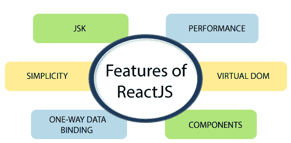

# 反应堆的特征

> 原文：<https://www.tutorialandexample.com/features-of-reactjs/>

**反应特征**

到目前为止，在开发人员中，ReactJS 作为最好的 JavaScript 框架越来越受欢迎。对于前端生态系统至关重要。

反应堆的一些重要特征如下:

*   JSX
*   成分
*   单向数据绑定
*   虚拟 DOM
*   简单
*   表演

让我们详细说明这些功能:

**JSX**

JSX 是 JavaScript XML 的首字母缩写。它是 JavaScript 语法的扩展。它的语法类似于 XML 或 HTML。该语法被处理成 React 框架的 JavaScript 调用。它增强了 ES6，使 HTML 这样的文本可以与 JavaScript react 代码共存。使用 JSX 不是强制性的，但在反应堆中使用它是明智的。

**单向数据绑定**

ReactJS 的设计方式遵循单向数据流或单向数据绑定。单向数据绑定是有利的，因为它在整个应用程序中提供了更好的控制。当数据流向另一个方向时，那么附加功能就需要在其中。发生这种情况是因为组件被认为是不可变的，并且其中的数据不能被修改。模式流有助于保持数据的单向性。它为应用程序提供了更大的灵活性，从而提高了效率。

**虚拟 DOM**

虚拟 DOM 只不过是真实 DOM 的一种表示。它的工作原理类似于单向数据绑定。在 web 应用程序的每次修改中，整个 UI 都以虚拟 DOM 表示重新呈现。然后，分析新的 DOM(被重新渲染)和以前的 DOM 的表示之间的差异。一旦完成，真正的 DOM 会修改发生变化的内容。它节省内存，使应用程序更快。

**简单**

正如我们所知，ReactJS 使用 JSX，这为应用程序提供了简单性，并使代码可以理解。ReactJS 遵循基于组件的方法，这为代码提供了可重用性。它便于学习和使用。

**组件**

ReactJS 由组件组成，其中每个组件都有自己的逻辑和控件。这些组件是可重用的，这有助于在大型项目中维护代码。

**性能**

ReactJS 性能很棒。由于这个特性，ReactJS 变得比其他框架好得多。这个原因的背后，有一个管理虚拟 DOM 的概念。DOM 只不过是处理 HTML、XML 和 XHTML 的跨平台和编程 API。DOM 完全存在于内存中。正因为如此，每当我们创建一个组件时，我们并不直接将它们写入 DOM 取而代之的是，我们编写虚拟组件来转化为 DOM，从而带来更平滑更快速的性能。