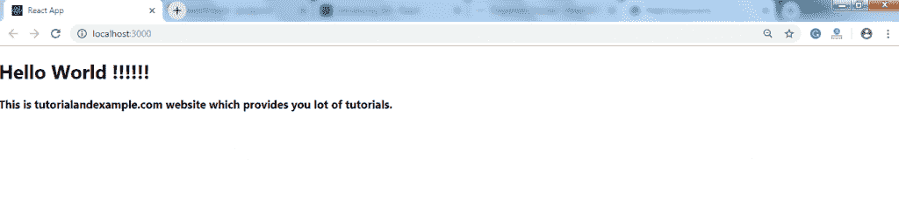
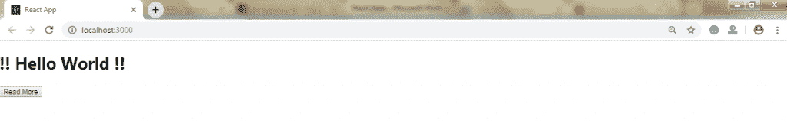
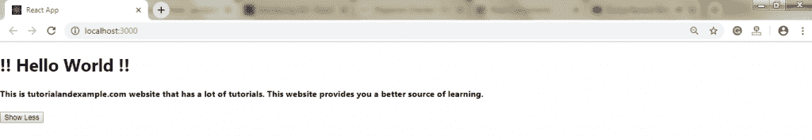

# 反应状态

> 原文：<https://www.tutorialandexample.com/react-state/>

**反应状态**

状态是一个可更新的结构，用于包含关于组件的数据或信息。组件中的状态可以随着时间而改变。状态随时间的变化作为对用户动作或系统事件的响应而发生。具有状态的组件称为有状态组件。它是 React 组件的一个关键部分，决定了组件的行为以及如何呈现。他们还负责使组件具有交互性和动态性。

一种状态是尽可能保持简单。可以使用 **setState()** 方法设置状态，在调用 **setState()** 时，方法触发 UI 更新。状态表示本地状态或信息。它可以由组件直接修改或访问，也可以在组件内部修改或访问。为了在任何交互发生之前设置一个初始状态，我们必须使用 **getInitialState()** 方法。

例如，假设我们有五个组件需要来自状态的数据或信息，那么我们必须创建一个容器组件来保存所有这些组件的状态。

**定义状态**

为了定义一个状态，我们必须首先声明一个默认的状态值来定义组件的初始状态。为此，添加一个使用 **this.state** 分配初始状态的类构造函数。可以在 **render()** 方法中呈现' **this.state** 属性。

**举例:**

下面给出的示例将向您展示如何使用 ES6 语法创建有状态组件:

```
import React, { Component } from 'react';  
class App extends React.Component {  
constructor() { 
super()
this.state = { displayBio: true }
}
render() {
const bio = this.state.displayBio ? (  

### 这是 tutorialandexample.com 网站，为你提供大量的教程。

) : nullreturn (

# 你好世界！！！！！！

 { bio }

)
}
}
export default App; 
```

**输出:**



设置状态需要调用构造函数中的 **super()** 方法。这是因为 **this.state** 在调用**super()方法之前未初始化。**

### 改变状态

组件的状态可以通过使用 **setState()** 方法并传递一个新的状态对象作为参数来更改。现在，在上例中创建一个新方法 **toggleDisplayBio()** ，并将这个关键字绑定到 **toggleDisplayBio()** 方法**；**否则，在 **toggleDisplayBio()** 方法中无法访问它。

```
this.toggleDisplayBio=this.toggleDisplayBio.bind(this)
```

**举例:**

在下面的例子中，我们给 **render()** 方法添加了一个**按钮**。单击该按钮会触发显示所需输出的 **toggleDisplayBio()** 方法。

```
import React, { Component } from 'react';  
class App extends React.Component { 
constructor() {
super()
this.state = { displayBio: false }
console.log('Component this', this)
this.toggleDisplayBio = this.toggleDisplayBio.bind(this) 
}
toggleDisplayBio(){ 
this.setState({displayBio: !this.state.displayBio});
}
render() {
return (

# ！！你好世界！！

{
this.state.displayBio ? (

#### 这是 tutorialandexample.com 网站，有很多教程。这个网站为你提供了更好的学习资源。

 <button onclick="{this.toggleDisplayBio}">Show Less</button> 
 (

 <button onclick="{this.toggleDisplayBio}">Read More</button> 

)
}

)
}
}
export default App
```

**输出:**



点击 **Read More** 按钮，你会看到下面的输出，点击 show less 按钮，你会得到上图的输出。

