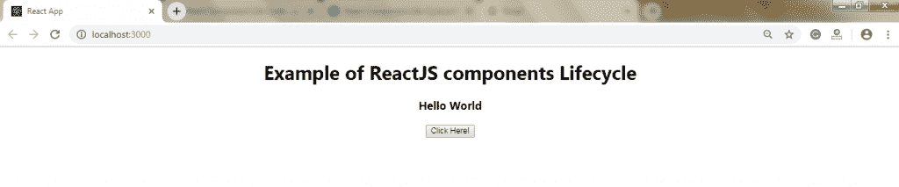
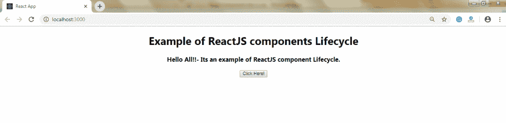

# 反应组件生命周期

> 原文：<https://www.tutorialandexample.com/react-component-life-cycle/>

**反应组件生命周期**

在 ReactJS 中，每个组件的创建过程都包括几个生命周期方法。这些方法统称为组件的生命周期。组件生命周期的四个阶段如下:

*   初始相位
*   安装阶段
*   更新阶段
*   卸载阶段

在生命周期的每个阶段都有一些方法。让我们逐一阐述这些阶段:

**初始阶段**

它被称为 ReactJS 组件生命周期的**诞生阶段**。在这个阶段，组件包括初始状态和默认属性。这些默认属性出现在组件的构造函数中。此阶段仅发生一次，包括以下方法:

*   **getDefaultProps()**

用于指定 **this.props** 的默认值。它在创建组件之前调用。

*   **getInitialState()**

用于指定 **this.state.** 的默认值

**安装阶段**

在这个阶段，创建一个组件的实例并将其插入到 DOM 中。它包括以下方法:

*   **componentWillMount()**

它在组件呈现到 DOM 之前立即调用。如果你在这个方法中调用了 **setState()** ，这个组件将不会被**重新渲染。**

*   **componentidmount()**

它在组件呈现后立即调用，并放在 DOM 上。现在，您可以执行任何 DOM 查询操作。

*   **render()**

它在每个组件中都有定义。它负责返回单个根 **HTML 节点**元素。如果你不想渲染任何东西，你可以创建一个**空值**或者**假值**。

**更新阶段**

这是 React 组件生命周期的下一个阶段。在这里，我们得到新的**道具**并改变**状态。**这个阶段还允许您处理与用户的交互，并提供与组件层次结构的通信。这个阶段的主要目标是确保组件显示它的最新版本。

与**出生或死亡阶段不同的是，**这个阶段一次又一次地重复。它包括以下方法:

*   **组件别墅接收插件()**

当一个组件收到新的道具时，它就会调用。如果您需要更新状态来响应属性的变化，您必须比较 **this.props** 和 **nextProps** 来使用 **this.setState()** 方法执行状态转换。

*   **shouldcomponentdupdate()**

每当组件决定更改/更新 DOM 时，它都会调用。它允许您控制组件的行为并自我更新。当此方法返回 true 时，组件将更新。否则，组件将跳过更新。

*   **componentWillUpdate()**

它就在组件更新发生之前调用。这里，您不能通过调用 **this.setState()** 方法来更改组件的状态。如果方法**shouldcomponentdupdate()**返回 false，它将不会被调用。

*   **render()**

它调用检查 **this.props** 和 **this.state** 并返回 React 元素、数组和片段、布尔值或 null、字符串和数字等类型。如果方法 **shouldComponentUpdate()** 返回 false，那么 **render()** 内部的代码将被再次调用，以确保组件正确显示自身。

*   **componentDidUpdate()**

它在组件更新发生后立即调用。在这个方法中，你可以把任何你想在更新发生时执行的代码放在里面。此方法不调用初始渲染。

**卸载阶段**

这是 React 组件生命周期的最后阶段。每当组件的实例从 DOM 中被**销毁**和**卸载**时，这个方法就会被调用。这个阶段只包括下面给出的一种方法:

*   **componentWillUnmount()**

在组件被永久销毁和卸载之前，此方法会立即调用。它执行任何必要的与**清理**相关的任务，比如使计时器失效、事件监听器、取消网络请求或者清理 DOM 的元素。如果组件的实例被卸载，将无法再次装载它。

**举例:**

<preclass>importReact,{Component}from'react'; classAppextendsReact.Component{ constructor(props){ super(props); this.state={world:"World"}; this.changeState=this.changeState.bind(this) } render(){ return(

# exampleofactjscomponentslifecycle

### 你好{this.state.world}

<buttononclick>ClickHere!</buttononclick>

); } componentWillMount(){ console.log('ComponentWillMOUNT!') } componentDidMount(){ console.log('ComponentDidMOUNT!') } changeState(){ this.setState({world:"All!!-ItsanexampleofReactJScomponentLifecycle."}); } componentWillReceiveProps(newProps){ console.log('ComponentWillRecieveProps!') } shouldComponentUpdate(newProps,newState){ returntrue; } componentWillUpdate(nextProps,nextState){ console.log('ComponentWillUPDATE!'); } componentDidUpdate(prevProps,prevState){ console.log('ComponentDidUPDATE!') } componentWillUnmount(){ console.log('ComponentWillUNMOUNT!') } } exportdefaultApp;

**输出:**

当您单击该按钮时，您将获得以下输出:

</preclass>