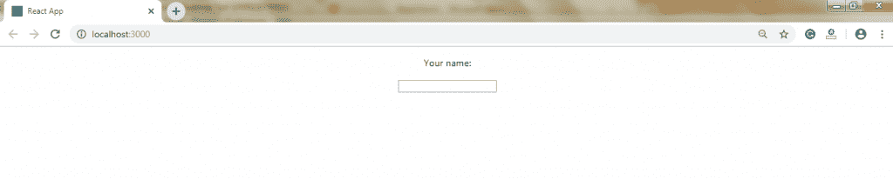

# 反应形式

> 原文：<https://www.tutorialandexample.com/react-forms/>

**反应形式**

表单是任何 web 应用程序的重要组成部分。它允许用户与应用程序进行交互，以及从用户那里收集信息。表单可以执行各种任务，这取决于您的业务和逻辑需求的性质，例如用户验证、添加用户、搜索、过滤、预订等。表单可以包括文本字段、按钮、复选框、单选按钮等。

**创建表单**

React 提供了一种有状态的、反应式的方法来创建表单。在 React 中，受控组件通常实现表单。

表单主要有以下两种类型:

1.  **非受控组件。**
2.  **受控组件。**

### 非受控组件

不受控制的组件类似于传统的 HTML 表单输入。DOM 本身负责处理表单数据。在这里，HTML 的元素保持它们的状态，当输入的值改变时，它们会更新。为了编写不受控制的组件，您必须使用 ref 从 DOM 中获取表单值。换句话说，为每个状态的更新编写一个事件处理程序并不重要。

**举例:**

```
import React, { Component } from 'react'; 
 class App extends React.Component { 
  constructor(props) { 
  super(props); 
  this.updateSubmit = this.updateSubmit.bind(this); 
  this.input = React.createRef(); 
  } 
  updateSubmit(event) {  
  alert('Data submitted successfully.'); 
  event.preventDefault(); 
  } 
  render() { 
  return ( 

```

<form onsubmit="{this.updateSubmit}">

<center>

# 不受控制的表单示例

 <label>### 你的名字:<input type="text" ref="{this.input}"></label>  <label>### 消息:<input type="text" ref="{this.input}"></label> 
<input type="submit" value="Submit"></center>

</form>

); } } export default App;

**输出:**


单击提交按钮后，您将获得以下输出:


### 受控组件

在受控组件中，表单元素的输入由组件而不是 DOM 处理。受控组件具有管理数据的功能，数据在每个 **onChange** 事件时传递给它们。这里，可变(mutable)状态保存在 state 属性中，并且只使用 **setState()** 方法进行更新。

像 **onChange** 事件一样，受控组件也通过 **props** 获取其当前值，并通过**回调通知变化。**

受控组件由管理数据的函数组成，数据在每个 **onChange 事件时传递给它们。**之后，该数据将保存到**状态**，并用 **setState()** 方法更新。它使组件能够更好地控制表单的元素和数据。

**举例:**

```
import React, { Component } from 'react'; 
 class App extends React.Component { 
  constructor(props) { 
  super(props); 
  this.state = {value: ''}; 
  this.handleChange = this.handleChange.bind(this); 
  this.handleSubmit = this.handleSubmit.bind(this); 
  } 
  handleChange(event) {  

<form onsubmit="{this.handleSubmit}"> 

# 受控表单示例

  <label> 

### 你的名字:<input type="text" value="{this.state.value}" onchange="{this.handleChange}">

  </label> 
  <input type="submit" value="Submit"> 
  </form>

  ); 
  } 
 } 
 export default App;  
```

**输出:**


单击提交按钮后，您将获得以下输出:


**多个输入字段**

通过向每个元素添加一个 **name** 属性，可以处理多个输入字段值。

如果你想访问事件处理程序中的字段，使用语法 **event.target.name** 和 **event.target.value** 。

**举例:**

```
import React, { Component } from 'react'; 
 class App extends React.Component { 
  constructor(props) { 
  super(props); 
  this.state = { 
  quali1: true, 
  quali2: true, 
  quali3: true, 
  quali4: false, 
  name: 'Madhav' , 
  age:20
  }; 
  this.handleInputChange = this.handleInputChange.bind(this); 
  } 
  handleInputChange(event) { 
  const target = event.target; 
  const value = target.type === 'checkbox' ? target.checked : target.value;  
  const name = target.name; 
  const age = target.age; 
  this.setState({ 
  [name]: value,
  [age]: value
  }); 
  } 
  render() {  
  return ( 

<form> 

# 多输入控制表单示例

  <label> 
  Your Name: 
  <input name="name" type="text" value="{this.state.name}" onchange="{this.handleInputChange}"> 
  </label> 

  <label> 
  Your Age: 
  <input name="age" type="number" value="{this.state.age}" onchange="{this.handleInputChange}"> 
  </label> 

  <label> 
  Qualification: 
  <input name="qual1" type="checkbox" checked="{this.state.quali1}" value="{this.state.quali1}" onchange="{this.handleInputChange}">10th
  <input name="qual2" type="checkbox" checked="{this.state.quali2}" onchange="{this.handleInputChange}">12th
  <input name="qual3" type="checkbox" checked="{this.state.quali3}" onchange="{this.handleInputChange}">Graduation
  <input name="qual4" type="checkbox" checked="{this.state.quali4}" onchange="{this.handleInputChange}">Post Graduation
  </label> 
  </form>

  ); 
  } 
 } 
 export default App; 
```

**输出:**


**条件渲染**

如果不希望在用户提供输入之前显示元素，可以添加 **if** 语句。

在下面的例子中，我们正在创建一个被称为 **top 的空变量。**我们还添加了 **if** 语句，用于在用户提供任何输入时将数据插入到 **top** 变量中。

**举例:**

```
import React, { Component } from 'react'; 
 class App extends React.Component {
  constructor(props) {
  super(props);
  this.state = { name: '' };
  }
  myChangeHandler = (event) => {
  this.setState({name: event.target.value}); 
  }
  render() {
  let top = '';
  if (this.state.name) {
  top = 您好，{this.state.name}先生;
  } else {
  top = '';
  }
  return ( 

<form>
  {top}

您的姓名:

  <input type="text" onchange="{this.myChangeHandler}">
  </form>

  );
  }
 }
 export default App; 
```

**输出:**

在用户给出任何输入之前，您将看到以下输出。



当用户提供输入时，你会看到下面的输出。

