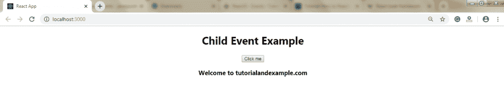

# 对事件做出反应

> 原文：<https://www.tutorialandexample.com/react-events/>

**反应事件**

事件是触发用户操作或系统生成事件响应的操作。作为 HTML，React 也可以基于用户事件执行操作。React 和 HTML 有相同的事件:改变、鼠标经过、点击等。

React 有自己的事件处理系统，这与处理 DOM 元素上的事件非常相似。这个 React 事件处理系统被称为**合成事件。**


用 react 处理事件和用 DOM 处理事件之间有一些区别。这些是:

1.  React 事件的命名约定是**小写**而不是**。**

**例如:**

onClick 而不是 **onclick。**

*   使用 JSX，一个函数被当作一个**事件处理程序**而不是一个字符串**。**

**例如:**

React 事件处理程序写在花括号中:

**onClick= {show}** 而不是 **onclick="show()"。**

*   **HTML 中的事件声明:**

```
 Click me 
```

*   **React 中事件的声明:**

```
 Click me 
```

*   在 react 中，我们不能返回 **false** 来阻止**默认**行为，而必须调用 **preventDefault** 事件来阻止默认行为。

**例如:**

*   在 HTML 中，为了防止打开新页面的默认链接行为，我们写为:

```
 Hello 
```

*   在 React 中，它可以写成:

```
function ActionLink() {
function handleClick(e) {
e.preventDefault();
console.log('You visited a Link.');
}
return (
 Hello 
);
}  
```

### 事件处理程序示例

以下示例定义了如何在 React 中生成事件。

```
import React, { Component } from 'react';
class App extends React.Component {
hello() {
alert("!!!!! Hello World !!!!!");
}
render() {
return (

# 事件处理程序示例

## 单击以下按钮生成事件

<button onclick="{this.hello}">lick me</button>

);
}
}
export default App; 
```

**输出:**


单击按钮后，您将获得以下输出。


**子事件**

当我们需要从子组件更新父组件的**状态**时，我们可以在父组件内部创建一个事件处理程序( **updateState** )，它将作为一个道具( **updateStateProp** )传递给子组件，在那里我们可以调用它。

```
import React from 'react';
class App extends React.Component {
constructor(props) {
super(props);
this.state = {
data: 'Hello World!!!!'
} 
this.updateState = this.updateState.bind(this);
};
updateState() {
}
render() {
return (

);
}
}
class Hello extends React.Component { 
render() {
return (

# 子事件示例

<button onclick="{this.props.updateStateProp}">Click me</button>

### {this.props.myDataProp}

);
}
}
export default App; 
```

**输出:**

编译上述代码后，您将获得以下输出:


单击该按钮后，您将获得以下输出:

