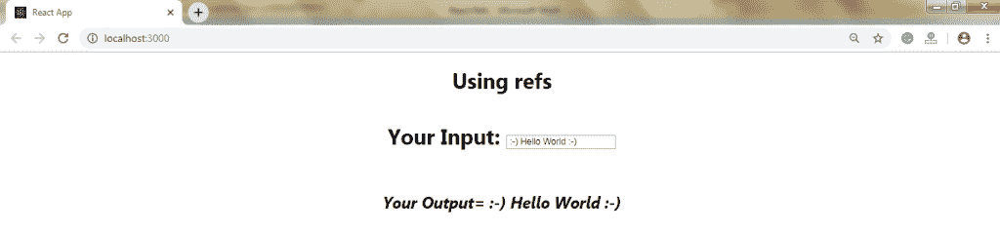
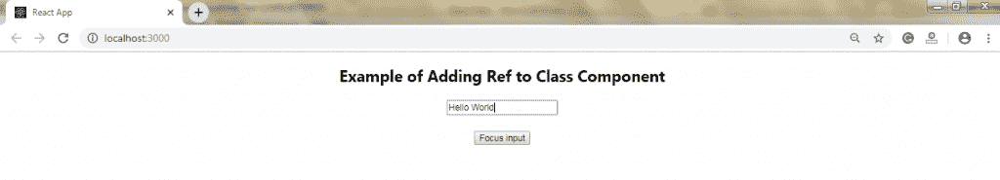

# 反应参考

> 原文：<https://www.tutorialandexample.com/react-refs/>

**反应参考**

单词“Refs”是 React 中**“References”**的缩写。它就像**键**在反应过来。Refs 是 React 中的一个函数，用于访问 DOM 元素和 React 元素。它也是一个属性，使得存储对特定 React 元素或 DOM 节点的引用成为可能。每当我们需要改变一个子组件的值时，它就会被使用，而不需要使用道具。

引用给了你更好的功能，就像我们可以使用回调一样。

### 参考文献的创建

在 React 中，我们可以通过使用 **React.createRef()来创建 **Refs** 。****引用**用于将**引用**返回给元素。下面的例子将帮助你理解我们如何创建 **refs。**

```
import React from 'react';
 class App extends React.Component { 
  constructor(props) { 
  super(props); 
  this.referenceCalling = React.createRef(); // Method for creating Refs
  } 
  render() { 
  return <div ref={this.referenceCalling} />;  
  } 
 } 
 export default App; 
```

### 参考文献的获取

在 React 中，当 **ref** 传递给 **render 方法中的一个元素时，那么**一个对节点的 ref 可以被 ref 的当前属性访问。

```
const node = this.callRef.current;
```

下面的例子展示了不使用 **引用**和使用 **引用的**的代码**。******

**举例:**

### 无参考文献

```
import React from 'react';
 class App extends React.Component { 
  constructor(){ 
  super(); 
  this.state = { written: ""}; 
  } 
  update(e){ 
  this.setState({ written: e.target.value}); 
  } 
  render(){  
  return ( 

# 不使用 refs 

您的输入:<input type="text" placeholder="Write Something" onchange="{this.update.bind(this)}/">

## *你的输出={this.state.written}* 

  ); 
 }  
 } 
 export default App; 
```

在上面的代码中，我们使用事件 e 的目标值来获取文本字段的值。编译完上面的代码后，您将得到下面的输出。

**输出:**


### 带参考

在这个例子中，我们使用了 refs。该示例的代码如下:

```
import React from 'react';
 class App extends React.Component { 
 constructor(){ 
  super(); 
  this.state = { written: ""}; 
 } 
 update(e){ 
  this.setState({ written: this.refs.any.value});  
 } 
 render(){ 
  return ( 

# 使用 refs 

您的输入:<input type="text" placeholder="Write Something" ref="any" onchange="{this.update.bind(this)}/">

## *你的输出= {this.state.written}* 

  ); 
 } 
 } 
 export default App; 
```

**输出:**



### 回调参考

在 React 中，**【回调参】**是使用**参的方式。**当**参考**被**置位**或**未置位时，它为您提供更多控制。**除了使用**createRef()**方法创建**引用**之外，还有一种方法可以通过在组件的 **ref 属性**中传递**回调函数**来创建引用。

例如:

```
 this.callRefInput = element} /> 
```

回调函数用于在实例属性中存储对 DOM 节点的引用，并且可以在其他地方访问它。

我们可以通过使用 **this.callRefInput.value** 来访问它。

下面的例子将帮助你理解**回调引用的工作原理。**

**举例:**

```
import React, { Component } from 'react'; 
 import { render } from 'react-dom'; 
 class App extends React.Component { 
  constructor(props) { 
  super(props); 
  this.input = null; 
  this.setInputRef = element => { 
  this.input = element; 
  }; 
  this.focusRefInput = () => { 
  //This will Focus on the input using the API of raw DOM 
  if (this.input) this.input.focus(); 
  }; 
  } 
  componentDidMount() { 
  //autofocus of the input on mount 
  this.focusRefInput(); 
  } 
  render() { 
  return ( 

## 回调参

 <input type="text" ref="{this.setInputRef}"> 

 <input type="button" value="Click me" onclick="{this.focusRefInput}"> 

##### 的例子点击按钮关注输入。

  ); 
 } 
 } 
 export default App;  
```

**输出:**


### 添加对 DOM 元素的引用

下面的例子将向您展示如何添加一个 **ref** 来存储对 React 元素或 DOM 节点的引用。

**举例:**

```
import React, { Component } from 'react'; 
 import { render } from 'react-dom'; 
 class App extends React.Component { 
  constructor(props) { 
  super(props); 
  this.callingRef = React.createRef(); 
  this.refInput = this.refInput.bind(this); 
  } 
  refInput() { 
  this.callingRef.current.focus();  
  } 
  render() { 
  return ( 

## 添加对 DOM 元素的引用的示例

  <input type="text" ref="{this.callingRef}"> 

  <input type="button" value="Click for Focus" onclick="{this.refInput}/"> 

  ); 
  } 
 } 
 export default App; 
```

**输出:**


### 添加对类组件的引用

在下面的例子中，我们添加了一个 **ref** 来存储对类组件的引用。

**举例:**

```
import React, { Component } from 'react'; 
 import { render } from 'react-dom'; 
 function UserInput(props) { 
  let refInput = React.createRef(); 
  function click() { 
  refInput.current.focus(); 
  } 
  return (

## 添加对类组件的引用的示例

  <input type="text" ref="{refInput}"> 

  <input type="button" value="Focus input" onclick="{click}/"> 

  );  
 } 
 class App extends React.Component { 
  constructor(props) { 
  super(props); 
  this.refInput = React.createRef(); 
  } 
  focusInput() { 
  this.refInput.current.focus(); 
  } 
  render() { 
  return ( 
  ); 
  } 
 } 
 export default App; 
```

**输出:**



### 与 useRef()反应

在 **React 版本 16.7** 及其以上版本中均有介绍。它有助于访问 React 元素或 DOM 节点。它返回 **ref** 的**的对象。current** 属性初始化为传递的参数。返回的对象在组件的生存期内保持不变。

**语法:**

```
const refContainer = useRef(initialValue);  
```

**举例:**

在下面的代码中， **useRef** 函数被赋值给一个变量， **refInput，**，然后它将附加到一个我们想要引用的属性上。

```
function useRefExample() { 
  const inputRef= useRef(null); 
  const onButtonClick = () => { 
  inputRef.current.focus(); 
  }; 
  return ( 

  Submit 
  ); 
 } 
```

### 参考当前属性

参考的一些属性如下:

*   如果我们在一个定制类组件上使用 ref 属性，那么 ref 的对象接收组件的挂载实例作为当前属性。
*   我们不能使用 ref 属性作为**函数组件**，因为它们没有实例。

### 何时使用参考文献

在下列情况下，引用很有用:

*   当我们需要 DOM 测量时，例如管理焦点、文本选择或媒体回放。
*   引用用于触发命令式动画。
*   引用在回调中使用。
*   当我们必须与第三方 DOM 库集成时，就会用到它。

### 何时不使用参考文献

*   当以声明方式使用 refs 时，应该避免使用 refs。例如，您正在传递一个 **isOpen** prop，而不是在一个对话框组件上使用 **open()** 和 **close()** 方法。
*   应避免过度使用参考文献。