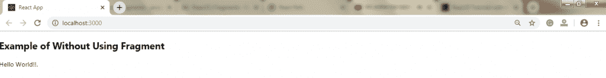
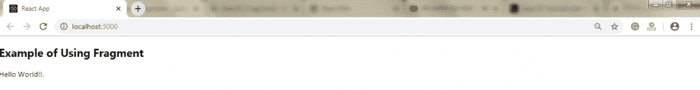
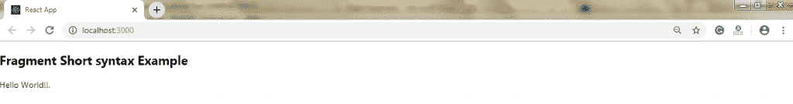

# 反应碎片

> 原文：<https://www.tutorialandexample.com/react-fragments/>

**反应碎片**

React 中的片段是从 **16.2 及以上版本引入的。**片段允许你分组一个子元素列表，而不需要在 DOM 中添加任何额外的节点。

在 React 中，如果你想把一些东西渲染到屏幕上，你必须在组件内部使用一个 render 方法；这个呈现方法一次只呈现一个根节点。但是如果你想返回多个语句，那么我们必须把 **< div >** 标签放在 render 方法里面，并且需要把整个内容和元素放进去。DOM 中的这个额外节点有时会导致 HTML 输出的格式错误。为了解决这个问题，React 引入了**碎片的概念。**

**语法:**

```
 # 儿童 1

儿童 2

 …………….. 
```

**例子**

**不使用片段**

```
import React, { Component } from 'react'; 
 import { render } from 'react-dom'; 
 class App extends React.Component { 
  render() { 
  return ( 
  //Extraneous div element

## 不使用片段的示例

你好世界！！。

  ); 
  } 
 } 
 export default App; 
```

**输出:**



**与片段**

```
import React, { Component } from 'react'; 
 import { render } from 'react-dom'; 
 class App extends React.Component { 
  render() { 
  return ( 
  //Fragment tag

## 使用片段的示例

你好世界！！。

  ); 
  } 
 } 
 export default App; 
```

**输出:**



### 为什么是碎片

让碎片有价值的原因有以下几点。

*   与 **< div >** 标签相比，它使代码执行得更快。
*   它消耗更少的内存。

**片段短语法**

使用**片段**的主要原因是，与 **< div >标签相比，它要快一点。**

片段短语法是声明片段的简写。它就像是一个空标签。而不是用**做出反应。片段，**我们用 **< >....</>/**用于声明片段。

**举例:**

以下示例显示了如何使用片段短语法。

```
import React, { Component } from 'react'; 
 import { render } from 'react-dom'; 
 class App extends React.Component { 
  render() { 
  return ( 
  //Fragment short syntax tag
  <>  
  片段短语法示例 
  你好世界！！。 

  ); 
  } 
 } 
 export default App; 
```

**输出:**



**键控片段**

片段的简写语法不接受键属性。您需要一个键来将集合映射到片段数组，就像创建描述列表一样。如果你想提供密钥，你需要用显式的 **<声明片段的反应。片段>** 语法。

关键字是唯一可以和片段一起传递的属性。

```
Function = (props) { 
  return ( 

  {props.items.data.map(item => ( 
  // Without the 'key', React will give a key warning 
  <react.fragment key="{item.id}"> 

## {item.name}

{item.url}

{item.description}

  </react.fragment> 
  ))} 

  ) 
 }
```