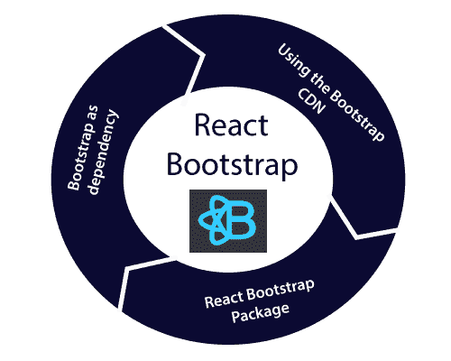

# 反应引导

> 原文：<https://www.tutorialandexample.com/react-bootstrap/>

**反应引导**

React 有一个广泛使用的用于创建 web 应用程序的 JavaScript 框架，Bootstrap 已经成为最流行的 CSS 框架。在过去的几年里，单页应用变得流行起来，所以像 Angular、React、Ember 等前端框架。有介绍。因此，jQuery 在构建 web 应用程序方面不再受欢迎。因此，有必要了解在 React 应用程序中使用引导程序的方法。

### 添加 Bootstrap 以进行反应

有几种方法可以将引导程序添加到 react 应用程序中；其中一些列举如下:

*   通过使用引导 CDN
*   作为依赖项的引导
*   React 引导包

### 使用引导 CDN

在 ReactJS 中使用 Bootstrap 是最简单的方法之一。它不需要安装和下载任何引导。我们必须将 **<链接>** 标签放入 react 应用程序的**index.html**文件的 **<头>** 段。

如果需要在 react 应用中使用依赖于 JavaScript/jQuery 的引导组件，我们必须在文档中包含 **jQuery** 和一些文件，如 **Popper.js** 和 **Bootstrap.js** 。您必须在**index.html**文件的 **< head >** 部分的<脚本> 标签内添加以下导入。