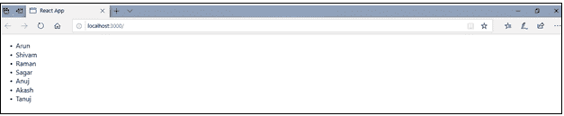
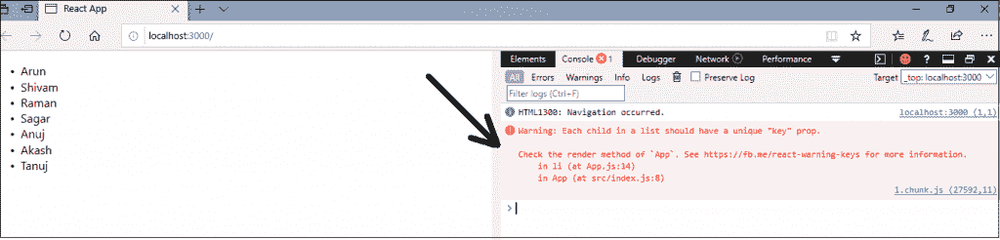
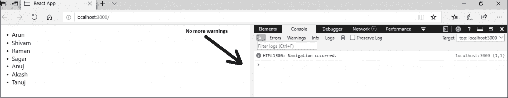

# 反应贴图

> 原文：<https://www.tutorialandexample.com/react-map/>

**反应图**

map()是 JavaScript 的标准函数，可以在任何数组中调用。 **map()方法**用于遍历和显示一个组件的相似对象列表。 **map()方法**主要通过在调用数组中的每个元素上调用提供的函数来创建一个新数组。

map()函数是一种数据收集类型，其中数据以成对的形式存储。map()函数包含一个唯一的键。存储在 map()函数中的值必须与键进行映射。您不能在 **map()函数中存储重复对。**这是因为每个存储的密钥都是唯一的。我们主要用它来快速搜索数据。

**举例:**

在下面的例子中，有一个 **map()** 函数，它接受一个数字数组和它们的一半值。我们将由 **map()** 函数返回的新数组赋给变量**值**，并记录下来。

```
var numbers = [1, 2, 3, 4, 5]; 
const value = numbers.map((number)=>{ 
return (number / 2); 
}); 
console.log(value);  
```

在 React 中， **map()** 函数用于:

**遍历列表元素**

```
import React from 'react'; 
class App extends React.Component{
constructor(props){
super(props);
this.state={
users:['Arun','Shivam','Raman','Sagar','Anuj','Akash','Tanuj']
}
}
render(){ 
return(

```

*   {用户}

) } } export default App;

**输出:**



正如我们所看到的，上面的代码运行良好，但是当您在浏览器中**检查(ctrl + shift + I)** 该输出并打开**控制台**部分时，您将看到如下图所示的警告:



出现这个警告是因为，在前面的例子中，我们没有定义任何键属性，react 要求一个键属性，通过这个键属性可以惟一地标识项目。

因此，如果我们重写上面的代码，并通过使用**索引**值分配一个**键**，那么警告将被解决。现在，我们在上面的代码中添加了 key 属性。

**App.js**

```
import React from 'react'; 
class App extends React.Component{
constructor(props){
super(props);
this.state={
users:['Arun','Shivam','Raman','Sagar','Anuj','Akash','Tanuj']
}
}
render(){
return(

```

*   {用户}

) } } export default App;

执行上述代码片段后，我们将得到相同的输出，但是当我们**检查**它并打开**控制台**部分时，我们将不会得到任何警告。您可以在下图中看到它:



因此，总是建议使用 key 属性来消除这些不必要的警告。