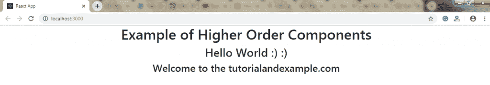

# 反应高阶成分

> 原文：<https://www.tutorialandexample.com/react-higher-order-components/>

**对高阶分量作出反应**

简而言之，高阶组件表示为 **HOC。**高阶组件是使用组件逻辑的高级技术。HOC 是一个接受组件并返回新组件的函数。这不是 React API 的特性，而是从 React 组合特性中产生的一种模式。这些类似于 JavaScript 的函数，用于在现有组件中添加额外的功能。

特设函数以参数的形式接受另一个函数。它的主要目标是将组件逻辑分解成更小更简单的功能，这些功能可以在将来重用。

**语法:**

```
const NewComponent = higherOrderComponent(WrappedComponent);
```

正如我们所知，组件将 props 转换为 UI，而 HOC 将组件转换为另一个组件，并允许我们向其中添加额外的数据或功能。高阶组件在第三方库中很常见。hoc 的一些例子是 **Redux 的 connect** 和 **Relay 的 createFragmentContainer。**

让我们通过下面的例子来理解 HOCs 的工作原理:

```
//Function Creation  
 function mul (x, y) {  
   return x * y  
 }  
 function higherOrder(x, addReference) {  
   return addReference(x, 20)  
 }  
 //Function call  
 higherOrder(30, mul) // 600   
```

在这个例子中，有两个函数 **mul()** 和 **higherOrder()。**现在，我们也给 **mul()** 函数作为 **higherOrder()** 函数的参数。

该函数被传递，被称为**回调函数，**，而传递了**回调函数**的函数被称为**高阶(HOCs)函数。**

**举例:**

现在，创建一个新文件 **HOC.js，**并在其中创建另一个函数 HOC。它将接受一个**参数**作为组件。

**HOC.js**

```
import React, {Component} from 'react'; 
export default function Hoc(HocComponent){ 
return class extends Component{ 
render(){ 
return ( 

); 
} 
} 
} 

```

将 **HOC.js** 文件包含到你的 **App.js** 文件中。在这个文件中，我们必须调用**特设函数**。

```
App = Hoc(App); 
```

**App.js**

```
import React, { Component } from 'react'; 
import Hoc from './HOC'; 
class App extends Component { 
render() { 
return ( 

# 高阶组件的例子

## Hello World:)

### 欢迎来到 tutorialandexample.com

) 
} 
} 
App = Hoc(App); 
export default App;  
```

**输出:**

执行上述代码后，输出将是:



**高阶组件约定**

*   不建议在组件的 render 方法中使用 **HOCs** 。
*   静态方法必须被复制才能被访问。这可以通过使用**提升-非反应-静态**包自动复制所有非反应静态方法来完成。
*   如果您想要将 ref 添加到 **HOC** 组件中的元素，那么 ref 将引用最外层容器组件的实例，而不是包装器组件。