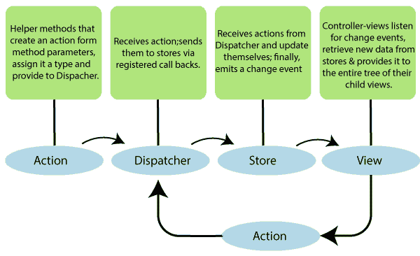

# 反应通量

> 原文：<https://www.tutorialandexample.com/react-flux/>

**反应焊剂介绍**

这是一个应用程序架构，由脸书内部使用，通过 react 构建客户端-web 应用程序。当项目包含动态数据，并且我们需要有效地更新我们的数据时，这是很有用的。它减少了运行时错误。

这是一个编程概念，其中数据是单向的。这些数据输入到应用程序中，向一个方向流动，直到呈现在屏幕上。

flux 应用程序有三个主要作用:

1.  分配器
2.  商店
3.  视图(反应组件)

甚至控制器也存在于模型-视图-控制器(MVC)模型中，但是控制器-视图(views)在层次结构的顶端。调度程序、存储和视图是独立的节点。这些动作是包含新数据和类型属性的新对象。

现在，让我们讨论一下 flux 架构的各个组件。

**调度员**

dispatcher 是 react flux 应用程序的中心枢纽，它还管理 flux 应用程序的所有数据流。它没有真正的智能，它只是作为一种将动作分配给商店的机制。它处理所有修改存储的事件。当操作创建者将新操作交给调度程序时，所有存储都通过注册表中的回调接收这些操作。

dispatcher 的 API 有以下五种方法:

| **序列号** | **方法** | **定义** |
| one | 寄存器() | 它用于注册存储的操作处理程序回调。 |
| Two | 注销() | 它用于取消注册存储回调。 |
| three | 等待() | 它用于等待指定的回调首先运行。 |
| four | 调度() | 它用于动作分派。 |
| five | isDispatching() | 它用于检查调度程序是否正在调度操作。 |

**店铺**

它包含应用程序的逻辑和状态。它类似于传统 MVC 中的模型。它用于维护应用程序中的特定状态。它发出 change 事件来警告控制器视图。

**视图**

它从商店接收数据并重新呈现应用程序。它也被称为控制器视图。它位于链的顶端，用于存储逻辑、生成操作以及从存储中接收新数据。它是一个 react 组件，侦听事件的变化，从存储中接收数据，并重新呈现应用程序。

**动作**

这些动作被发送给调度程序以触发数据流。

### 助焊剂的优点

焊剂的一些优点如下:

*   单向数据流很容易理解。
*   很容易维护。
*   flux 应用程序的各个部分是分离的。
*   它是开源的，比 MVC 架构这样的正式框架有更多的设计模式。