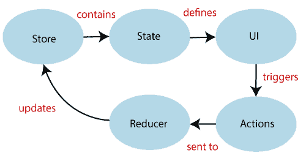
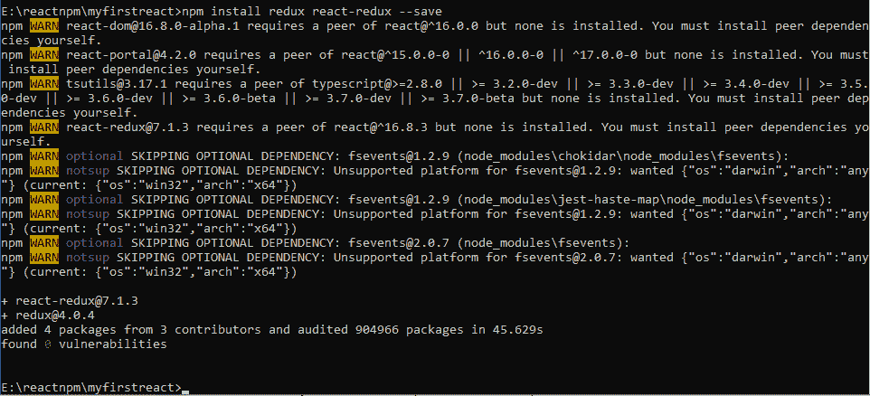
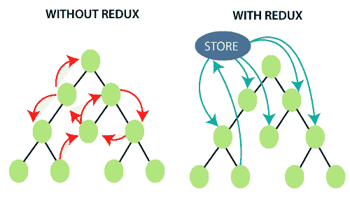
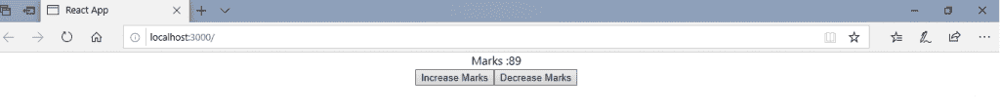
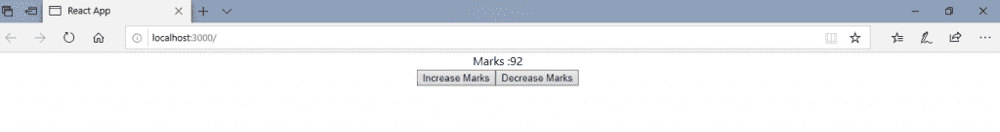
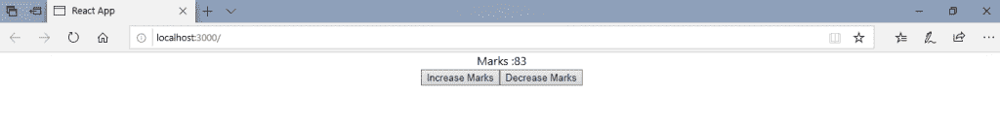
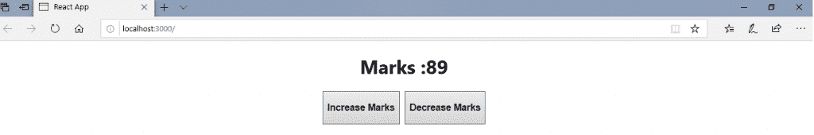
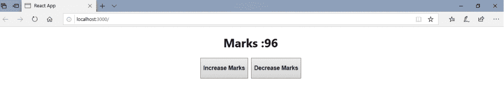
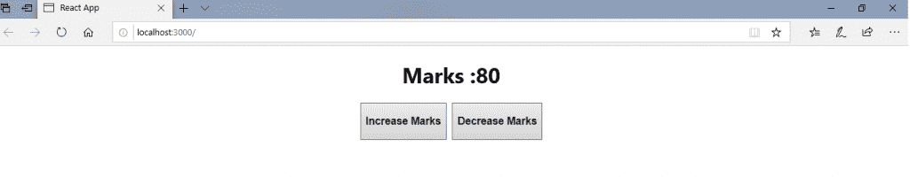

# 反应还原

> 原文：<https://www.tutorialandexample.com/react-redux/>

**如何将 Redux 与 React 挂钩一起使用**

它是一个用于管理应用程序状态的 JavaScript 开源库。React 使用 Redux 来构建用户界面。它最早是由**丹·阿布拉莫夫**和**安德鲁·克拉克**在 **2015** 创造的。

React redux 允许 React 组件从 redux 存储中读取数据，它还将**动作**分派给**存储**来更新数据。Redux 为应用程序提供了一种通过单向数据流模型管理状态的合理方式，从而帮助应用程序进行扩展。

redux 忽略了 Flux 架构中不必要的复杂性。Redux 没有任何 dispatcher 概念。Redux 包括单个商店，但是 flux 包括几个商店。

### 为什么需要 React Redux？

显示 redux 重要性的原因如下:

*   它保持最新的 API 变化，以确保 react 组件的行为符合预期。
*   它内部实现了许多性能优化，允许组件仅在实际需要时重新呈现。

### Redux 架构



redux 体系结构的组件如下:

STORE: 这是一个列出了你的应用程序的整个状态的地方。它用于管理应用程序的状态，并具有调度(动作)功能。

**动作:**从视图发送或调度，视图是有效载荷，可以被 reducers 读取。它是一个用来存储用户事件信息的对象。它包括诸如动作类型、时间、发生位置、坐标以及必须改变的状态等信息。

**REDUCER:** 它从动作中读取有效负载，并根据状态更新存储。它是一个从初始状态返回新状态的函数。

### Redux 入门

**安装反应冗余**

**要求:**要求 React 16.8.3 或更高版本。

要在 React 应用程序中使用 React redux，您必须运行以下命令:

***npm 安装 redux react-redux–保存***



### React Redux 示例

这里，我们展示两个例子，其中第一个例子是使用 redux 之前的**、**，第二个例子是使用 redux 之后的**。**



**使用 Redux 之前**

**App.js**

```
import React, {Component} from 'react';
 import './App.css' 
 class App extends Component{
 state = {
 marks:89
 }
 onIncrease = () =>{
 this.setState({
 ...this.state,
 marks:++this.state.marks
 })
 }
 onDecrease = () =>{
 this.setState({
 ...this.state,
 marks:--this.state.marks
 })
 }
 render(){
 return(

 Marks :{this.state.marks}
 <button onclick="{this.onIncrease}">Increase Marks</button>
 <button onclick="{this.onDecrease}">Decrease Marks</button>

 );
 }
 }
 export default App; 
```

**输出:**



点击增加标记按钮，您将得到:



同样，单击减号按钮，您将看到:



### 使用 Redux 后

让我们先了解一下 redux 应用中常用的一些术语。

**Reducer:****Reducer 不过是一个函数，取两个参数**【动作】**和**【状态】**计算并返回更新后的状态。它从**动作**中读取**有效载荷**，并通过使用**状态更新**存储**。****

 ****组件:** 它关注事物的外观，比如标记、样式。它负责接收数据，并通过使用 props 专门调用回调。数据来自哪里以及如何更改数据都无关紧要。它只呈现提供给他们的东西。

容器:它是一个关注事物如何工作的组件，比如获取数据和更新状态。它向其他容器组件提供行为和数据。它通常使用 redux 状态来读取数据，并调度 redux 动作来更新数据。

**Store:** 所有的容器组件都需要访问 Redux store 来订阅它。为此，您需要将商店作为道具传递给每个组件。然而，它变得索然无味。因此，建议使用一个特殊的 react-redux 组件，它使存储对所有容器组件都可用，而无需显式传递它。它在根组件被渲染时使用一次。

**动作:**使用**‘类型’**属性通知应该发送给商店的数据。

现在，让我们转向使用 react-redux 的例子。

首先，在 react 应用程序的 src 文件夹中创建**存储文件夹**。然后，在**存储文件夹**中创建一个 **reducer.js** 文件。

现在，打开您的 **Index.js** 文件并将一些包导入其中。它是负责创建商店和呈现 react 应用程序组件的根文件。

让我们试着理解 React-Redux 应用程序的最简单的例子。

**Index.js**

```
import React from 'react';
import ReactDOM from 'react-dom';
import './index.css';
import App from './App';
import * as serviceWorker from './serviceWorker';
import {createStore} from 'redux';
import {Provider} from 'react-redux';
import reducer from './Store/reducer'; 
const store = createStore(reducer); 
ReactDOM.render(, document.getElementById('root'));
serviceWorker.unregister(); 
```

现在，打开你的 **App.js** 文件。

**App.js**

```
import React, {Component} from 'react';
import './App.css' 
import {connect} from 'react-redux';
class App extends Component{
render(){
return(

# 标志: {this.props.marks} 

 <button onclick="{this.props.onIncrease}">### 增加分数</button> 
 <button onclick="{this.props.onDecrease}">### 减分</button> 

);
}
}
const mapStateToProps = (state) => {
return {
marks:state.marks
}
};
const mapDispatchToProps = (dispatch) => {
return{ 
onIncrease:() => dispatch({type:'INCREASE_MARKS'}),
onDecrease:() => dispatch({type:'DECREASE_MARKS'})
}
};
export default connect(mapStateToProps,mapDispatchToProps)(App);  
```

**。/Store/reducer.js**

```
const iState = {
marks:89
};
const reducer = (state=iState,action) =>{
const nState ={...state};
if(action.type==='INCREASE_MARKS')
{
nState.marks++;
}
if(action.type==='DECREASE_MARKS')
{
nState.marks--;
}
return nState;
};
export default reducer; 
```

**输出:**

成功执行代码后，输出将是:



单击增加标记按钮，输出将是:



单击减号按钮，输出将是:

**