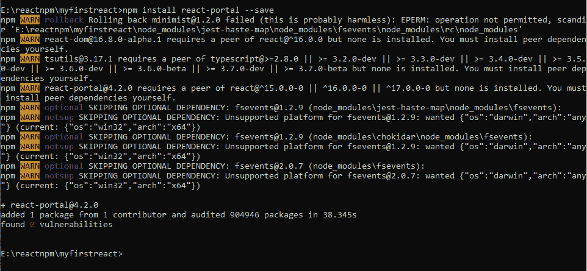
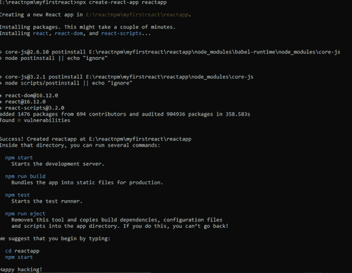
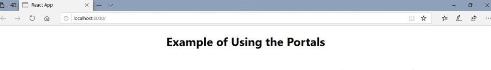
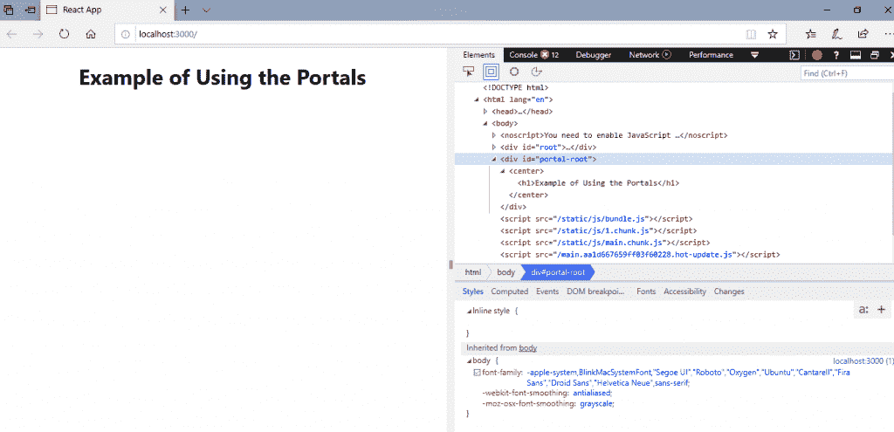

# react 门户

> 原文：<https://www.tutorialandexample.com/react-portals/>

**React 门户网站**

React 门户网站由 **React 16.0** 于 2017 年 9 月**推出。它为您提供了一种在组件层次结构之外呈现元素的方式，即在一个单独的组件中呈现元素。**

 **在 **[React 16.0](https://reactjs.org/blog/2017/09/26/react-v16.0.html) ，**之前，很难在父组件层次之外呈现子组件。

**语法:**

```
ReactDOM.createPortal(child, container)
```

react portals 语法包含两个参数，其中第一个参数是子组件，可以是字符串或片段，第二个参数是容器，是 DOM 元素。

**反应 v16** 之前的示例

当您需要通过组件的 render 方法返回元素时，它将作为新的 div 安装在 DOM 中，并呈现最近的父组件的子组件。

```
render() { 
// React mounted a new div in the DOM and renders the child in it 
return ( 

{this.props.children} 

);  
}  
```

**使用门户网站的示例**

有时，我们需要将子组件插入到 DOM 中的不同位置。这意味着 react 不需要创建新的 div。这可以通过创建 react 门户来实现。

```
render() { 
return ReactDOM.createPortal( 
this.props.children, 
myNode, 
); 
} 
```

### React 门户的特性

React 门户有以下几个特性:

*   它使用 **React 16.0** 和官方 API 来创建门户。
*   它将子组件传输到新的 React 门户中，默认情况下，React 门户附加到文档正文中。
*   它还可以针对用户指定的 DOM 元素。
*   它通常支持服务器端渲染。
*   它支持返回数组(因为不需要包装器 div)。
*   React 门户没有任何依赖关系。
*   它使用<portal>和<portalwithstate>；这就是为什么在方便性和灵活性之间没有妥协。</portalwithstate></portal>

### 何时需要 React 门户？

React 门户通常用于:

*   工具提示
*   模型
*   小工具
*   浮动菜单

### React 门户入门

**安装**

您可以使用以下命令安装 React 门户:

***npm 安装 react-portal -保存***



**解释**

现在，使用以下命令创建新的 react 项目:

***npx create-react-app react app***



现在，打开你的 **App.js** 文件。

**App.js**

```
import React, {Component} from 'react'; 
import './App.css' 
import PortalExample from './PortalExample.js'; 
class App extends Component { 
render () { 
return ( 

 <portalexample></portalexample>  
); 
} 
} 
export default App; 
```

现在，创建一个门户组件，并将其导入到您的 **App.js** 文件中。

**连接埠灯泡. js**

```
import React from 'react';
import ReactDOM from 'react-dom'; 
function PortalExample(){ 
return ReactDOM.createPortal( 

# 使用门户的示例

, 
document.getElementById('portal-root') 
) 
} 
export default PortalExample; 
```

打开您的**Index.html**文件，并在其中添加**<div id = " portal-root "></div>**元素，以便访问根节点之外的子组件。

**Index.html**

```

React App

You need to enable JavaScript to run this app.

**输出:**



现在，打开你的 **Inspect (ctrl + shift + I)。**在 inspect 窗口中，选择**元素部分**并点击**<div id = " portal-root "></div>**组件。在这里，您可以看到每个标记都在**‘portal-root’**DOM 节点下，而不是在**‘root’**DOM 节点下。

因此，您可以看到 react 门户如何提供脱离根 DOM 树的能力。



```**