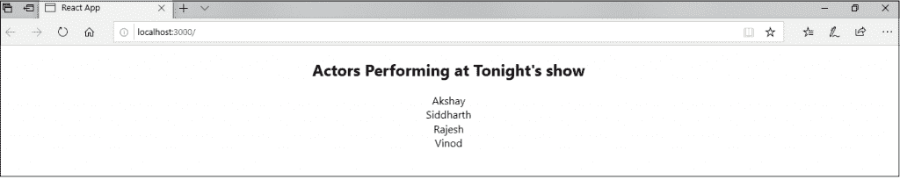
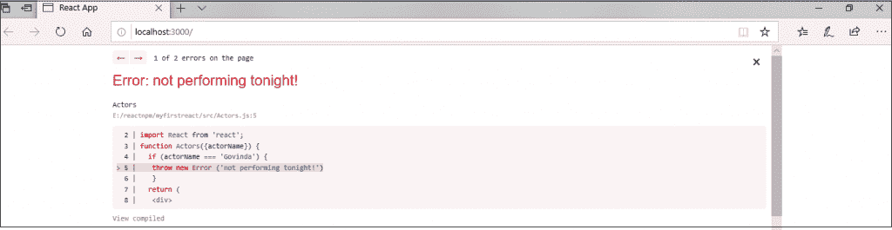

# 反应误差边界

> 原文：<https://www.tutorialandexample.com/react-error-boundaries/>

**反应误差边界**

过去，组件中的 JavaScript 错误被用来破坏 react 的内部状态，并导致它在下一次渲染时发出神秘的错误。这些错误总是由于应用程序代码中的前一个错误，但是 react 中没有任何方法可以在组件中优雅地处理它们，而且我们也无法恢复它们。

**React 16** 引入了处理错误的新概念，即通过**定义错误边界。**错误边界是 react 的组件，它捕捉子组件树中任何位置的 JavaScript 错误，记录这些错误，并将显示一个回退 UI，而不是崩溃的组件树。

**错误边界**在渲染过程中，在生命周期方法中，以及在它们下面的整个树的构造函数中捕捉错误。

错误边界**不捕捉**事件处理程序、异步代码、服务器端呈现的错误，错误边界本身抛出的错误。

对于 react 的一个简单应用程序，您可以声明一次错误边界，并将其用于整个应用程序。对于具有多个组件的复杂应用程序，可以声明多个错误边界来恢复整个应用程序的每个部分。

### 类中的错误边界

如果一个类定义了两个生命周期方法**static getderivedstatefromrerror()**或者 **componentDidCatch()** ，那么这个类就是一个错误边界。使用**静态 getDerivedStateFromError()** 是为了在抛出错误后呈现回退 UI。使用 **componentDidCatch()** 是为了记录错误信息。

对于组件来说，错误边界就像 JavaScript 的 **catch {}块**。只有类组件可以是错误边界。错误边界无法捕捉自身内部的错误。如果错误边界在呈现错误消息时失败，则错误将传播到其上最近的错误边界。这也类似于 JavaScript 中的 **catch {}块**的工作方式。

### 错误边界的实现

让我们通过使用以下示例来尝试理解错误边界的实现:

```
class ErrorBoundaryExample extends React.Component {
constructor(props) {
super(props);
this.state = { hasError: false };
}
static getDerivedStateFromError(error) {
// Update the state so the next render show the fallback UI.
return { hasError: true };
}
componentDidCatch(error, errorInfo) {
// We can also log the error for an error reporting service
logErrorToMyService(error, errorInfo);
}
render() {
if (this.state.hasError) {
// You can render any custom fallback UI 
return <div>Something went wrong.</div>;
}
return this.props.children; 
}
} 
```

现在，您可以将它作为常规组件使用。在 HTML 中添加新组件，您需要将它添加到错误边界中。在这个例子中，我们添加了一个**小部件**组件。

### 在哪里放置误差边界

错误界限完全取决于你。您可以在应用程序组件的顶层使用错误边界，或者将其包装在单个组件上，以保护它们免受应用程序其他部分的破坏。

**使用错误边界的例子:**

让我们看一个例子:

**App.js**

```
import React, { Component } from 'react';
import './App.css';
import Actors from './Actors';
class App extends Component {
render() {
return (

## 在今晚演出中表演的演员

);
}
}
export default App; 
```

**acters . js**

```
import React from 'react';
function Actors({actorName}) {
if (actorName === 'Govinda') {
throw new Error ('not performing tonight!')
}
return (

{actorName}

)
}
export default Actors; 
```

**输出:**



如果您将其中一个艺术家的名字更改为“哥文达”，如**<actor name =‘哥文达’></Actors>**，那么您将看到以下内容:



### 未捕获错误的新行为

如果错误没有被任何错误边界捕获，将导致整个 React 应用程序的**卸载**。这是误差边界的新含义。

**事件处理程序内部的错误边界**

如上所述，错误边界不能捕捉事件处理程序中的错误。React 不需要任何错误边界来从事件处理程序内部的错误中恢复。

如果您必须在事件处理程序中捕获错误，您应该使用常规的 JavaScript **try/catch** 语句，如下例所示:

```
class App extends React.Component {
constructor(props) {
super(props);
this.state = { error: null };
this.handleClick = this.handleClick.bind(this);
}
handleClick() { 
try {
// Do something that can throw the error
} catch (error) {
this.setState({ error });
}
}
render() {
if (this.state.error) {
return 发现一个错误。
}
return Click Me 
}
} 
```

需要注意的是，上面的例子演示了常规 JavaScript 和**不使用错误边界的行为。**