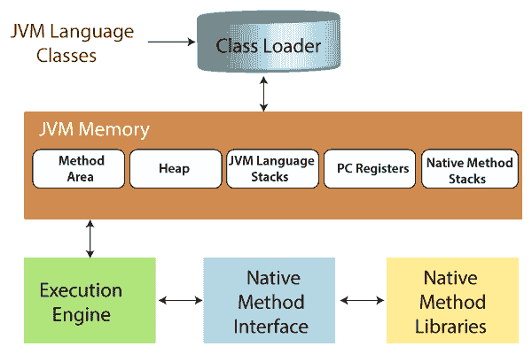

# Java 虚拟机(JVM)

> 原文：<https://www.tutorialandexample.com/java-virtual-machine>

JVM 是执行 Java 字节代码的虚拟运行时环境。JVM 不理解我们用来写代码的关键字。这就是为什么它被转换成字节码。

它控制 Java 程序的执行，并支持自动异常处理、垃圾收集等功能。当我们编译任何 Java 文件时，文件都被翻译成。包含字节码的类文件。那个“*”。类*"文件在我们执行它的时候潜入了许多步骤。整个过程一起描述了 JVM。

### 类加载器

它处理以下三种活动

*   加载:它读取。类文件，生成等效的二进制数据并将其存储在方法区域中。对于每一个。类文件中，它将加载的类的完全限定名、其直接父类、修饰符、变量和方法信息保存在方法区域中。JVM 在装载。类文件。
*   链接:它检查。类文件的格式是否正确，是否由有效的编译器生成。如果验证失败，它将返回运行时异常。JVM 为类变量分配内存，并将内存初始化为默认值。
*   初始化:JVM 为代码中定义的所有静态变量赋值。它遵循从上到下的方法，即在类层次结构中从上到下或从父到子分配值。

下面是 Java 中三个内置的类装入器:

1.  Bootstrap ClassLoader:它是扩展类加载器的超类，加载 rt.jar 文件，该文件包含 Java 标准版包的所有类文件，如 java.lang、java.net、java.util 等..
2.  扩展类加载器:它是引导的子类加载器和父类加载器，用于加载位于$JAVA_HOME/jre/lib/ext 目录或 java.ext.dirs 系统属性指定的任何其他目录中的 jar 文件。
3.  系统/应用程序类加载器:它是扩展类加载器的子类加载器。它从应用程序类路径加载类，并在内部使用与 java.class.path 关联的环境变量

### JVM 内存

JVM 内存区域分为以下几个区域:

方法区域:它包含所有类级别的信息，如类名、直接父类名、变量(包括静态变量和方法细节)等。

堆区:堆区是一个共享资源，在运行时存储所有对象的信息。

Stack area:对于每个线程，在创建线程的同时会创建一个私有的 JVM 堆栈。它存储帧并保存局部变量，在方法调用和返回中起作用。在线程终止后，它的运行时堆栈将被销毁。

PC 寄存器:每个线程都有自己独立的 PC 寄存器，存储当前正在执行的指令的地址。

本机方法堆栈:包含应用程序中使用的所有本机方法。

### 执行引擎

执行引擎执行。类文件并逐行读取字节码。它包含:

*   虚拟处理器。
*   逐行翻译字节码并执行的解释程序。
*   实时(JIT)编译器:它编译字节码并将其转换成本机代码。

### Java 本地接口(JNI)

JNI 与本地方法库交互，使其执行所需的库可用，并与用另一种语言如 C/C++编写的库通信。

### 本机方法库

执行引擎所需的用另一种语言(如 C/C++)编写的库的集合。