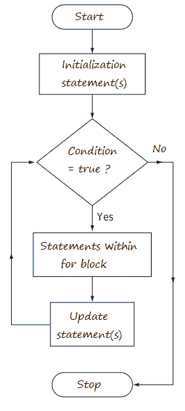

# Java For 循环

> 原文：<https://www.tutorialandexample.com/java-for-loop>

for 循环用于执行一组固定次数的语句。它采用以下形式:

```
for (initialization; condition; update) {
statements;
}

```

for 循环定义了三种类型的语句，用分号(；)，如下:

*   初始化语句
*   终止条件
*   更新子句(可执行语句)

**例如:**

```
public class Myclass {
public static void main(String[] args) {
int tableOf = 25;
for (int ctr = 1; ctr <= 5; ctr++) {
System.out.println(tableOf * ctr);
}
}
}

```

**输出:**

```
25
50
75
100
125
```

上面的代码将执行五次。它从变量 ctr 的初始值 1 开始，并在 ctr 小于或等于 5 时执行。ctr 的值将增加 1 ( ctr++)。

代码针对 ctr 值 1、2、3、4 和 5 执行。因为 6 < = 5 的计算结果为 false，所以现在 for 循环在不执行语句集的情况下完成了它的执行。

                                  

for 循环操作如下。

**第一步:** **初始化**。它设置循环控制变量的值，该变量充当控制循环的计数器。初始化表达式只执行一次。

**第二步:条件**。这必须是布尔表达式。它根据目标值测试循环控制变量。如果该表达式为真，则执行循环体。如果为假，循环终止。

**第三步:** **迭代**。这通常是递增或递减循环控制变量的表达式。然后循环进行迭代，首先计算条件表达式，然后执行循环体，然后每次都执行迭代表达式。重复这个过程，直到控制表达式为假。

update 子句在 for 循环体中定义的所有语句之后执行。只执行一次的初始化部分可以定义多个初始化语句。update 子句可以定义多个语句。但是 for 循环只能有一个终止条件。

[← Prev](https://www.tutorialandexample.com/java-while-loop)[Next →](https://www.tutorialandexample.com/java-enhanced-for-loop)