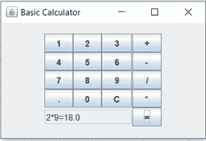

# Java 中的计算器程序

> 原文：<https://www.tutorialandexample.com/calculator-program-in-java/>

**Java 中的计算器程序**

一个**计算器**执行基本的数学运算，如加、减、乘等。在本节中，我们将使用 switch case 和 Java swing 在 Java 中创建一个**计算器程序。**

让我们从开关盒开始。

**使用开关情况**

**文件名:**基础计算示例*。* java

```
import java.util.*;
public class BasicCalculatorExample
{             
   public static void main(String[] args)
   {
      double a; //will store the first operand
      double b;//will store the second operand
      double result;//will store the final outcome
      char operator;// will store the operator acting upon the above two operands
      Scanner rdr = new Scanner(System.in);//taking user input
      System.out.print("Enter two numbers: \n");
      a = rdr.nextDouble(); //assigning first operand
      b = rdr.nextDouble(); //assigning second operand
      System.out.print("\n Enter one of the mentioned operators (+, -, *, /): \n");
      operator = rdr.next().charAt(0);//assigning operator
      switch(operator) {
         case '+': result = a + b;
            break;
         case '-': result = a - b;
            break;
         case '*': result = a * b;
            break;
         case '/': result = a / b;
            break;
      default: System.out.print("Please enter one of the mentioned operators.");
         return;
      }
      System.out.print("\nThe result is given as follows:\n");
      System.out.printf(a + " " + operator + " " + b + " = " + result);//printing the result
   }
}
```

**输出:**

```
Enter two numbers:
2
3
Enter one of the mentioned operators (+, -, *, /):
-
The result is given as follows:
2.0 - 3.0 = -1.0
```

解释:代码的工作非常简单。我们接受用户的输入，以分别获得操作数和运算符的值。然后，我们根据用户提供的运算符，对两个操作数进行运算。最后，我们正在打印最终结果。

现在，让我们观察下面的代码，它使用 Java-Swing 实现了一个基本的计算器。

**使用 Java Swing**

**文件名:**基础计算示例 1 *。* java

```
import java.awt.*;
import java.awt.event.*;
import javax.swing.*;
public class BasicCalculatorExample1 implements ActionListener
{
               private static JTextField inBox;// inBox will be used to display the result
               BasicCalculatorExample1(){}
               public static void main(String[] args)
               {
                                makeWindow();
               }
               private static void makeWindow()
               {         
                               //Setting name of the frame
                               JFrame fr = new JFrame("Basic Calculator");
                               //For closing Jframes
                               fr.setDefaultCloseOperation(JFrame.EXIT_ON_CLOSE);
                               createUI(fr);
                               fr.setSize(200, 200);  //setting frame size         
                               fr.setLocationRelativeTo(null);//for centering the window
                               fr.setVisible(true);//making the frame visible
}
private static void createUI(JFrame fr)
{
               JPanel pnl = new JPanel(); //creating object of JPanel
               BasicCalculatorExample1 basicCalculator = new BasicCalculatorExample1();
               //GridBagLayout is responsible for placing components in grid of columns and //rows
               GridBagLayout layout = new GridBagLayout(); //creating GridBagLayout object
               //Specifics constraints for components       
               GridBagConstraints gbc = new GridBagConstraints(); //creating               //GridBagConstraintsobject
               pnl.setLayout(layout);
               inBox = new JTextField(10); // Creating a text field. Also, setting default             //columns to 10  
               inBox.setEditable(false); // The text field is not editable
               //Creating buttons and putting appropriate labels on it
               JButton btn0 = new JButton("0");
               JButton btn1 = new JButton("1");
               JButton btn2 = new JButton("2");
               JButton btn3 = new JButton("3");
               JButton btn4 = new JButton("4");
               JButton btn5 = new JButton("5");
               JButton btn6 = new JButton("6");
               JButton btn7 = new JButton("7");
               JButton btn8 = new JButton("8");
               JButton btn9 = new JButton("9");
               JButton btnPlus = new JButton("+");
               JButton btnMinus = new JButton("-");
               JButton btnDivide = new JButton("/");
               JButton btnMultiply = new JButton("*");
               JButton btnClear = new JButton("C");
               JButton btnDot = new JButton(".");
               JButton btnEquals = new JButton("=");
               //Adding listeners to the above-created buttons
               btn1.addActionListener(basicCalculator);
               btn2.addActionListener(basicCalculator);
               btn3.addActionListener(basicCalculator);
               btn4.addActionListener(basicCalculator);
               btn5.addActionListener(basicCalculator);
               btn6.addActionListener(basicCalculator);
               btn7.addActionListener(basicCalculator);
               btn8.addActionListener(basicCalculator);
               btn9.addActionListener(basicCalculator);
               btn0.addActionListener(basicCalculator);
                btnPlus.addActionListener(basicCalculator);
               btnMinus.addActionListener(basicCalculator);
               btnDivide.addActionListener(basicCalculator);
               btnMultiply.addActionListener(basicCalculator);
               btnClear.addActionListener(basicCalculator);
               btnDot.addActionListener(basicCalculator);
               btnEquals.addActionListener(basicCalculator);
               gbc.fill = GridBagConstraints.HORIZONTAL; // Specifying constraint horizontal
               //Assigning the positioning of different buttons and adding them to the panel
               gbc.gridx = 0;       gbc.gridy = 0;       pnl.add(btn1, gbc);       
               gbc.gridx = 1;       gbc.gridy = 0;       pnl.add(btn2, gbc);
               gbc.gridx = 2;       gbc.gridy = 0;       pnl.add(btn3, gbc);
               gbc.gridx = 3;       gbc.gridy = 0;       pnl.add(btnPlus, gbc);
               gbc.gridx = 0;       gbc.gridy = 1;       pnl.add(btn4, gbc);
               gbc.gridx = 1;       gbc.gridy = 1;       pnl.add(btn5, gbc);
               gbc.gridx = 2;       gbc.gridy = 1;       pnl.add(btn6, gbc);
               gbc.gridx = 3;       gbc.gridy = 1;       pnl.add(btnMinus, gbc);
               gbc.gridx = 0;       gbc.gridy = 2;       pnl.add(btn7, gbc);
               gbc.gridx = 1;       gbc.gridy = 2;       pnl.add(btn8, gbc);
               gbc.gridx = 2;       gbc.gridy = 2;       pnl.add(btn9, gbc);
               gbc.gridx = 3;       gbc.gridy = 2;       pnl.add(btnDivide, gbc);
               gbc.gridx = 0;       gbc.gridy = 3;       pnl.add(btnDot, gbc);
               gbc.gridx = 1;       gbc.gridy = 3;       pnl.add(btn0, gbc);
               gbc.gridx = 2;       gbc.gridy = 3;       pnl.add(btnClear, gbc);
               gbc.gridx = 3;       gbc.gridy = 3;       pnl.add(btnMultiply, gbc);
               gbc.gridwidth = 3; //Now, the component width will span to 3 columns
               gbc.gridx = 0;       gbc.gridy = 4;       pnl.add(inBox, gbc); //Notice the width of   //text field in the output 
               gbc.gridx = 3;       gbc.gridy = 4;       pnl.add(btnEquals, gbc);
               //Adding the panel to the frame and positioning it to center. Options like North,           
               //West, South, East can also be tried instead of center.
               fr.getContentPane().add(pnl, BorderLayout.CENTER);       
   }
//This method displays text in the text field on the basis of the button pressed.
//It also invokes the *evaluate* method.
public void actionPerformed(ActionEvent e)
{
               String cmd = e.getActionCommand();
               if (cmd.charAt(0) == 'C')
               {                     
                              inBox.setText("");
               }
               else if (cmd.charAt(0) == '=')
               {                   
                              inBox.setText(evaluate(inBox.getText()));
               }
               else
               {                               
                              inBox.setText(inBox.getText() + cmd);
               }
}
//This method takes the expression in its argument and filters out the two operands and //the operator. Then, it does the calculation on the basis of the operator and returns the //result.
public static String evaluate(String exp)
{
               char[] arr = exp.toCharArray();
               String a = ""; String b = ""; String op = "";
               double ans = 0;
               for (int i = 0; i < arr.length; i++)
               {
                               if (arr[i] >= '0' && arr[i] <= '9' || arr[i] == '.')
                               {
                                              if(op.isEmpty())
                                              {
                                                             a += arr[i];
                                              }
                                              else
                                              {
                                                             b += arr[i];
                                              }
                               } 
                               if(arr[i] == '+' || arr[i] == '-' || arr[i] == '/' || arr[i] == '*')
                               {
                                              op += arr[i];
                               }
               }
               if (op.equals("+"))
                               ans = (Double.parseDouble(a) + Double.parseDouble(b));
               else if (op.equals("-"))
                               ans = (Double.parseDouble(a) - Double.parseDouble(b));
               else if (op.equals("/"))
                               ans = (Double.parseDouble(a) / Double.parseDouble(b));
               else
                               ans = (Double.parseDouble(a) * Double.parseDouble(b));   
               return a + op + b + "=" + ans;
} 
}
```

**输出:**



**解释:**首先，我们正在创建一个 **JFrame** 即**基本计算器**。然后，我们将面板添加到框架中。面板对中是通过*边界布局实现的。居中*。该面板包含所有按钮和文本字段。在输出中，我们可以看到按钮是水平对齐的。这是由于*gridbag 约束。横向* **。**

**GridBagConstraints** 还包含字段 **gridx** 和 **gridy** ，这有助于按钮的定位。对于**按钮 1** ，gridx = 0，gridy = 0。这就是为什么**按钮 1** 处于左上位置。对于**按钮=** ，gridx = 4，gridy = 4。因此，它采取的是右下方的位置。所有这些按钮都填充在由行和列组成的网格中。字段 **gridx** 处理行，而 **gridy** 处理列。在代码中，我们覆盖了 **actionPerformed()** 方法。当我们按下任何按钮时，这个方法就会被调用，它还负责进行计算并在文本字段中呈现输出。