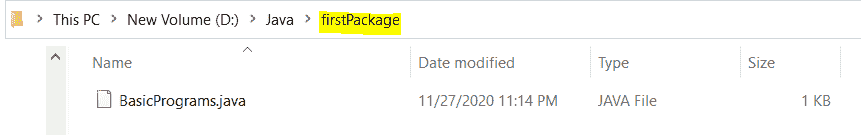

# Java 打包程序

> 原文：<https://www.tutorialandexample.com/package-program-in-java/>

**用 Java 封装程序**

Java 中的**包程序**帮助我们理解 Java 中包的意义。包主要用于将相似的类、接口和子包组合在一起。Java 中的包程序是数据隐藏(或数据封装)的最好例子。Java 中有两种类型的包，即**预定义/内置包**和**自定义包**。

### Java 中预定义/内置的包

内置软件包是 JDK 附带的软件包。我们必须将它包含在我们的代码中并使用它。一些预定义的软件包包括:

*   java.util :每当我们想要使用数据结构，比如字典、链接列表以及时间和日期操作的助手时，我们都会使用这个包。
    T3】
*   **java.io** :用于执行输入输出操作。

*   java.net:对于网络，我们使用 java.net 包。
    T3】
*   **java.lang** :这是自动导入的包。这个包包含了定义数学运算，原始数据类型如 int，float 等的类。**系统类在本包**中定义。

### Java 中的子包

子包是那些位于包内的包。我们必须显式地导入一个子包，因为自动导入特性并不包含在子包中。

为了更好地理解上述概念，让我们观察下面的代码。

**文件名:**包例*。* java

```
// Importing all classes of util package
import java.util.*;
public class PackageExample
{             
public static void main(String argvs[])
{
               Vector v = new Vector(); // Creating an object of class Vector.
               LinkedList ll = new LinkedList(); // Creating an object of class LinkedList.
               System.out.println("We are learning about Java-package.");  
}
}
```

**输出:**

```
We are learning about Java-package.
```

**解释:**因为我们已经导入了 java 的所有类。 *util* 包，因此，我们创建了 *Vector* 和 *LinkedList* 类的对象。然而 *util* 包并不仅仅局限于这两个类。它还包含许多其他类，这些类是我们导入的，但没有在我们的代码中使用。这就是为什么通常避免这种类型的导入。我们必须只导入那些我们将在代码中使用的类。因此，第一行代码可以替换为以下内容:

```
import.java.util.Vector;
import.java.util.LinkedList;
```

在这里，我们只加载 *Vector* 和 *LinkedList* 类，这是一个很好的实践。请注意， *util* 是驻留在 *java* 包中的一个包。因此，我们可以说 *util* 是一个子包。因为 *java.lang* 包已经导入。因此，语句*system . out . println()；*永远管用。

我们也可以重新编写上面的程序来生成相同的输出。

**文件名:**包例 1 *。* java

```
public class PackageExample1
{             
public static void main(String argvs[])
{
               // Providing package details along-with class name
               java.util.Vector v = new java.util.Vector(); // Creating an object of class Vector.
               java.util.LinkedList ll = new java.util.LinkedList(); // Creating an object of class
               // LinkedList.
               System.out.println("We are learning about Java-package.");  
}
}
```

**输出:**

```
We are learning about Java-package.
```

**解释:**因为我们没有使用导入语句。因此，我们必须提供每个包的细节以及类名。

**静态导入**

静态导入是适用于 Java 5(或更高版本)的独有特性。这种类型的导入允许在 Java 代码中使用作为 public **static** 出现在类中的方法和字段。下面的示例演示了同样的情况。

 ****文件名:**包例 2 *。* java

```
// *static* keyword is important in static import
import static java.lang.System.*;
public class PackageExample2
{             
public static void main(String argvs[])
{
               // No need for the System class here.
               out.println("We are learning about static import.");
}
}
```

**输出:**

```
We are learning about static import.
```

**解释:**自*出*是*系统*类的*静态*和*公共*成员，我们已经在*系统*类上做了一个*静态*导入。所以我们可以在代码中省略*系统*这个词。

 **### Java 中的用户定义包

用户定义的包称为**用户定义的包**。第一步是创建一个目录，可以选择任何名字。在我们的例子中，我们将使用名称 *firstPackage* 。在 *firstPackage* 目录中，我们创建一个名为*BasicPrograms.java*的. java 文件。



**文件名:**基本程序*。* java

//包名必须与目录名匹配。

```
package firstPackage;
public class BasicPrograms
{             
               // A method for printing names passed in its argument.
               public void printNames(String str)
               {       
                               System.out.print(str);       
               }
}
```

在 *firstPackage* 目录之外，我们创建另一个。java 文件，即 PackageExample3.java 的*。*

 *

**文件名:**包例 3 *。* java

```
// Importing class *BasicPrograms* by using package *firstPackage*.
import firstPackage.BasicPrograms;
public class PackageExample3
{
               public static void main(String[] args)
                {
                               // Creating object of BasicPrograms class
                               BasicPrograms obj = new BasicPrograms();
                               // Calling method *printNames()*
                               obj.printNames("Tutorial And Example");
               }
}
```

现在，使用*javac PackageExample3.java*编译*PackageExample3.java*文件，并使用 *java PackageExample3* 执行它。我们将获得以下输出。

**输出:**

```
Tutorial And Example
```

**解释:**类 *BasicPrograms* 的可见性将被最大化，因为我们使用了公共访问说明符。方法 *printNames()* 也是如此。因此，我们可以很容易地创建一个 *BasicPrograms* 的对象，并调用方法 *printNames()* 。但是为了工作，我们必须导入 *BasicNames* 类，这是在 *firstPackage* 的帮助下实现的。*****