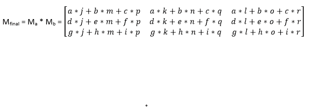

# Java 中的矩阵乘法程序

> 原文：<https://www.tutorialandexample.com/matrix-multiplication-program-in-java/>

**Java 中的矩阵乘法程序**

Java 中的**矩阵乘法程序**是我们之前已经讨论过的 Java 中矩阵程序的延续。在这一节，我们将学习如何乘矩阵。

 **为了求两个矩阵的乘积，我们按行取第一个矩阵的元素，按列取第二个矩阵的元素。下面给出了求矩阵乘法的步骤。

**第一步:**取两个输入矩阵。假设输入矩阵为:


这里，M <sub>a</sub> 是第一输入矩阵，M <sub>b</sub> 是第二输入矩阵。

**第二步:**比较第一个矩阵的列数和第二个矩阵的行数。它必须相等，否则乘法是不可能的。

在我们的例子中，矩阵 M <sub>a</sub> 的列数是 3，矩阵 M <sub>b</sub> 的行数是 3。

**步骤 3:** 现在，按行取第一个矩阵的元素，按列取第二个矩阵的元素，做乘法，然后做加法，得到结果矩阵的元素。因此，矩阵 M <sub>a</sub> 的第一行的元素被乘以矩阵 M <sub>b</sub> 的第一列的元素，并且第二行的元素被乘以第二列的元素，等等。数学上它可以表示为:



让我们在 Java 程序中实现这个逻辑。

**文件名:**矩阵乘法*。* java

```
 public class MatrixMultiplication
 {
 public static void main(String argvs[])
 {
                // first input matrix
                int[][] arr1 = { { 12, 3, 4 }, { 51, 23, 31 }, { 5, 6, 7 } };
                // second input matrix
                int[][] arr2 = { { 0, 50 }, { 45, 46 }, { 1, 9 } };
                // calculating number of columns of the first matrix
                int colOfArr1 = arr1[0].length;
                // calculating number of rows of the first matrix
                int rowOfArr1 = arr1.length;
                // calculating number of rows of the second matrix
                int rowOfArr2 = arr2.length;
                // calculating number of columns of the second matrix
                int colOfArr2 = arr2[0].length;
                if(colOfArr1 != rowOfArr2)
                {
                                System.out.print("Multiplication of the given matricx is not possible");
                }
                 // reaching here means the number of columns of the first matrix
                 // is equal to the number of rows of the second matrix.
                 // Hence, multiplication of the given matrices are possible
                else 
                {
                      // contains the output matrix
                       int[][] result = new int[rowOfArr1][colOfArr2];
                      // performing multiplication of the input matrices
                      for (int i = 0; i < rowOfArr1; i++) // loop for the rows of the output matrix
                      {
                                // loop for the columns of the output matrix
                                for (int j = 0; j < colOfArr2; j++)
                                {
                                               // for storing output of every element of the output matrix
                                               int sum = 0;
                                               for (int k = 0; k < colOfArr1; k++)
                                               {
                                                              // taking elements row-wise for the first input matrix
                                                               //and column-wise for the second
                                                              // input matrix
                                                               sum = sum + ( arr1[i][k] * arr2[k][j] );           
                                               }
                                               // updating our result matrix
                                               result[i][j] = sum;
                                }
                      }
                      // Displaying the outcome
                     System.out.println("Multiplication of the given two matrices is: ");
                      for(int row = 0; row < rowOfArr1; row++)
                      {
                                               for (int col = 0; col < colOfArr2; col++)
                                               {
                                                              System.out.print(result[row][col] + " ");
                                               }
                                               System.out.println("");
                      }
                }    
 }
 } 
```

**输出:**

```
 Multiplication of the given two matrices is:
 139 774
 1066 3887
 277 589 
```

**解释:**我们三次嵌套 Java for-loop 来实现我们的结果。最里面的循环处理乘法过程，对第一个输入数组按行取元素，对第二个输入数组按列取元素。我们观察到，在给定的矩阵中，第一个矩阵的列数等于第二个矩阵的行数。

> 两个矩阵相乘也是一个矩阵，其行大小等于第一个矩阵的行大小，列大小与第二个矩阵的列大小相同。

数学上，如果 M <sub>a</sub> 是 r1 * r2 矩阵，M <sub>b</sub> 是 r2 * c2 矩阵。那么，M <sub>a</sub> * M <sub>b</sub> = r1 * c2 矩阵。这里，r1 和 r2 是矩阵 M <sub>a</sub> 的行大小和列大小，而 r2 和 c2 是矩阵 M <sub>b</sub> 的行大小和列大小。**