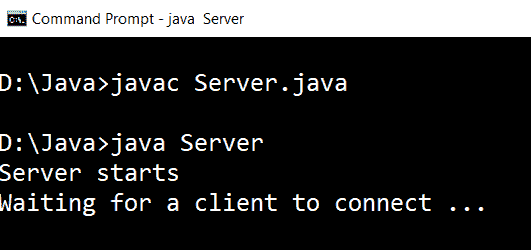
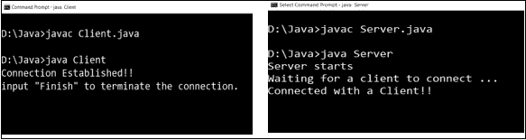
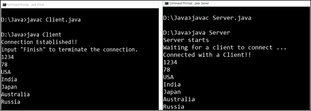
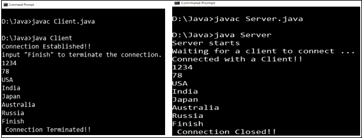

# Java 客户端服务器程序

> 原文：<https://www.tutorialandexample.com/client-server-program-in-java/>

**Java 客户端服务器程序**

客户端和服务器是套接字编程的两个主要组件。客户端是请求服务的计算机/节点，服务器是响应客户端的计算机/节点。在 Java 中，使用 **socket 编程**，我们可以连接客户端和服务器端。

一个**套接字**是一个发送和接收消息的端点。**它是 IP 地址和端口号的组合。在客户机-服务器程序中使用了两种类型的套接字:一种是客户机套接字，另一种是服务器套接字。在客户机-服务器程序中，客户机必须知道服务器的端点(IP 地址和端口号)在哪里，客户机希望将服务请求发送到哪里。在计算机世界里，客户机和服务器都是应用程序。服务器程序使用服务器套接字，而客户端程序使用客户端套接字进行通信。**

以下 Java 程序说明了如何在客户端和服务器之间建立通信。让我们从客户端程序开始。

**客户端程序**

**文件名:**客户端*。* java

```
 // import statements
 import java.net.*;
 import java.io.*;
 import java.util.Scanner;
 public class ClientSide
 {
     // initializing socket and input output streams
     private DataOutputStream dataOut  = null;
     private Scanner sc                = null;
     private Socket skt                = null;
     // constructor to create a socket with given IP and port address
     public Client(String address, int port)
     {
         // Establishing connection with server
         try
         {
              // creating an object of socket
             skt = new Socket(address, port);
             System.out.println("Connection Established!! ");
             System.out.println("input \"Finish\" to terminate the connection. ");
             // taking input from user
             sc = new Scanner(System.in);
             // opening output stream on the socket
             dataOut = new DataOutputStream(skt.getOutputStream());
         }
         catch(UnknownHostException uh)
         {
             System.out.println(uh);
         }
         catch(IOException io)
         {
             System.out.println(io);
         }
         // to store the input messages given by the user
         String str = "";
         // The reading continues until "Finish" is input
         while (!str.equals("Finish"))
         {
             input = sc.nextLine(); // reading input
             try
             {
                 dataOut.writeUTF(str); // writing to the underlying output stream
             }
             // For handling errors while writing to output stream
             catch(IOException io)
             {
                 System.out.println(io);
             }
         }
         System.out.println(" Connection Terminated!! ");
         // for closing the connection
         try
         {
             dataOut.close();
             skt.close();
         }
         catch(IOException io)
         {
             System.out.println(io);
         }
     }
     public static void main(String argvs[])
     {
          // creating object of class Client
         ClientSide client = new ClientSide("localhost", 6666);
     }
 } 
```

**解释:**我们知道要建立连接，客户端和服务器端都需要套接字。以下语句在客户端创建一个套接字:

```
sk = new Socket(address, port);
```

Socket 类的构造函数有两个参数:一个是 address (IP 地址),另一个是 port(端口号),并创建 Socket 类的对象。在代码中，我们使用了端口号 6666。这里，我们使用了 localhost，因为客户端应用程序和服务器应用程序运行在同一系统上。通常，客户端程序和服务器程序位于不同的系统上。在这种情况下，将使用运行服务器的系统的 IP 地址，而不是 localhost。确保在这种情况下使用完全限定的 IP 地址/名称。

端口号 6666 意味着客户端正试图在端口 6666 建立到服务器的连接。如果服务器出现在端口 6666，连接建立；否则，不会。

该声明

```
 dataOut = new DataOutputStream(skt.getOutputStream());
 dataOut.writeUTF(str); 
```

写入套接字上打开的输出流。服务器正在读取输出流中写入的任何内容。这里， *str* 是一个字符串，它读取用户输入的任何内容。变量 *str* 的读取持续到用户输入“完成”为止。如果在写入底层流时出现任何错误， *IOException* 的 catch 块就会出现。

如果我们在 Socket 类的构造函数的参数中给出任何无效的 IP 地址，上面 catch 块的以下代码片段就会起作用。

```
 catch(UnknownHostException uh)
 {
 System.out.println(uh);
 } 
```

例如，如果我们键入“localhost ”,而不是“localhost ”,上面的 catch 块的语句就会起作用。

现在，让我们讨论服务器端程序。

**服务器端程序**

**文件名:**服务器端*。* java

```
// import statements
 import java.net.*;
 import java.io.*;
 public class Server
 {
     //initializing input stream and socket
     private DataInputStream inStream = null;
     private Socket skt = null;
     private ServerSocket srvr = null;
     // constructor of the class Server
     public Server(int port)
     {
         // Starting the server and waiting for a client 
         try
         {
             srvr = new ServerSocket(port);
             System.out.println("Server starts");
             System.out.println("Waiting for a client to connect ... ");  
             skt = srvr.accept(); // waiting for  a client to send connection request
             System.out.println("Connected with a Client!! ");
             // Receiving input messages from the client using socket
             inStream = new DataInputStream( skt.getInputStream() );
             String str = ""; // variable for reading messages sent by the client
             // Untill "Finish" is sent by the client,
             // keep reading messages
             while (!str.equals("Finish"))
             {
                 try
                 {
                     // reading from the underlying stream
                     str = inStream.readUTF();
                     // printing the read message on the console
                     System.out.println( str );
                 }
                // For handling errors
                 catch(IOException io)
                 {
                     System.out.println( io );
                 }
             }
             // closing the established connection
             skt.close();
             inStream.close();
             System.out.println(" Connection Closed!! ");
         }
         // handling errors
         catch(IOException i)
         {
             System.out.println(i);
         }
     }
     public static void main(String argvs[])
     {
         // creating an object of the class ServerSide
         Server server = new Server(6666);
     }
 } 
```

**解释:**声明

```
srvr = new ServerSocket(port);
```

创建一个新的套接字并将其绑定到端口号，该端口号作为参数(port)传递给类 *ServerSocket* 的构造函数。在代码中，我们使用了端口号 6666。这意味着服务器正在监听端口号 6666，客户端必须使用这个端口号(6666)连接到服务器。

该声明

```
skt = srvr.accept();
```

由服务器用来接受来自客户端的连接请求。服务器在调用方法 *accept()后等待。*等待持续到服务器收到客户端的连接请求。在这里，等待意味着在服务器收到连接请求之前， *accept()* 方法之后编写的任何语句都不会被执行。在这个位置，我们说服务器正在监听给定的端口号，在我们的例子中是 6666。

为了读取从客户端发送的消息，我们必须打开套接字的输入流。下面的语句也是如此。

```
inStream = new DataInputStream( skt.getInputStream() );
```

方法 *getInputStream()* 返回附加到套接字的输入流。在 Java 中，数据输出流用于写入数据，这些数据稍后可以被输入流读取。同样的情况也发生在上面的语句中。当我们调用类 *DataInputStream* 的 *readUTF()* 方法时，我们从客户端发送的任何东西都在这里被读取。下面的语句也是如此

```
str = inStream.readUTF();
```

在客户端，我们使用了方法 *writeUTF()* 来完成流的写入部分。类似地，在服务器端，我们使用 here readUTF()从流中读取数据。 *readUTF()* 方法返回一个 Unicode 字符串，我们将它存储在变量 *str 中。*继续读取，直到客户发送“完成”命令。在阅读完单词“Finish”之后，连接被关闭。下面的语句达到了同样的效果。

```
 skt.close();
 inStream.close(); 
```

**执行步骤**

首先，应该执行服务器端程序。这是因为，当我们开始执行客户端程序时，它开始在端口号 6666 上寻找服务器。因为我们没有先执行服务器端程序，所以没有服务器监听端口号 6666。因此，客户端程序引发了 *NullPointerException* 。因此，客户端程序必须在服务器端程序执行之后执行。

为了执行上述程序，打开两个命令提示符，一个用于客户端程序，另一个用于服务器端程序。分别使用命令 *javac* 和 *java* 进行编译和执行。

**输出:**

首先，我们执行服务器端程序。



我们看到在执行之后，服务器等待客户机连接。现在，执行客户端程序，观察服务器如何响应。



我们看到服务器响应消息*与客户端连接！！*现在，连接已经建立，我们可以向连接的服务器发送消息了。观察以下快照。



1234，78，…，俄罗斯是从客户端发送的输入。这些输入消息在服务器端显示出来。要终止连接，我们必须输入单词 Finish。



输入单词“Finish”后，两边的连接都关闭。

**客户端-服务器应用示例**

客户机-服务器应用程序有许多用途。下面提到其中的几个。

 ***   每当我们使用 ATM 查询银行账户余额或取款时，我们实际上都参与了客户端-服务器通信。自动取款机被设计成能与银行服务器互动。写在服务器端的程序服务于我们通过 ATM 发送的请求。很明显，自动取款机充当客户端，银行服务器充当服务器。

*   我们经常使用网络浏览器，如 Opera、Mozilla Firefox、Google Chrome 等。，用于上网。这些浏览器充当向服务器发送请求的客户端。浏览器将连接请求发送到哪个服务器是由用户给浏览器的 URL(统一资源定位符)决定的。
*   发送邮件也是客户机-服务器应用程序的一个例子。愿意发送电子邮件的客户端向邮件服务器发送连接请求。然后，服务器向客户端请求身份验证(密码和电子邮件地址)。如果密码和电子邮件地址匹配，电子邮件将被发送到目标地址。**