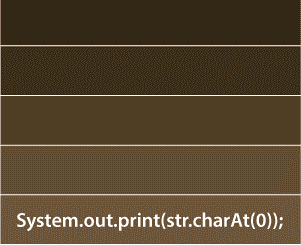
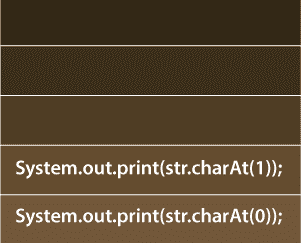
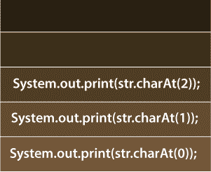
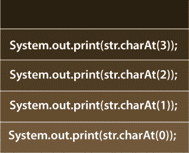
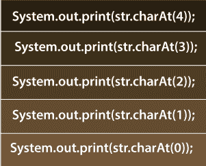
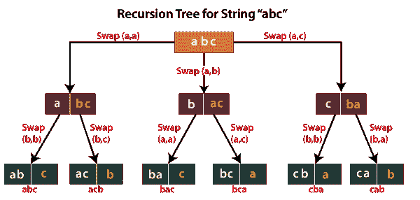

# Java 中的递归程序

> 原文：<https://www.tutorialandexample.com/recursion-program-in-java/>

Java 中的**递归程序演示了递归的用法。**一个函数/方法一次又一次地调用自己**的过程被称为递归。**每个递归调用都被压入堆栈。**进行递归调用的函数/方法称为递归方法。递归类似于迭代。然而，递归和迭代是不一样的。相似之处在于**递归和迭代都是反复执行同一段代码**。在循环中，有一个条件部分，如果评估为假，则该条件部分负责循环终止。而在递归中，有一个**基础用例负责递归**的终止。在进行递归之前，我们必须知道以下两件事:**

1)将终止递归的基本情况。

2)必须知道如何将一个较大的问题分成较小的问题，然后将较小的问题分成更小的子问题，并继续这样做，直到我们达到基本情况。

### 基本情况是什么？

基本案例是一个基本问题(基本)的解决方案。也就是不能再分成更小的问题了。让我们通过一个数的阶乘来理解递归。

假设我们想求数字 5 的阶乘。现在，我们把这个问题分成更小的问题。

5! = 5 × 4!

现在问题是求 4 的阶乘，这个问题也可以化简。

4! = 4 × 3!

同理，3！被简化为

3! = 3 × 2!

为了 2！我们有

2! = 2 × 1!

为了 1！我们有

1! = 1 × 0!

数学方面，0！被定义为 1。因此，

0! = 1

现在，我们不能减少 0！把更小的问题分解为负数的阶乘是不可能的。从而 0！= 1 是[阶乘](https://www.tutorialandexample.com/factorial-program-in-java/)问题的基本情况。基本情况有助于打破递归。在没有基本情况下，递归将继续无限运行，最终导致堆栈溢出。发生堆栈溢出是因为每次递归调用都会消耗一些内存(记住！每次递归调用都被压入堆栈)，内存有限，导致堆栈溢出。让我们看看递归的一些应用。

### 递归的应用

递归的一些常见应用有:

**1)寻找数组中的最小值**

**文件名:**最小值示例*。* java

```
 // importing the class Arrays
 import java.util.Arrays;
 public class MinimumValueExample 
 {
 // Method for finding minimum element in the array   
 static int findMin(int inputArr[], int index, int size)
 {
     // base case
     if(size == 1)
     {
         return inputArr[index];
     }
     // recursively solving the problem by diving it in the smaller problems
     return Math.min( inputArr[index], findMin(inputArr, index + 1, size - 1));
 }
 public static void main(String argvs[]) 
 {
     int numArr[] = { 27, 56, 90, 12, 120, 263 }; // input array
     // displaying the input array
     System.out.println("The input Array is : " + Arrays.toString(numArr));
     int length = numArr.length; // finding size of the input array
     int minVal = findMin(numArr, 0, length); // calling the method and storing its result
     // displaying the final outcome
     System.out.print("Minimum element of the input array is: " + minVal + " \n ");
 }
 } 
```

**输出:**

```
 The input Array is : [27, 56, 90, 12, 120, 263]
 Minimum element of the input array is: 12 
```

**说明:**代码中， *findMin()* 方法是递归查找输入数组的最小值元素。在每次递归调用中，方法 *findMin()* 将较大的数组分割成较小的数组，并不断减小数组的大小，直到输入数组的大小为 1，即数组中只有一个元素。如果一个数组只包含一个元素，那么这个元素就是最小元素。它构成了问题的基本情况。让我们在这里学习递归是如何工作的。

为了找到包含 6 个元素的输入数组的最小值，我们可以在数组的后 5 个元素中找到最小值，并与第一个元素进行比较。假设 *x* 是最后 5 个元素的最小值，那么将 *x* 与第一个元素比较，即 27。 *x* 和 27 的最小值就是我们的答案。同样的事情也发生在第一次递归调用中。数学上，

(27，56，90，12，120，263)的最小值= 27 的最小值，即(56，90 12，120 263)的最小值

同样，对于第**次递归调用**

(27 的最小值，56，90 12，120 263 的最小值)= 27 的最小值，56 的最小值，90，12，120，263 的最小值)

对于**的第三次递归调用**

(27 的最小值，56 的最小值，90，12，120，263 的最小值)= 27 的最小值，56 的最小值，90 的最小值，12，120，263 的最小值)

对于**的第四次递归调用**

(27 的最小值，56 的最小值，90 的最小值，12，120，263 的最小值))= 27 的最小值，56 的最小值，90 的最小值，12 的最小值，120，263 的最小值))

对于第**次递归调用**

(27 的最小值，56 的最小值，90 的最小值，12 的最小值，120，263 的最小值)))= 27 的最小值，56 的最小值，90 的最小值，12 的最小值，120 的最小值，(263 的最小值))))

现在我们到达基本情况，即(263)的 Min，也就是 263。

由于每个递归调用都被压入堆栈，因此首先，最后一个递归调用进入画面。这是因为堆栈的工作原理是后进先出。

因此，**第五次递归调用**减少为

(27 的最小值，56 的最小值，90 的最小值，12 的最小值，120，263 的最小值)))= 27 的最小值，56 的最小值，90 的最小值，12 的最小值，120，263 的最小值)

我们知道 120 和 263 的最小值是 120。因此，对于第四次递归调用,**,我们有**

(27 的最小值，56 的最小值，90 的最小值，12，120，263 的最小值)))= 27 的最小值，56 的最小值，90 的最小值，12，120 的最小值)

12 和 120 的最小值是 12。因此，对于第**次递归调用**

(27 的最小值，56 的最小值，90，12，120，263 的最小值)= 27 的最小值，56 的最小值，90，12 的最小值)

类似地，对于第二个递归调用，,我们有

(27 的最小值，56，90 12，120 263 的最小值)= 27，12 的最小值

对于第一次递归调用，27 和 12 的最小值最终是 12

(27，56，90，12，120，263)的最小值= 12。

因此，12 是输入数组的最小值。

注意，上面程序中使用的递归称为**尾递归**。因为**递归调用是 *findMin()* 方法中的最后一个语句**。

**2)以相反的顺序打印字符串**

**文件名:**reverse string 示例*。* java

```
 public class ReverseStringExample
 {
     // Method for printing the input string in the reverse order
     public static void reverseString(String str, int size, int index)
     {
         // Handling the base case
         if(index == size)
         {
             return;
         }
         // recursively printing the string in the reverse order
         reverseString(str, size, index + 1);
         // Printing the string in reverse order
         System.out.print(str.charAt(index));
     }
     public static void main(String argvs[])
     {
         String s = "apple"; // input string
         int length = s.length(); // calculating length of the input string
         // calling the method reverseString
         reverseString(s, length, 0);
     }
 } 
```

**输出:**

```
elppa
```

**解释:**在上面的程序中，我们已经使用了存储每个递归调用的内置堆栈来反转输入字符串。递归调用后的打印语句被压入堆栈。在第一次递归调用中，变量 index 的值为 0。于是，语句*system . out . print(str . charat(0))；*被压入堆栈。下图显示了同样的情况。



对于第二次递归调用，索引的值为 1。因此，语句*system . out . print(str . charat(1))；*被推入堆栈。第二次递归调用后堆栈的当前状态是:



对于第三次递归调用，index = 2。因此，第三次递归调用后的更新状态是:



类似地，对于第四次递归调用，index = 3，堆栈存储四条语句。如下图所示。



在第五次也是最后一次递归调用之后，堆栈包含五条语句。观察下图。



第五次递归调用后，索引的值为 5。因此，我们满足基本情况，递归被终止。现在，无论堆栈中有什么语句，都会被逐一执行。由于堆栈是根据 LIFO 原理工作的，所以语句*system . out . print(str . charat(4))；*先被执行。在字符串*苹果*中，出现在第 4 个<sup>第</sup>个索引处的字符是 e。因此，字母 e 首先被打印。然后，语句*system . out . print(str . charat(3))；执行*并打印字母 *l* 。之后是语句*system . out . print(str . charat(2))；执行*并打印字母 *p* 。然后，*system . out . print(str . charat(1))；*打印字母 *p* ，最终打印字母 *a* 。因此，它打印出*埃尔帕*。

上述程序中使用的递归称为**头递归**。在头递归中，**递归语句不是调用递归的方法**的最后一条语句。在代码中，递归之后有一个 print 语句。

**迭代和递归的区别**


| **迭代** | **递归** |
| 迭代适用于循环。

 | 递归适用于方法。 |
| 反复执行代码，直到循环的条件部分被评估为假。

 | 反复执行代码，直到满足基本条件。 |
| 内存消耗更少。 | 每次递归调用被压入堆栈时，内存消耗会更多。 |
| 时间消耗更少。 | 时间消耗更多，因为每次递归调用都要花费一些时间。 |
| 如果循环的条件部分始终为真，迭代可以永远继续下去。 | 如果没有提到或没有达到基本条件，递归将由于堆栈溢出错误而停止。 |
| 迭代冗长。因此，很容易理解。 | 递归并不冗长。因此，很难理解。 |


### 选择哪一个:迭代还是递归，还是两者都选？

从上表可以得出结论，迭代应该优先于递归，这在一定程度上是正确的，但并不总是如此。在许多情况下，使用迭代方法编写代码变得极其困难。比如河内 的 **[塔谜题，是无法借助一个回环解决的。](https://www.tutorialandexample.com/tower-of-hanoi-program-in-java/)**

**遍历树**是递归优先于迭代的另一个例子。因此，我们观察到即使迭代很快，了解递归也是必须的。

递归和迭代，当一起使用时，是一个致命的组合。在许多情况下，使用迭代或递归都不可能解决问题。然而，如果同时使用递归和迭代，我们可以解决这个问题。一个这样的例子是打印一个字符串的**排列。**

**字符串的排列**

假设，我们有一个字符串 *abc* 。那么，字符串的排列 *abc* 就是:

abc acb bac bca cab

该方法是将给定字符串的一个字母的位置固定在第一个位置，然后对该字符串的其余字母进行排列。下面给出了排列字符串 abc 的字母所涉及的步骤。

第一步:首先，我们将字母 *a* 固定在第一个位置。然后，剩下字母的排列顺序是: *bc* 和 *cb* 。因此，我们得到 *abc* 和 *acb* 。为了首先实现 *b* 和*c*的排列，我们将 *b* 固定在第二个位置，将 *c* 固定在第三个位置，得到 *bc* 。然后， *c* 在第二位置， *b* 在第三位置，得到 *cb* 。

第二步:现在，我们将字母 *b* 固定在第一个位置。于是，剩下的字母是 *a* 和 *c* ，它们的排列是 *ac* 和 *ca* 。这一次，我们得到 *bac* 和 *bca* 。字母 *a* 和 *c* 的排列与我们在步骤 1 中所做的相同。

**第三步:**同样，我们将 *c* 固定在第一个位置，对其余字母进行排列，得到 *cab* 和 *cba* 。

下图演示了同样的情况。



在图中，如果我们看前三个箭头，我们看到上面写着 Swap(a，a)，Swap(a，b)，Swap(a，c)。互换(a，a)是指；首先，我们将字母 *a* 固定在第一个位置。Swap(a，b)表示 *b* 固定在第一个位置，Swap(a，c)表示 *c* 固定在第一个位置。同理，其他箭头上写的东西也可以解释。

现在，观察下面的 Java 程序。

**文件名:**字符串置换*。* java

```
 public class StringPermutation
 {
     // for swapping characters of the input string
     public static String swap(String s, int i,  int j)
     {
         // convreting the string into character array
         char[] ch = s.toCharArray();
         // swapping characters of the index i and j
         char t = ch[i];
         ch[i] = ch[j];
         ch[j] = t;
         // converting the character array into a new String
         String newString = new String(ch);
         //returning the new string
         return newString;
     }
     // Method to find the permutation of the input string.
     // The method takes three arguments: first is the input string
     // second is the starting index, and third is the ending index
     public static void permuteString(String s, int st, int end)
     {
         // Handling the base case
         if(st == end)
         {
             System.out.println(s); // printing the string
             return;
         }
         // iterating over every character of the input string
         for(int i = st; i <= end; i++)
         {
             // In the first swap, we are
             // fixing the letters of the input string at the index st.
             String swappedString = swap(s, st, i);
             // recursive call for the next character
             permuteString(swappedString, st + 1, end);
             // second swap for doing backtracking to re-store
             // the state of string that was present before the recursive call
             swap(swappedString, st, i);
         }
     }
     public static void main(String argvs[])
     {
         String str = "abc"; // input string
         int size = str.length(); // calculating length of the input string
         // calling the method permuteString()
         permuteString(str, 0, size - 1);
     }
 } 
```

**输出:**

```
 abc
 acb
 bac
 bca
 cba
 cab 
```

**解释:**在上面的程序中，我们看到递归调用放在了两个 swap 语句之间。第一次交换是在特定索引处固定字母的位置，第二次交换是在递归之前恢复字符串的状态。上图也是这么说的。如果我们观察前三个箭头，我们看到它是从弦的同一状态出现的，即 *abc* 。这三个箭头中的每一个都产生了弦的两种不同状态 *abc* 。但问题是如果我们已经打印了 *abc* 和 *acb，*我们怎么能打印 *bac* 或 *bca* 。这就是第二次互换的救援之处。第二次交换恢复了更改，最终，我们从 *bca* 获得了原始字符串，即 *abc* 。因此，首先我们从 *abc* 移动到 *bca* ，然后再从 *bca* 移动到 *abc* ，即移动图中提到的箭头的相反方向。这叫**回溯**。在我们从 *acb* 得到 *abc* 后，第一次交换再次作用于 *abc* ，然后我们得到 *bac* 和 *bca* 。对琴弦 *cba* 和 *cab* 的类似解释。