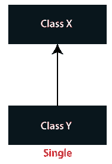
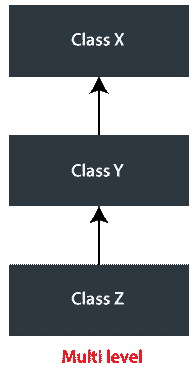
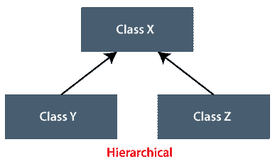
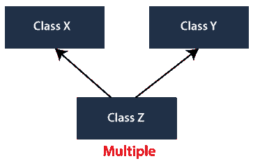
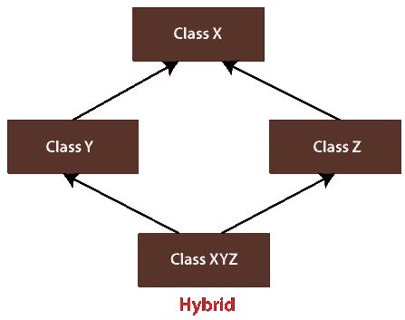

# Java 中的继承程序

> 原文：<https://www.tutorialandexample.com/inheritance-program-in-java/>

**Java 中的继承程序**

**继承**是面向对象编程的重要支柱之一，它促进了编程中的父子关系。使用继承，我们可以在现有类的帮助下创建一个新类。这个新创建的类也称为派生类、子类或子类，而现有的类称为基类、父类或超类。子类获得了父类的特征。**继承**在编程世界中被广泛使用，因为它按照层次顺序管理信息(父到子，子到子，等等)。使用继承的主要优点是:

1)有助于实现代码的重用。

2)促进子类中的方法重写。

**继承主要用在有 IS-A 关系的地方**。举个例子，

*   乌鸦**是一种**鸟。
*   蟒蛇**是一种**爬行动物。
*   员工**是一个**人。
*   苹果**是一种**水果。
*   牙医是医生。

在上面的例子中，Crow、Python、Employee、Apple 和 Dentist 是子类，而 Bird、爬虫、Human、Fruit 和 Doctor 是父类。Java 中的**继承程序展示了父子关系是如何通过编程实现的。**

**语法:**

```
 class XYZ extends ABC
 {
 …
 …
 } 
```

在 Java 中，关键字*扩展*用于实现继承。在上面的代码片段中，类 *XYZ* 正在获取类 *ABC* 的特性。因此， *XYZ* 是子类， *ABC* 是基类。

**代码在继承中的可重用性**

考虑下面的代码。

**档案名称:** MainClass.java

```
 class Fruit
 {
    String fruitName;
 }
 // child class Apple is inheriting parent class Fruit
 class Apple extends Fruit
 {
 }
 // child class Banana is inheriting parent class Fruit
 class Banana extends Fruit
 {
 }
 public class Main
 {
 public static void main(String argvs[])
 {
     // creating object of the child class Apple
                Apple apple = new Apple();
                // assigning the fruit name
                apple.fruitName = "Apple";
                // displaying the fruit name
                System.out.println("Fruit name is " + apple.fruitName);
                // creating object of the child class Banana
                Banana banana = new Banana();
                // assinging the fruit name
                banana.fruitName = "Banana";
                // displaying the fruit name
                System.out.println("Fruit name is " + banana.fruitName);
 }
 } 
```

**输出:**

```
 Fruit name is Apple
 Fruit name is Banana 
```

**说明:**代码中，字符串字段*水果名称*只在*水果*类中声明。两个子类:Apple 和 Banana 是从水果类继承而来的。因此，字符串字段 *fruitName* 出现在类 Apple 和 Banana 中。在 driver 方法中，我们创建了两个对象:Apple 和 Banana 类各一个。使用创建的对象，我们访问两个类的字段 fruitName。因此，我们看到无论我们在父类中声明什么，子类都会自动访问它。我们不必明确地作出声明。这就是代码重用的实现方式。与字段类似，在方法中我们也可以实现代码的重用。

**继承中的方法覆盖**

父类中定义的方法可以在子类中被重写。重写方法意味着在子类中改变方法的定义。我们借助一个程序来了解一下。

**档案名称:** MainClass.java

```
 class Fruit
 {
                // declaration of a string field
                String fruitName;
                // a method that tells about seeds in a fruit
                void seeds()
                {
                                System.out.println("Some fruit has no seeds. ");
                }
 }
 // child class Banana is inheriting the parent class Fruit
 class Banana extends Fruit
 {
                // overriding the method seeds() in the child class Banana
                @Override
                void seeds()
                {
                                System.out.println("Banana has no seeds. ");
                }
 }
 public class MainClass
 {
 // driver method
 public static void main(String argvs[])
 {
                // creating object of the child class Banana
                Banana banana = new Banana();
                // assinging the fruit name
                banana.fruitName = "Banana";
                // displaying the fruit name
                System.out.println("Fruit name is " + banana.fruitName);
                // invoking the method seeds() on the object banana
                banana.seeds();
 }
 } 
```

**输出:**

```
 Fruit name is Banana
 Banana has no seeds. 
```

**解释:**方法 *seeds()* 在 Banana 类中被覆盖。请注意，在重写方法时，方法的定义发生了变化，而不是它的签名。在对象 banana 上调用方法 *seeds()* 时，调用方法 *seeds()* 的被覆盖版本(观察输出)。要停止覆盖，在子类中注释/删除方法 *seeds()* (自己动手，然后观察输出中发生了什么变化。).在重写方法之前，最好添加“@Override”。这增强了代码的可读性。但是，省略“@Override”对输出没有任何影响。

**注意:**在 Java 中重写一个方法时，我们不能为子类中被重写的方法指定一个较弱的访问说明符。让我们看看如果我们在类 Fruit 的方法 *seeds()* 中添加关键字 *public* 会发生什么。

**档案名称:** MainClass.java

```
 class Fruit
 {
                // declaration of a string field
                String fruitName;
                // a method that tells about seeds in a fruit
                public void seeds() // added keyword public
                {
                                System.out.println("Some fruit has no seeds. ");
                }
 }
 // child class Banana is inheriting the parent class Fruit
 class Banana extends Fruit
 {
                // overriding the method seeds() in the child class Banana
                @Override
                void seeds()
                {
                                System.out.println("Banana has no seeds. ");
                }
 }
 public class MainClass
 {
 // driver method
 public static void main(String argvs[])
 {
                // creating object of the child class Banana
                Banana banana = new Banana();
                // assinging the fruit name
                banana.fruitName = "Banana Fruit";
                // displaying the fruit name
                System.out.println("Fruit name is " + banana.fruitName);
                // invoking the method seeds() on the object banana
                banana.seeds();
 }
 } 
```

**输出:**编译错误

```
 /MainClass.java:18: error: seeds() in Banana cannot override seeds() in Fruit
                void seeds()
                     ^ 
```

**试图分配较弱的访问权限；已公开**

1 个错误

**解释:**方法 *seeds()* 在父类中具有公共访问说明符，而在子类中，seeds()具有*默认*访问说明符，该说明符弱于*公共*访问说明符。因此，我们减少了方法 *seeds()* 的可见性。因此，我们在执行上面的程序时得到了编译错误。

**Java 中的继承类型**

Java 中有五种类型的继承。

**1)单继承**

 **

在上图中，类 Y 正在获取类 X 的属性。因此，类 X 是父类，类 Y 是子类。下面的 Java 程序也演示了这一点。

```
 // X is the parent class
 class X
 { 
 void foo()
 {
     System.out.println("In the method foo ... ");
 } 
 }
 // Y is the child class
 class Y extends X
 { 
 void zoo()
 {
     System.out.println("In the method zoo ... ");
 } 
 }
 public class SingleInheritance
 { 
 // driver method
 public static void main(String argvs[])
 { 
     // creating an object of class Y
     Y y=new Y();
     // class Y has herited the method foo()
     y.foo(); 
     y.zoo(); 
 }
 } 
```

**输出:**

```
 In the method foo ...
 In the method zoo ... 
```

**2)多级继承**



多层次继承是单一继承的延伸。在上图中，类 Y 正在获取类 X 的属性，而类 Z 正在从类 Y 继承属性。因此，类 Y 是子类，因为它从类 X 继承属性。类 Y 也是父类，因为类 Z 正在获取类 Y 的属性。

```
 // X is the parent class
 class X
 { 
 void foo()
 {
     System.out.println("In the method foo ... ");
 } 
 }
 // Y is the child class
 class Y extends X
 { 
 void zoo()
 {
     System.out.println("In the method zoo ... ");
 } 
 }
 // Here, class Y act as the parent class.
 // class Z is the child class of class Y.
 class Z extends Y
 { 
 void coo()
 {
     System.out.println("In the method coo ... ");
 } 
 }
 public class MultilevelInheritanceExample
 { 
 // driver method
 public static void main(String argvs[])
 { 
     // creating an object of class Z
     Z z=new Z();
     // class Z has herited the methods foo() and zoo()
     z.foo(); 
     z.zoo();
     z.coo();
 }
 } 
```

**输出:**

```
 In the method foo ...
 In the method zoo ...
 In the method coo ... 
```

**3)层次继承**



在层次继承中，一个父类有多个子类。在给定的图中，类 Y 和类 Z 从类 x 继承属性。下面的例子说明了相同的情况。

```
 // X is the parent class
 class X
 { 
 void foo()
 {
     System.out.println("In the method foo ... ");
 }
 void zoo()
 {
     System.out.println("In the method zoo ... ");
 }
 }
 // Y is the child class of class X
 class Y extends X
 { 
 }
 // Z is the child class of class X
 class Z extends X
 { 
 }
 public class HierarchicalInheritanceExample
 { 
 // driver method
 public static void main(String argvs[])
 { 
     // creating an object of class Y
     Y y=new Y();
     // creating an object of class Z
     Z z=new Z();
     // class Y has herited the methods foo() and zoo()
     y.foo(); 
     y.zoo();
     // class Z has herited the methods foo() and zoo()
     z.foo(); 
     z.zoo();
 }
 } 
```

**输出:**

```
 In the method foo ...
 In the method zoo ...
 In the method foo ...
 In the method zoo ... 
```

**4)多重继承**



多重继承的对立面是层次继承。在层次继承中，一个子类有多个父类。注意，Java 不支持多重继承。为了理解其背后的原因，考虑下面的例子。

**文件名:**MultipleInheritanceExample.Java

```
 // X is the parent class
 class X
 { 
 void foo()
 {
     System.out.println("In the method foo ... ");
 }
 }
 // Y is also the parent class
 class Y
 { 
  void foo()
 {
     System.out.println("In the method zoo ... ");
 }
 }
 // Z is the child class of class X and Y
 class Z extends X, Y
 { 
 }
 public class MultipleInheritanceExample
 { 
 // driver method
 public static void main(String argvs[])
 {     
     // creating an object of class Z
     Z z=new Z();
     // class Z has herited the methods foo() of class X and foo() class Y
     z.foo(); 
 }
 } 
```

**输出:**编译错误

**解释:**类 Z 是类 X 和类 Y 的子类，同样，父类 X 和 Y 包含相同签名的方法 *foo()* 。因此，子类 Z 继承了类 X 和 y 中提到的两个方法 foo()。这导致了在执行方法 z.foo()时的两难境地，因为不清楚 z.foo()是调用类 X 的方法 foo()还是调用类 y 的方法 foo()。因此，为了完全消除这种情况，Java 从不支持多重继承。

**5)混合遗传**



混合继承是多重继承和层次继承的混合。上面的部分，其中类 Y 和类 Z 是类 X 的子类，表示分层继承，而下面的部分，其中类 XYZ 获得类 Y 和类 Z 的属性，表示多级继承。由于多级继承是混合继承的一部分，因此 Java 不支持混合继承。**