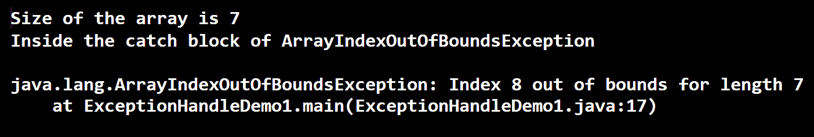

# Java 中的异常处理程序

> 原文：<https://www.tutorialandexample.com/exception-handling-program-in-java/>

**Java 中的异常处理程序**

**异常**指不正常的事情。在 Java 中，异常被视为扰乱程序正常流程的问题。异常导致 Java 程序异常终止。有许多可能发生异常的情况。下面提到其中的几个。

*   当一个数被零除时，例如，*int x = 6/0；*这种说法在语法上是正确的，但零在数学上永远无法除尽一个数。因此，会引发异常。
*   连接到服务器，但服务器已关闭。
*   打开一个文件，但该文件已被某人删除。
*   访问数组中不存在的索引。
    比如在语句 *int arr[] = {7，8，9}中；，*数组包含三个元素 arr[0]，arr[1]，arr[2]，但是如果有人试图访问 arr[10]，那么这是不可能的，因为第 10 个<sup>的</sup>索引不在数组中，导致异常的产生。
*   当 JVM 耗尽内存时。
*   用户输入了一些无效数据。例如，当有人被要求写他/她的名字时，他/她键入 1342。

上面提到的一些异常情况是由于程序员的错误造成的；有些是由于资源故障，而有些是由于用户错误。Java 中的**异常处理程序演示了如何处理异常以保持程序的正常运行。**

### Java 中异常的层次结构

  

exception 的所有类都是从 java.lang.Exception 类派生的，而 Exception 类本身是 Throwable 类的子类。错误也是 Throwable 类的子类型。

### 处理异常的需要

假设一个 Java 程序中有 8 条语句，在第 4 条<sup>到第</sup>条语句发生了异常。由于异常，程序的正常流程被中断，导致程序异常终止。因此，第 4 个<sup>语句之后的语句永远不会被执行。为了保证第 4 条<sup>第</sup>条语句之后的语句被执行，或者保证程序的正常流程，需要处理第 4 条<sup>第</sup>条语句引发的异常。</sup>

### Java 中异常的类型

Java 中的异常可以分为以下三类:

1)检查异常

2)未检查的异常

3)误差

让我们详细讨论每种类型的异常。

**检查异常**

检查异常是那些在编译时被通知或处理的异常。因此，这些异常也称为编译时异常。这些异常永远不能被忽略，因为它是在编译时生成的。例如，如果我们试图访问一个不存在的文件，它会抛出 FileNotFoundException。考虑下面的代码。

**档案名称:**档案 filenotfoundexceptiondemo . java

```
 // import class FileReader
import java.io.FileReader;
// import class File
import java.io.File;
public class FileNotFoundExceptionDemo
{
// Driver Method
public static void main(String argvs[])
{                            
  // creating an fileObj using the text file path
  // along with its name
  File fileObj = new File("D:\\file.txt");
  // creating the object fr using the object fileObj
  // This object fr is used to read the file
  FileReader fr = new FileReader(fileObj);
  int rd;  
  // reading the file character by character
  // till the end of file
  while( (rd = fr.read()) != -1)  
  { 
    // printing the characters present in the file
               System.out.print( (char) rd);
  }
  // closing the filereader
  fr.close();   
}
} 
```

编译时，会引发以下异常。

**输出:**

  

**解释:**我们已经看到，我们从未到达执行阶段，因为在编译阶段会出现异常。方法 *read()、*和 *close()* 是类 *FileReader* 的方法。这些方法抛出 *IOException，*，Java 编译器在输出中通知了同样的情况。

### 消除已检查的异常

我们可以使用 try-catch 块来消除上面编写的程序中出现的异常。下面的代码说明了同样的情况。

**文件名:**例外处理模式。Java(Java)

```
 // import class FileReader
import java.io.FileReader;
// import class File
import java.io.File;
// Importing Exception classes FileNotFoundException & IOException
import java.io.FileNotFoundException;
import java.io.IOException;
public class ExceptionHandleDemo
{
// Driver Method
public static void main(String argvs[])
{             
  // creating an fileObj using the text file path
  // along with its name
  File fileObj = new File("D:\\file.txt");
  FileReader fr = null;
  try
  {
      // creating the object fr using the object fileObj
      // This object fr is used to read the file
      fr = new FileReader(fileObj);
  }
  // handling the FileNotFoundException
  catch(FileNotFoundException fe)
  {
      System.out.println("Inside the catch block of FileNotFoundException");
      fe.printStackTrace();
  }
  int rd;  
  try
  {
      // reading the file character by character
      // till the end of file
      while( (rd = fr.read()) != -1)  
      { 
        // printing the characters present in the file
               System.out.print( (char) rd);
      }
      // closing the filereader
      fr.close();
  }
  // handling the IOException & NullPointerException
  catch(IOException | NullPointerException ex)
  {
      System.out.println("Inside the catch block of NullPointerException & IOException");
      ex.printStackTrace();
  }
}
} 
```

**输出:**

  

**解释:**我们看到了因语句*fr = new FileReader(file obj)；* *抛出 FileNotFoundException* 。为了处理异常，语句*fr = new FileReader(file obj)；*放在 try 块中，引发的异常在 catch 块中处理。类似地， *NullPointerException* 和 *IOException* 也被处理。观察这一次程序的终止是正常发生的。

### 未检查的异常

在执行过程中生成的异常称为未检查异常。这些异常也称为运行时异常。这些异常主要是因为程序员/开发人员犯了一些错误(逻辑错误，没有正确使用 API)而发生的。例如，如果一个数组的大小被声明为 7，并且程序正在尝试访问第 8 个<sup>元素</sup>，它将生成一个异常。下面的程序说明了同样的情况。

 ****文件名:**ArrayIndexExample.Java

```
 public class ArrayIndexExample
{
public static void main(String argvs[])
{
// declaring an integer array
int arr[] = {6, 7, 8, 6, 8, 0, 4};
// calculating size of the array
int size = arr.length;
// printing size of the array
System.out.println("Size of the array is " + size );
// displaying the 8th index of the array
System.out.println("The 8th index of the array is " + arr[8] );
}
} 
```

**输出:**

  

**说明:**在数组中，内存是为 0 到 6 这 7 个整数分配的。因此，第 8 个<sup>索引超出了数组 arr[]的索引范围。因此，我们得到了异常 **java** 。**郎**。**ArrayIndexOutOfBoundsException**。如果从语法上看代码，我们发现语句 *System.out.println("数组的第 8 个索引是"+arr[8])；*是正确的。Java 编译器解释代码正在访问第 8 个<sup>索引处的元素。然而，Java 编译器不知道数组的内存分配。这是因为内存分配发生在运行时。因此，我们在运行时得到异常*Java . lang . arrayindexoutofboundsexception*。</sup></sup>

### 处理未检查的异常

类似于处理检查异常，try-catch 块在处理未检查异常时也很方便。 **java** 。【郎】。**上面程序中出现的 ArrayIndexOutOfBoundsException**可以由下面的程序处理。

**档案名称:**例外处理码 1。Java(Java)

```
 public class ExceptionHandleDemo1
{
public static void main(String argvs[])
{
// declaring an integer array
int arr[] = {6, 7, 8, 6, 8, 0, 4};
// calculating size of the array
int size = arr.length;
// printing size of the array
System.out.println("Size of the array is " + size );
try
{
    // displaying the 8th index of the array
    System.out.println("The 8th index of the array is " + arr[8] );
}
catch(ArrayIndexOutOfBoundsException excptn)
{
    System.out.println("Inside the catch block of ArrayIndexOutOfBoundsException");
    excptn.printStackTrace();
}
}
} 
```

**输出:**

  

**解释:**这次负责引发*ArrayIndexOutOfBoundsException*的语句也被放到了 try 块中。然后在 catch 块中处理引发的异常。

**错误**

错误不是例外。错误是开发人员力所不及的问题。错误并不那么重要，因为人们对它们几乎无能为力。一般来说，程序永远无法从错误中恢复。换句话说，错误是不可恢复的。当出现严重故障时，就会出现错误。Java 环境产生的一些错误有 VirtualMachineError、OutOfMemoryError、AsserstionError 等。**