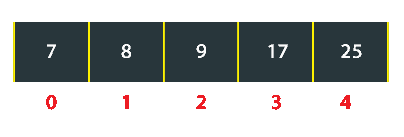
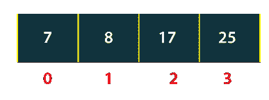

# Java 中的数组列表程序

> 原文：<https://www.tutorialandexample.com/arraylist-program-in-java>

**Java 中的 ArrayList 程序**:在 Java 中， **ArrayList** 是属于 java.util 包的类。它是一个动态列表，在运行时根据需求增长或收缩。由于它的动态特性，数组列表优于基本数组。换句话说，数组列表是可调整大小的数组。ArrayList 类实现 List 接口并继承 AbstractList 类。

### 数组列表的主要特征

数组列表的主要特征是:

*   数组列表中允许有重复的元素。
*   ArrayList 保持添加到其中的元素的插入顺序。
*   数组列表不同步。
*   像原始数组一样，可以根据索引随机访问元素。

如果我们想创建一个 ArrayList，我们需要创建一个 ArrayList 类的实例。

```
ArrrayList<type> identifier = new ArrayList<type>();
```

在上面的语句中，*标识符*是引用变量。它的名字可以根据个人的选择而改变。 ***在尖括号中键入*** 确保将要创建什么样的数组列表。为了创建整数列表，应该在尖括号内使用整数。对于字符串列表的创建，应该使用*字符串*，以此类推。

**FileName:** ArrayListExample.java

```
 // Importing class ArrayList
import java.util.ArrayList;
public class ArrayListExample
{
// driver method
public static void main(String argvs[])
{
    // creating an array list of integer type
    ArrayList<Integer> al = new ArrayList<Integer>();
    // adding elements to the list
    al.add(1);
    al.add(-9);
    al.add(45);
    al.add(443);
    al.add(4);
    // calculating the size of the list
    int size = al.size();
    if(size > 0)
    {
        // displaying the size and the elements of the list
        System.out.println("Size of the array list is: " + size );
        System.out.println(al );
    }
}
} 
```

**输出:**

```
 Size of the array list is: 5
[1, -9, 45, 443, 4] 
```

**说明:**在代码中，我们创建了一个空列表。方法的作用是:在列表中添加一个元素。因此，add()方法将列表的大小增加 1。最后，我们在控制台上打印列表。

### 迭代数组列表

有很多方法可以迭代数组列表。其中一些是:

*   使用 for 循环
*   使用迭代器

让我们从 for 循环开始。

**使用 For 循环**

考虑下面的程序。

 ****FileName:** ArrayListExample1.java

```
 // Importing class ArrayList
import java.util.ArrayList;
public class ArrayListExample1
{
// driver method
public static void main(String argvs[])
{
    // creating an array list of integer type
    ArrayList<Integer> al = new ArrayList<Integer>();
    // adding elements to the list
    al.add(1);
    al.add(-9);
    al.add(45);
    al.add(443);
    al.add(4);
    // calculating the size of the list
    int size = al.size();
    System.out.println("Elements of the array list are: " );
    // Iterating on every elements of the list
    for(int i = 0; i < size; i++)
    {
       System.out.println(al.get(i) );
    }
}
} 
```

**输出:**

```
 Elements of the array list are:
1
-9
45
443
4 
```

**解释:**将元素添加到列表中后，我们正在计算列表的大小。然后，使用 Java for-loop，我们遍历列表中的元素。 *get()* 方法用于访问列表中的元素。它返回给定索引处的元素。因此， *get(0)* 返回出现在索引 0 处的元素。 *get(1)* 负责访问索引 1 处的元素，依此类推。

**使用迭代器**

考虑下面的程序。

 ****FileName:** ArrayListExample2.java

```
 // Importing the class ArrayList
import java.util.ArrayList;
// Importing the class Iterator
import java.util.Iterator;
public class ArrayListExample2
{
// driver method
public static void main(String argvs[])
{
    // creating an array list of integer type
    ArrayList<Integer> al = new ArrayList<Integer>();
    // adding elements to the list
    al.add(1);
    al.add(-9);
    al.add(45);
    al.add(443);
    al.add(4);
    // calculating the size of the list
    int size = al.size();
    System.out.println("Elements of the array list are: " );
    // Creating an iterator for the list al
    Iterator itr = al.iterator();
    //check if the list has elements 
    while(itr.hasNext() )
    {  
        //printing the element and move to the next
        System.out.println(itr.next()); 
    }
}
}              
```

**输出:**

```
 Elements of the array list are:
1
-9
45
443
4 
```

**解释:**我们使用迭代器来迭代数组列表的元素，而不是 for 循环。hasNext()方法检查元素是否出现在列表中。如果数组列表中存在元素，则返回 true，否则返回 false。 *next()* 方法返回控制台上打印的下一个元素。

**从数组列表中移除元素**

要从 ArrayList 中移除元素，可以使用 remove()方法。请遵守以下程序。

**FileName:** ArrayListExample3.java

```
 // Importing the class ArrayList
import java.util.ArrayList;
// Importing the class Iterator
import java.util.Iterator;
public class ArrayListExample3
{
// driver method
public static void main(String argvs[])
{
    // creating an array list of integer type
    ArrayList<Integer> al = new ArrayList<Integer>();
    // adding elements to the list
    al.add(7);
    al.add(8);
    al.add(9);
    al.add(17);
    al.add(25);
    // removing the element present at the index 2
    al.remove(2);
    System.out.println("Elements of the array list are: " );
    // Creating an iterator for the list al
    Iterator itr = al.iterator();
    //check if iterator has the elements 
    while(itr.hasNext() )
    {  
        //printing the element and move to the next
        System.out.println(itr.next()); 
    }
}
} 
```

**输出:**

```
 Elements of the array list are:
7
8
17
25 
```

**说明:**删除元素之前，数组列表看起来是这样的。



当第 2 个<sup>和第</sup>索引处的元素被删除时，元素 9 之后的元素向左移动一个位置。



因此，从数组列表中移除元素是一个漫长的过程，因为将元素从其原始位置移动需要时间。****