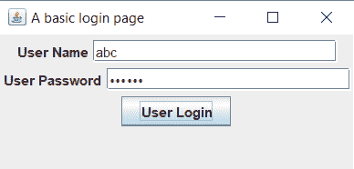

# Java 中的 Swing 程序

> 原文：<https://www.tutorialandexample.com/swing-program-in-java/>

Java Swing 是 Java 基础类(JFC)的一部分。swing 工具包用于为用 Java 编写的程序生成图形用户界面(GUI)。与 AWT(抽象窗口工具包)相比，Java swing API 更加复杂和轻量级。swing API 也是独立于平台的。Java 中的 **swing 程序演示了 swing API 在程序中的用法。**

**挥杆示例**

让我们学习如何使用 Java Swing 创建一个简单的登录页面。下面的程序说明了同样的情况。

 ****文件名:**SwingExample.java

```
 // importing the important classes of the swing API
import javax.swing.JFrame;
import javax.swing.JLabel;
import javax.swing.JPanel;
import javax.swing.JButton;
import javax.swing.JPasswordField;
import javax.swing.JTextField;
public class SwingExample
{
// driver method
public static void main(String argvs[])
{   
               // Creating an object of the class JFrame with a title
               JFrame f = new JFrame("A basic login page");
               // providing the breadth and height of the frame
               f.setSize(325, 199);
               // to force the application to terminate, when the x button is pressed
               f.setDefaultCloseOperation(JFrame.EXIT_ON_CLOSE);
               // Creating a panel. A frame can have many panels attached to it
               JPanel p = new JPanel();
               // Panel p has to be attached with the frame
               f.add(p);
               //invoking the custom method addComponents for providing components
               // to the panel p
               addComponents(p);
               // Setting the visibility of the frame to true value
               f.setVisible(true);
}
private static void addComponents(JPanel pnl)
{
               // Creating JLabel
               JLabel usrLabel = new JLabel("User Name");
               // The method setBounds() serves two purposes.
               // One purpoase is to specify the position of the label
               // by taking reference from the top left corner (10, 20) of the panel
               // Another purpose is to provide the size of the label (80, 25)
               // x, y coordinates => 11 and 21
               // width, height => 81, 26
               usrLabel.setBounds(11,21,81,26);
               // adding the 'User Name' label to the panel
               pnl.add(usrLabel);
               //Creating a text field where the user is supposed to
               //enter user name.
               JTextField usrText = new JTextField(21);
               // providing position and size of the text field
               usrText.setBounds(101,21,166,26);
               // adding text field to the panel
               pnl.add(usrText);
               // Adding another label User Password
               JLabel pswdLabel = new JLabel("User Password");
               // providing position and size of the label User Password
               // by invoking the method setBounds
               pswdLabel.setBounds(11,51,81,26);
               // adding the 'User Password' label to the panel
               pnl.add(pswdLabel);
               //Creating a password field where the user is supposed to
               //enter user password.
               JPasswordField pswdText = new JPasswordField(21);
               // providing position and size of the password field
               pswdText.setBounds(101,51,166,26);
               // adding password field to the panel
               pnl.add(pswdText);
               // Creating a button 'User Login'
               JButton loginBtn = new JButton("User Login");
               // providing position and size to the 'User Login' button
               loginBtn.setBounds(11, 81, 79, 26);
               // adding the button to the panel
               pnl.add(loginBtn);
}
} 
```

**输出:**

  

**说明:**上面创建的 UI 有很多部分。其中一部分是 JFrame。

JFrame 是 swing 应用程序中出现的第一个部分。它包含标题、面板、各种按钮、文本字段等。JFrame 是 swing UI 应用程序最基础的部分。

```
JFrame f = new JFrame("A basic login page");
```

上面的语句创建了一个标题为“基本登录页面”的 JFrame

JFrame 不直接包含按钮或字段。这个框架需要一块嵌板。

JPanel:JPanel 类负责在 swing 应用程序中创建面板。一个框架可以有多个面板。面板负责字段、按钮等的定位或大小。swing 中的面板类似于 HTML 中的 div 标签。两者都用于元素/组件的分组。

```
JPanel p = new JPanel();
```

上面的语句为 Java swing 应用程序创建了一个新面板。创建面板后，我们可以添加标签、文本字段、按钮等组件。

**JLabel** :输出中写入的文本(用户名，用户密码)是由于 JLabel 这个类。JLabel 类的主要用途是在 GUI 中放置标签/文本。

```
JLabel usrLabel = new JLabel("User Name");
```

上面的语句创建了一个标签“用户名”。类似地，也可以创建其他标签。

**JTextField:** 对应标签“用户名”，需要允许用户输入自己的用户名。为此，使用了 JTextField 类。*输出中显示的 abc* 是用户编写的。

```
JTextField usrText = new JTextField(21);
```

上面的语句使用给定的列号(即 21)创建一个空文本字段。

**JPasswordField:**JPasswordField 类类似于 JTextField。唯一的区别是 JPasswordField 类隐藏了用户给出的输入，只显示点，这是在任何登录页面上输入密码时的正常行为。输出也显示相同的内容。

```
JPasswordField pswdText = new JPasswordField(21);
```

上述语句创建了一个列大小为 21 的新密码字段。

**JButton:** 需要一个登录按钮来验证用户输入的。对于登录按钮的创建，使用 JButton 类。下面的语句创建一个按钮，并将标签“用户登录”放在上面。

```
JButton loginBtn = new JButton("User Login");
```

**十字按钮(X):** 十字按钮按下后终止应用程序(看输出的右上角)。发生这种情况的原因如下:

```
f.setDefaultCloseOperation(JFrame.EXIT_ON_CLOSE);
```

该语句必须存在才能终止程序。因为十字按钮的默认行为是隐藏应用程序。对程序中的上述语句进行注释，并观察其行为。**