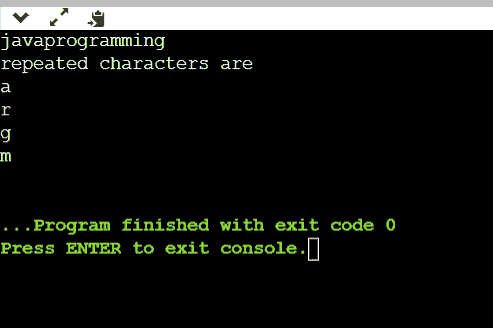
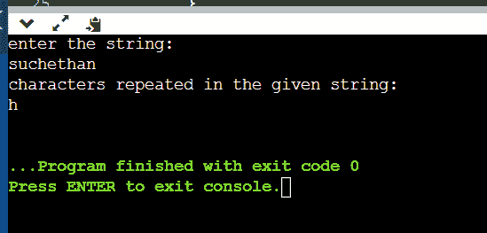
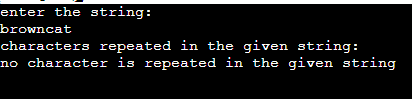

# 寻找字符串中重复字符的程序

> 原文：<https://www.tutorialandexample.com/program-to-find-the-duplicate-characters-in-a-string>

## 问题陈述

你已经给出了一个字符串，你的任务是从字符串中找出重复的字符并打印出来。如果没有字符重复，那么需要输出“给定字符串中没有字符重复”。

**例子**

考虑字符串“javaprogramming”，重复的字符是 a，r，g，m，因此，你需要输出 a，r，g，m。

```
import java.io.*;
import java.util.*;

public class Main
{
	public static void main (String [] args) {

		Scanner sc = new Scanner ( System.in ) ;
		HashMap <Character,Integer> p = new HashMap<> ();
		// creating hashmap to store the individual character as Key
		// and storing count of each character as value of hashmap
                  System.out.println(“enter the string:”);
		String s = sc.next ();
		for (int i = 0; i < s.length (); i++)
		{
		    if (p.containsKey (s.charAt (i)))
		    {
		        p.put (s.charAt (i),p.get (s.charAt (i))+1);
		   // increment count if character already exists in hashmap

		    }
		    else
		    {
		        p.put (s.charAt (i),1);
		        // inerting characters into hashmap

		    }
		}
		System .out. println ("repeated characters are");
		for (int i = 0; i < s.length (); i++)
		{
		    if (p.get (s.charAt (i)) >1)
		    {
		        System .out. println (s.charAt(i));
		        p.put (s.charAt (i),0);
		        // making the count of traversed character to zero 
		        // to prevent repating of same character (on output ).
		    }
		    else
		    { 
           System.out.println("no chacter is repeated in the given string");

		    }
		}

	}
} 
```

这种代码的时间复杂度是 O(n*log(n))，其中 n 是字符串的长度，插入到映射中需要 O(log(n))。

这种编码的空间复杂度是 O(k)，k 是映射的大小。



**例 2**

```
import java .io. *;
import java .util.  *;

public class Main {  
     public static void main (String [ ] args) {
        Scanner sc = new Scanner (System.in);
        System.out.println("enter the string:");
        String str = sc.next ();  
        int count ;  
        int found=0;

        // Convert the given string into character array  
        char str1 [ ] = str.toCharArray ();  

        System.out.println ("characters repeated in the given string: ");  
        // Counts each character present in the string  
        for (int i = 0; i <str1.length; i++) {  
            count = 1;  
            for (int j = i+1 ; j < str1.length;  j++) {  
                if (str1 [ i ] == str1 [ j ]) {  
                    count++;  
                    // Set str [j] to 0 to avoid printing visited character  
                    str1 [ j ] ='0';  
                }  
            }  
            // A character is considered as duplicate if count is greater than 1  
            if (count > 1 && str1[i] != '0')  
            {
                System.out.println (str1 [ i ] ); 
                found++;
              }

        }  
        if(found==0)
        {
            System.out.println ("no character is repeated in the given string");
        }
    }  
} 
```

**输出**



如果用户输入字符串没有类似于 **browncat** 的重复字符，输出如下所示:

