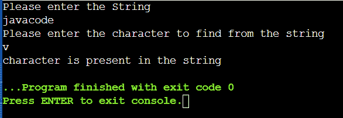
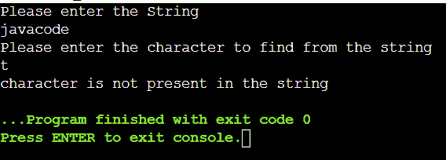
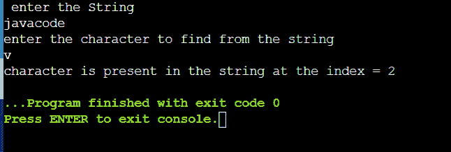

# 检查字符串中是否存在给定字符的程序

> 原文：<https://www.tutorialandexample.com/program-to-check-whether-a-given-character-is-present-in-a-string-or-not>

在本文中，您将了解查找给定字符是否出现在字符串中以及查找指定字符在字符串中的位置的逻辑。我们将使用 Java 编程语言来执行程序。此外，您还可以通过遵循相同的逻辑使用其他编程语言来获得输出。

## 方法

给定问题的主要逻辑是，您需要通过将字符串中的每个字符与所需的字符进行比较来遍历字符串。如果找到了所需的字符，就需要输出消息，说明该字符是否出现在字符串中。

**例子**

```
import java.io.* ;
import java.util.*;

public class Main
{
	public static void main (String [] args) {

		Scanner sc = new Scanner (System.in);
		int found = 0; 
               // found is used to give the output the index of required character in the string
		System.out.println(" enter the String");
		String s = sc.next ();
                   // string input will be given by the user
		System.out.println("enter the character to find from the string ");
		char c=sc. next () .charAt (0);
                   // character input will be given by the user
		for (int i = 0; i < s.length (); i++)
		{ 
		    if (c == s.charAt (i))
                          // traversing the string and comparing it with the required character
		    {
		        found = i; 
       // if the character is found then found will be updated to i and will exit the loop		        break;
		    }

		}

		if (found!=0)
		{
		    System.out.print ("character is present in the string at the index = " +found); 
                            // output message

		}
		else
		{
		    System.out.print ("character is not present in the string");
                        // output message

		}
	}
} 
```

**输出**





## 查找给定字符在字符串中的位置

给出的问题陈述是你会得到一个字符串。你必须找到给定字符串中出现的字符的位置。我们将使用 Java 编程语言来执行程序。此外，您还可以通过遵循相同的逻辑使用其他编程语言来获得输出。

### 方法

给定问题的主要逻辑是，您需要通过将字符串中的每个字符与所需的字符进行比较来遍历字符串。如果找到了字符，那么需要输出该字符在字符串中的索引。

**例子**

```
import java.io.* ;
import java.util.*;

public class Main
{
	public static void main (String [] args) {

		Scanner sc = new Scanner (System.in);
		int found = 0; 
               // found is used to give the output the index of required character in the string
		System.out.println(" enter the String");
		String s = sc.next ();
                   // string input will be given by the user
		System.out.println("enter the character to find from the string ");
		char c=sc. next () .charAt (0);
                   // character input will be given by the user
		for (int i = 0; i < s.length (); i++)
		{ 
		    if (c == s.charAt (i))
                          // traversing the string and comparing it with the required character
		    {
		        found = i; 
       // if the character is found then found will be updated to i and will exit the loop		        break;
		    }

		}

		if (found!=0)
		{
		    System.out.print ("character is present in the string at the index = " +found); 
                            // output message

		}
		else
		{
		    System.out.print ("character is not present in the string");
                        // output message

		}
      }
}
```



假设字符串中所需的字符重复出现。然后第一次出现的索引将打印在屏幕上。