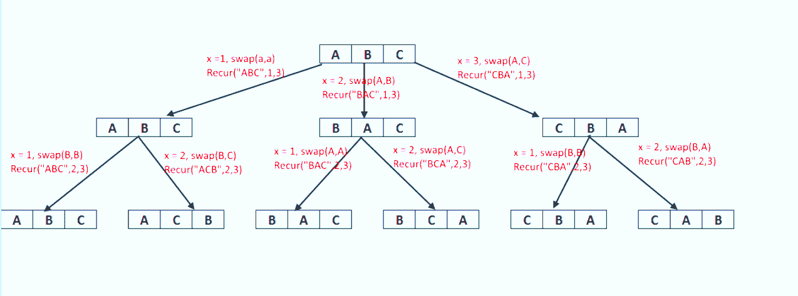
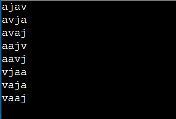

# 打印字符串排列的 Java 程序

> 原文：<https://www.tutorialandexample.com/java-program-to-print-permutations-of-string>

给定一个字符串，你需要打印该字符串所有可能的方式。排列是排列一个字符串的字符，以获得给定字符串的输出。

例如，假设“rat”是字符串，字符串的所有可能排列列表如下:

1.  鼠
2.  艺术
3.  水手
4.  肾小管酸中毒
5.  轮胎轮辋协会（Tireand Rim Association 的缩写）
6.  （同 antitransmit-receive）反收发

为了解决这类问题，我们首先需要学习回溯算法。

## 回溯算法

**算法**

1.建立一个字符串。

2.固定一个字符，然后切换其他字符。

3.对于剩余的字符，调用 permutationFunction()。

4.回去再换一次角色。



### 程序

1.  在固定第一个字符后，用第一个位置的字符替换其余字符。与 ABC 类似，第一次迭代导致三个字符串的形成:ABC、BAC 和 CBA，分别用 A、B 和 C 替换 A。对于剩余的字符，重复步骤 1，固定第二个字符 B，依此类推。
2.  再次切换以返回到原始位置。例如，从 ABC 开始，我们将通过再次调整 B 来创建 ABC，然后返回并交换 B 和 c。我们现在有了 ABC 和 ACB。
3.  对 BAC 和 CBA 重复这些过程，以获得所有可能的组合。

如果允许重复，我们可以使用递归方法得到输出

重复-在输出中重复相同的字符串

## 递归方法 1

在这个方法中，函数被递归调用，直到传递的字符串为空(终止条件)。使用这种方法，我们将得到字符串的重复排列。

### Java 程序打印给定字符串的所有排列

```
public class Main {
	static void printStrings(String str, String ans)
	{
		// If string is empty
		if (str.length() == 0) {
			System.out.println(ans + " ");
			return;
		}
		for (int i = 0; i < str.length(); i++) {

			char ch = str.charAt(i);
			String ros = str.substring(0, i) +str.substring(i + 1);
			// Calling the function recursively
			printStrings(ros, ans + ch);
		}
	}// printStrings
	//Main method
	public static void main(String[] args)
	{
		String s = "abb";
		printStrings(s, "");
	} 
}//main 
```

**输出**

  

### 说明

在上面的程序中，我们使用字符串“abb”调用名为“ **printStrings** 的函数，并且我们提供另一个空字符串作为参数来附加字符串的剩余字符。该函数通过产生一个空字符串作为输出来结束，如果该字符串为空，则程序结束。使用 for 循环，我们将遍历字符串，添加除位置 I 以外的每个附加字符，并重复调用函数，直到字符串为空。

## 递归方法 2

为了避免字符串的重复，我们将使用另一种递归方法。

### 程序打印所有不同的字符串排列

```
// Java program to print all the permutations of the given string
public class Main {
    static void Permutations(String s1,String ans)
    {
        if (s1.length() == 0) {
            System.out.println(ans + " ");
            return;
        }
        boolean a[] = new boolean[26];
        for (int i = 0; i < s1.length(); i++) {
            char c = s1.charAt(i);
            String ros = s1.substring(0, i) +s1.substring(i + 1);
            if (a[c - 'a'] == false)
                Permutations(ros, ans + c);
            a[c- 'a'] = true;
        }
    }
    public static void main(String[] args)
    {
        String s = "java";
        Permutations(s,"");
    }
} 
```

**输出**

  

### 说明

创建一个 26 个字符长的布尔数组来跟踪正在使用的字符。如果字符没有被使用，将进行递归调用。否则，不要拨打任何电话。当给定的字符串为空时，句子将结束。

## 3.迭代方法:使用集合

```
import java.util.ArrayList;
import java.util.List;

class Main
{
    public static void Permutations(String s)
    {
        if (s == null || s.length() == 0) 
        {
            return;
        }
        List<String> result = new ArrayList<>();
        result.add(String.valueOf(s.charAt(0)));
        for (int i = 1; i < s.length(); i++)
        {
            for (int j = result.size() - 1; j >= 0 ; j--)
            {
                String s1 = result.remove(j);
                for (int k = 0; k <= s1.length(); k++)
                {
                    result.add(s1.substring(0, k) + s.charAt(i) + s1.substring(k));
                }
            }
        }
        System.out.println(result);
    }
    public static void main(String[] args)
    {
        String string = "QWE";
        Permutations(string);
    }
} 
```

**输出**

