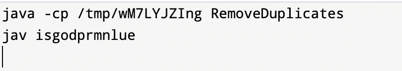
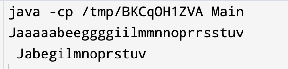
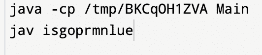
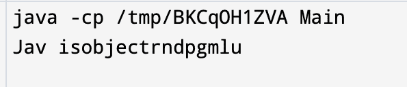

# 去除字符串中重复字符的 Java 程序

> 原文：<https://www.tutorialandexample.com/java-program-to-remove-duplicate-characters-in-a-string>

在字符串中，我们可以发现许多字符在一个字符串中出现一次或多次；由于重复，访问特定字符是困难的。字符串中出现的重复字符可以通过多种方式去除。一些方法包括:

*   使用 for 循环
*   按排序方法
*   散列法
*   IndexOf()

因此，有许多方法可以从给定的字符串中删除重复的字符。

这些不同的方法具有不同的时间复杂度。我们可以根据要求使用它们。

### 使用 for 循环

这是从给定的字符串中删除重复字符的最简单的方法之一。

使用 for 循环删除重复键的步骤。

1.  给定的数组被转换成字符数组作为字符的除法。
2.  求数组的长度。
3.  创建一个函数，通过将字符作为参数传递来调用数组中的重复元素。
4.  使用 for 循环，访问数组中的所有字符以搜索重复元素。
5.  检查字符串中存在的字符。

**例子**

```
import java.io.*;
import java.util.*;
class RemoveDuplicates
{
  //creating method for removing duplicate characters
   static void  remove duplicate(char strings[], int len)
 {
  // declaring value for sttoring index
  int n=0;
  for(int i=0;i<len;i++)
 {
   // checking whether the character is present
     int j;
     for(j=0;j<i;j++)
     {
        if(strings[i]==strings[j])
       {
           break;
        }
     }
   //if it was not present then add it result
   if(j==i)
   {
      strings[n++]=strings[i];
   }
 }
 System.out.println(String.valueOf(Arrays.copyOf(strings,n)));
}
//main section
public static void main(String s[])
{
  String info=“java is a good programming language”;
   //Converting to character array
  char strings[]=info.toCharArray();
 //finding length of character array
  int lengt=strings.length;
  // calling method for removal of characters
   removeDuplicate(strings,lengt);
}
} 
```

**输出**

  

### 使用排序方法

排序方法是删除字符串中重复字符的方法之一。

与 for 循环方法相比，此方法速度更快。首先，对数组进行排序。

并且重复的元素彼此相邻。执行此操作包括:

1.  给定字符串排序
2.  获取当前元素，并将其与循环中的其余元素进行比较。
3.  出现多次的字符可以删除。
4.  该技术不维护输入字符串的真实顺序。字符串顺序不同于初始顺序。

一个使用排序技术的简单 java 程序。

**例子**

```
import java.util.Arrays; 
import java.util.*;
public class Main 
{   
      static void removeDuplicates(String str)   
    {   
        //to find next character of string given
        int ind1 = 1;          

        // to find next character in the resultant string 
        int ind2 = 1;  

        // converting string to indivial(Chaaracter array)  
        char arr[] = str.toCharArray();   

        //Checking whether the character is present in it or not
while (ind1 != arr.length)   
        {   
            if(arr[ind1] != arr[ind1-1])   
            {   
                arr[ind2] = arr[ind1];   
                ind2++;   
            }   
            ind1++;   

        }   

        str = new String(arr);  
        System.out.println(str.substring(0, ind2));   
    }   
  //method for storing the sorted string  
    static String sortString(String str)   
    {   
       // String is converted to character 
       char temp[] = str.toCharArray();   

       //sort array using array's sort () method  
       Arrays.sort(temp);   

       //String from character array   
       str = new String(temp);   

       // result 
       return str;   
    }   

    public static void main(String[] args)   
    {   
        //Declaring a default string   
        String str = “Java is best programming language";   

        //calling method for storing the sorted string 
        String newString = sortString(str);  
        System.out.println(newString);  

        // removeDuplicates() method for removal of same characters  
        removeDuplicates(newString);  
    }   
} 
```

**输出**

  

### 使用哈希方法

另一种消除字符串中重复字符的方法是散列法。通过使用散列，我们可以做到这一点。我们将使用后续步骤，通过散列法消除重复项:

*   在 main()方法中，我们可以创建一个字符串，从中删除复制字符。
*   我们可以调用 **removeDuplicates** ()方法并超越我们需要消除重复的字符串。
*   在 **removeDuplicates** ()技术中，创建一个角色种类的 **LinkedHashSet** 。LinkedHashSet 包括一个独特的细节。这个集合包含不同的元素。以便删除重复的字符。最终，我们打印 LinkedHashSet 的所有字符。
*   它包括按插入顺序排列的字符。
*   这可以用一个简单的程序来完成。

**例子**

```
import java.util.*;   

//Class for accessing methods for removing duplicate characters
class Main 
{   
    //Create a method removeDuplicates() for finding unique characters using Hashing  
    static void removeDuplicates(String str)   
    {     
        //HashSet class creation   
        LinkedHashSet<Character> set = new LinkedHashSet<>();   
        //each character is added to set   
        for(int i=0;i<str.length();i++)   
            set.add(str.charAt(i));   

        // string after removing same characters   
        for(Character ch : set)   
            System.out.print(ch);   
    }   

    //main() 
    public static void main(String args[])   
    {   
        //Default value is assigned to str  
        String str = "java is good programming language";   
        //calling method by passing string as a parameter   
        removeDuplicates(str);   
    }   
} 
```

**输出:**

  

### index()方法

此方法用于移除字符串中的重复字符。

它使用索引值从给定的字符串中查找不同的字符。

接下来的步骤是:

*   main()方法包含一个用于查找唯一字符的字符串。
*   调用 removeDuplicates()方法，并将字符串作为参数传递。
*   初始字符串长度是在 removeDuplicates()方法中计算的。
*   检查字符串中的所有字符。
*   如果元素不能出现在字符串中，这个方法返回-1。所以它被添加到结果字符串中。

**例子**

```
// import classes and packages   
import java.util.*;   

//create RemoveDuplicatesIndex class to remove characters   
class RemoveDuplicatesIndex {   

    // Create removeDuplicates() for removing duplicate characters by index()  
    public static void removeDuplicates(String str)   
    {   
        //Empty string for storing 
        String newstr = new String();   

        //length is calculated using length() function  
        int length = str.length();   

        //visiting each and every character of string  
        for (int i = 0; i < length; i++)    
        {   
            // Index value of ith position is stored
            char charAtPosition = str.charAt(i);   

            // check the charAtPosition  index. if it returns true add it to result
            if (newstr.indexOf(charAtPosition) < 0)   
            {   
                newstr += charAtPosition;   
            }   
        }   
        //Unique character string
        System.out.println(newstr);  
    }   

    // main()  
    public static void main(String[] args)   
    {   
        // default value   
        String str = "Java is a object oriented programming language";   
        //calling method removeDuplicates method   
        removeDuplicates(str);   
    }   
} 
```

**输出**

  

以上四种方法都可以用来去除重复字符。根据我们的选择，可以使用四种方法中的任何一种。