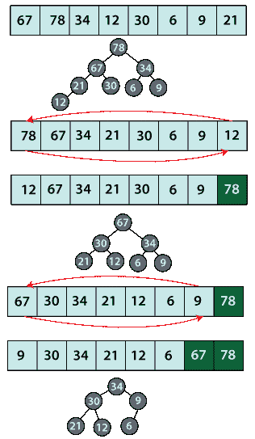

# Java 中的堆排序

> 原文：<https://www.tutorialandexample.com/heap-sort-in-java/>

# Java 中的堆排序

 T2】

Java 中的堆排序 使用数据结构二进制堆、最小堆或最大堆来对元素进行排序。因为 min-heap 总是首先给出最小的元素，所以堆排序变得类似于选择排序，其中 min-heap 用于对数组进行排序。当最大堆用于排序目的时，堆排序类似于冒泡排序，因为最大堆首先给出最大元素。

在这一节中，我们已经讨论了用于排序元素的 max-heap。

最大堆算法

步骤 1: 使用方法 heapify()为给定的输入数组构建最大堆。

第二步:用数组的最后一个元素交换根。将堆的大小减少 1。

第三步:再次调用 heapify()方法，维护剩余元素的 max heap 属性。

步骤 4: 重复步骤 3 & 4，直到整个数组排序完毕。

伪代码

<textarea wrap="soft" class="urvanov-syntax-highlighter-plain print-no" data-settings="dblclick" readonly="" style="box-sizing: border-box; background: rgb(255, 255, 255); border-width: 0px; border-style: initial; border-color: initial; padding: 0px 5px; color: rgb(0, 0, 0); width: 688.729px; overflow: hidden; height: 320px; position: absolute; opacity: 0; border-radius: 0px; box-shadow: none; white-space: pre; overflow-wrap: normal; resize: none; tab-size: 3; z-index: 0; font-family: Monaco, monacoregular, &quot;courier new&quot;, monospace !important; font-size: 14px !important; line-height: 20px !important;">

<table class="crayon-table" style="box-sizing: border-box; margin-bottom: 15px; margin-left: -28px; border-color: rgb(238, 238, 238); width: 716.729px; border-spacing: 0px !important; background: 0px 0px !important; table-layout: auto !important;"><tbody style="box-sizing: border-box;"><tr class="urvanov-syntax-highlighter-row" style="box-sizing: border-box; background: 0px center; padding: 0.857em 0.587em; max-width: 100%; border-width: initial !important; border-style: none !important; border-color: initial !important; vertical-align: top !important; margin: 0px !important;"><td class="crayon-nums " data-settings="hide" style="box-sizing: border-box; padding: 0.857em 0.587em; max-width: 100%; border-top: none !important; border-right-color: rgb(85, 85, 85) !important; border-bottom: none !important; border-left: none !important; background: rgb(34, 34, 34) !important; vertical-align: top !important; margin: 0px !important; color: rgb(137, 137, 137) !important;">

1

2

3

4

5

6

7

8

9
10

11

12

13

14

15

16
</td><td class="urvanov-syntax-highlighter-code" style="box-sizing: border-box; padding: 0.857em 0.587em; width: 689.417px; background: 0px center; max-width: 100%; border-width: initial !important; border-style: none !important; border-color: initial !important; vertical-align: top !important; margin: 0px !important;">
 
 
 
    //执行操作 heapify-down 或 down-heap 以获得 max-heap

//arr:表示堆的数组，从 0

//j:表示开始向下堆的索引

Heapify()2*j

right child？2j+1

最高   ？j

ifleft child<size(arrleft child

ifright child<sizeright child

如果   最高   ？j然后

互换arrj

</td></tr></tbody></table>

 Java 程序

下面的 Java 程序使用上面解释的伪代码实现堆排序。

文件名:堆顺序示例. java

<textarea wrap="soft" class="urvanov-syntax-highlighter-plain print-no" data-settings="dblclick" readonly="" style="box-sizing: border-box; background: rgb(255, 255, 255); border-width: 0px; border-style: initial; border-color: initial; padding: 0px 5px; color: rgb(0, 0, 0); width: 688.729px; overflow: hidden; height: 1440px; position: absolute; opacity: 0; border-radius: 0px; box-shadow: none; white-space: pre; overflow-wrap: normal; resize: none; tab-size: 3; z-index: 0; font-family: Monaco, monacoregular, "courier new", monospace !important; font-size: 14px !important; line-height: 20px !important;"/>

<table class="crayon-table" style="box-sizing: border-box; margin-bottom: 15px; margin-left: -28px; border-color: rgb(238, 238, 238); width: 810.75px; border-spacing: 0px !important; background: 0px 0px !important; table-layout: auto !important;"><tbody style="box-sizing: border-box;"><tr class="urvanov-syntax-highlighter-row" style="box-sizing: border-box; background: 0px center; padding: 0.857em 0.587em; max-width: 100%; border-width: initial !important; border-style: none !important; border-color: initial !important; vertical-align: top !important; margin: 0px !important;"><td class="crayon-nums " data-settings="hide" style="box-sizing: border-box; padding: 0.857em 0.587em; max-width: 100%; border-top: none !important; border-right-color: rgb(85, 85, 85) !important; border-bottom: none !important; border-left: none !important; background: rgb(34, 34, 34) !important; vertical-align: top !important; margin: 0px !important; color: rgb(137, 137, 137) !important;">
1

【2】

【3】

【4】

【5】
【6】
【7】 

【28】

【29】

【30】

【31】

【32】
【33】

34】 

55【T1110】
【56】【T1112】
【57】【T1114】
【58】【T1117】

【60】【T1121】【61】

</td><td class="urvanov-syntax-highlighter-code" style="box-sizing: border-box; padding: 0.857em 0.587em; width: 783.438px; background: 0px center; max-width: 100%; border-width: initial !important; border-style: none !important; border-color: initial !important; vertical-align: top !important; margin: 0px !important;">

 

 // Java program that uses max heap to do the sorting

 public class HeapSortExample

 {

 public static void maxHeapSort(int a[])

 {

                int size = a.length;

                // rearranging array elements so that it

                // resembles max heap

                for (int j = size / 2 - 1; j >= 0; j--)

                                heapify(a, size, j);

                // One by one extract the top element, which is

                // also the maximum element from the heap

                for (int j = size - 1; j >= 0; j--)

                {

                                // Moving the maximum element of the current heap to the end

                                int tmp = a[0];

                                a[0] = a[j];

                                a[j] = tmp;

                                // invoking method heapify on the reduced heap

                                heapify(a, j, 0);

                }

 }

 // The heapfiy() method does the rearrangement of elements of

 // the given input array to resemble it like a max heap

 // Element present at the index j resembles the root of the max heap

 // length gives the size of the max heap

 static void  heapify(int a[], int length, int j)

 {

                int highest = j; // assign highest as root

                int left = 2 * j + 1; // leftChild = 2 * j + 1

                int right = 2 * j + 2; // rightChild = 2 * j + 2

                // If the root element is smaller the left child

                if (left < length && a[left] > a[highest])

                                highest = left;

                // If the root element so fat is smaller the right child

                if (right < length && a[right] > a[highest])

                                highest = right;

                // If root is not the highest

                if (highest != j)

                {

                                int change = a[j];

                                a[j] = a[highest];

                                a[highest] = change;

                                // Heapifying the affected sub-tree recursively

                                heapify(a, length, highest);

                }

 }

 // main method

 public static void main(String argvs[])

 {

     // given input array

     int a[] = {67, 78, 34, 12, 30, 6, 9, 21};

     // calculating size of the array

     int size = a.length;

     System.out.println("The array before sorting is: ");

     for(int i = 0; i < size; i++)

     {

        System.out.print(a[i] + " ");

     }

     System.out.println("\n");

     // invoking method maxHeapSort()

     maxHeapSort(a);

     System.out.println("The array after sorting is: ");

     // displaying the sorted array

     for(int i = 0; i < size; i++)

     {

         System.out.print(a[i] + " ");

     }

 }

 } 

 

</td></tr></tbody></table>

输出:

<textarea wrap="soft" class="urvanov-syntax-highlighter-plain print-no" data-settings="dblclick" readonly="" style="box-sizing: border-box; background: rgb(255, 255, 255); border-width: 0px; border-style: initial; border-color: initial; padding: 0px 5px; color: rgb(0, 0, 0); width: 688.729px; overflow: hidden; height: 120px; position: absolute; opacity: 0; border-radius: 0px; box-shadow: none; white-space: pre; overflow-wrap: normal; resize: none; tab-size: 3; z-index: 0; font-family: Monaco, monacoregular, "courier new", monospace !important; font-size: 14px !important; line-height: 20px !important;"/>

<table class="crayon-table" style="box-sizing: border-box; margin-bottom: 15px; margin-left: -19px; border-color: rgb(238, 238, 238); width: 707.729px; border-spacing: 0px !important; background: 0px 0px !important; table-layout: auto !important;"><tbody style="box-sizing: border-box;"><tr class="urvanov-syntax-highlighter-row" style="box-sizing: border-box; background: 0px center; padding: 0.857em 0.587em; max-width: 100%; border-width: initial !important; border-style: none !important; border-color: initial !important; vertical-align: top !important; margin: 0px !important;"><td class="crayon-nums " data-settings="hide" style="box-sizing: border-box; padding: 0.857em 0.587em; max-width: 100%; border-top: none !important; border-right-color: rgb(85, 85, 85) !important; border-bottom: none !important; border-left: none !important; background: rgb(34, 34, 34) !important; vertical-align: top !important; margin: 0px !important; color: rgb(137, 137, 137) !important;">

1
T3】2
T5】3
4

5

6
</td><td class="urvanov-syntax-highlighter-code" style="box-sizing: border-box; padding: 0.857em 0.587em; width: 688.823px; background: 0px center; max-width: 100%; border-width: initial !important; border-style: none !important; border-color: initial !important; vertical-align: top !important; margin: 0px !important;">

数组排序 是:

67783412  排序后 是:

69122130

</td></tr></tbody></table>

说明:上面的程序是模仿冒泡排序。<em style="box-sizing: border-box; margin: 0px; padding: 0px; border: 0px; outline: 0px; text-size-adjust: 100%; vertical-align: baseline; background: 0px 0px;"> heapify() </em>方法确保最大值元素位于索引 0 处。然后在一次交换中，最大元素被放在数组的末尾。当第二次调用<em style="box-sizing: border-box; margin: 0px; padding: 0px; border: 0px; outline: 0px; text-size-adjust: 100%; vertical-align: baseline; background: 0px 0px;"> heapify() </em>方法时，它将第二个最大元素放在索引 0 处。

交换过程将第二个最大元素放在数组的倒数第二个索引处，调用<em style="box-sizing: border-box; margin: 0px; padding: 0px; border: 0px; outline: 0px; text-size-adjust: 100%; vertical-align: baseline; background: 0px 0px;"> heapify() </em>方法和交换元素的过程继续进行，直到整个数组排序完毕。下图演示了同样的情况。

注意，除了使用 max-heap，min-heap 也可以用于排序。使用最小堆，堆排序类似于选择排序，因为最小堆的根总是给出最小值的元素。

堆排序分析

尽管堆排序类似于选择排序或冒泡排序，但堆排序比选择排序或冒泡排序快得多。然而，类似于选择或冒泡排序，堆排序也将输入数组虚拟地分成两半；一个是排序的，一个是未排序的。

时间复杂度

<em style="box-sizing: border-box; margin: 0px; padding: 0px; border: 0px; outline: 0px; text-size-adjust: 100%; vertical-align: baseline; background: 0px 0px;"> heapify() </em>方法在 O(log(n))次内完成<em style="box-sizing: border-box; margin: 0px; padding: 0px; border: 0px; outline: 0px; text-size-adjust: 100%; vertical-align: baseline; background: 0px 0px;">heap ify</em>过程，其中 n 是输入数组的大小。此外，for 循环从右向左遍历数组的每个元素(参见代码)。在每次迭代中，都会调用<em style="box-sizing: border-box; margin: 0px; padding: 0px; border: 0px; outline: 0px; text-size-adjust: 100%; vertical-align: baseline; background: 0px 0px;"> heapify() </em>方法。因此，对于 for 循环，时间复杂度为 O(n)，对于<em style="box-sizing: border-box; margin: 0px; padding: 0px; border: 0px; outline: 0px; text-size-adjust: 100%; vertical-align: baseline; background: 0px 0px;"> heapify() </em>方法，时间复杂度为 O(log(n))。因此，总时间复杂度为 O(n * log(n)) = O(nlog(n))。As O(nlog(n)总是小于 o(n^2)；因此，堆排序优于选择排序或冒泡排序。人们可以把堆排序算法看作是选择排序或冒泡排序的改进版本。

空间复杂度

与选择或冒泡排序类似，堆排序算法也进行就地排序。堆排序试图将输入数组可视化为最小堆或最大堆。因此，堆排序的空间复杂度为 O(1)，也就是说，对输入数组或列表进行排序的空间是恒定的。

结论

堆排序比冒泡排序或选择排序更快。然而，对于较大的数据集，发现合并排序比堆排序更好，即使合并和堆排序给出 O(nlog(n))的时间复杂度。此外，与合并排序不同，堆排序不是一种稳定的排序算法。然而，通过一些修改，可以使合并排序稳定。然而，使堆排序稳定会增加算法的复杂性。

 </body> </html></textarea>