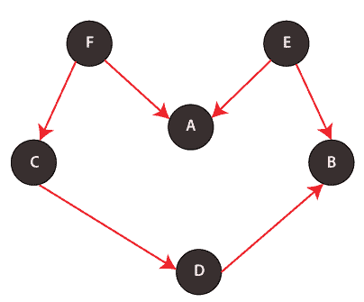

# Java 中的拓扑排序

> 原文：<https://www.tutorialandexample.com/topological-sort-in-java/>

# Java 中的拓扑排序

拓扑排序主要用于有向无环图(DAG)中顶点的线性排序。Java 中的拓扑排序演示了如何在编程中做顶点的线性排序。这里顶点的线性排序意味着对于有向非循环图的每两个节点 v 和 u，使得 v - > u，节点 v 应该总是在 u 之前

### 算法&伪码

第一步:通过调用 createEdge('x '，' y ')创建图形。

第二步:调用拓扑排序( )

1.  制作一个布尔数组(命名为 visit[ ])和一个栈；

2.  b: 将“false”值填充到 vist[]数组的所有元素中。元素的“false”值意味着不访问该元素。

3.  递归调用帮助函数 topologicalSortUtility()来跟踪从所有顶点开始的拓扑排序。

第三步:定义 topologicalSortUtil(char node，bool visit[]，stack < Character > & stk):

1.  通过将当前节点标记为已访问来更新布尔数组访问，即应该添加对应于当前节点的“真”值。

<textarea wrap="soft" class="urvanov-syntax-highlighter-plain print-no" data-settings="dblclick" readonly="" style="box-sizing: border-box; background: rgb(255, 255, 255); border-width: 0px; border-style: initial; border-color: initial; padding: 0px 5px; color: rgb(0, 0, 0); width: 735.547px; overflow: hidden; height: 60px; position: absolute; opacity: 0; border-radius: 0px; box-shadow: none; white-space: pre; overflow-wrap: normal; resize: none; tab-size: 3; z-index: 0; font-family: Monaco, monacoregular, &quot;courier new&quot;, monospace !important; font-size: 14px !important; line-height: 20px !important;">

<table class="crayon-table" style="box-sizing: border-box; margin-bottom: 15px; margin-left: -19px; border-color: rgb(238, 238, 238); width: 754.547px; border-spacing: 0px !important; background: 0px 0px !important; table-layout: auto !important;"><tbody style="box-sizing: border-box;"><tr class="urvanov-syntax-highlighter-row" style="box-sizing: border-box; background: 0px center; padding: 0.857em 0.587em; max-width: 100%; border-width: initial !important; border-style: none !important; border-color: initial !important; vertical-align: top !important; margin: 0px !important;"><td class="crayon-nums " data-settings="hide" style="box-sizing: border-box; padding: 0.857em 0.587em; max-width: 100%; border-top: none !important; border-right-color: rgb(85, 85, 85) !important; border-bottom: none !important; border-left: none !important; background: rgb(34, 34, 34) !important; vertical-align: top !important; margin: 0px !important; color: rgb(137, 137, 137) !important;">
T1】1
T3】2T5】3T7】</td><td class="urvanov-syntax-highlighter-code" style="box-sizing: border-box; padding: 0.857em 0.587em; width: 735.641px; background: 0px center; max-width: 100%; border-width: initial !important; border-style: none !important; border-color: initial !important; vertical-align: top !important; margin: 0px !important;">
 
 
 
 访=真 
 
 
 
</td></tr></tbody></table>

<ol type="i" style="box-sizing: border-box; margin: 0px; padding: 0px 0px 23px; border: 0px; outline: 0px; text-size-adjust: 100%; vertical-align: baseline; background: 0px 0px; list-style-position: inside; list-style-image: initial; line-height: 26px;"><li style="box-sizing: border-box; margin: 0px; padding: 0px; border: 0px; outline: 0px; text-size-adjust: 100%; vertical-align: baseline; background: 0px 0px;">通过递归调用 topologicalSortUtility()方法来访问与当前顶点相邻的所有顶点。确保递归仅在相邻顶点未被访问时发生，即，</li></ol>

<textarea wrap="soft" class="urvanov-syntax-highlighter-plain print-no" data-settings="dblclick" readonly="" style="box-sizing: border-box; background: rgb(255, 255, 255); border-width: 0px; border-style: initial; border-color: initial; padding: 0px 5px; color: rgb(0, 0, 0); width: 735.547px; overflow: hidden; height: 120px; position: absolute; opacity: 0; border-radius: 0px; box-shadow: none; white-space: pre; overflow-wrap: normal; resize: none; tab-size: 3; z-index: 0; font-family: Monaco, monacoregular, "courier new", monospace !important; font-size: 14px !important; line-height: 20px !important;"/>

<table class="crayon-table" style="box-sizing: border-box; margin-bottom: 15px; margin-left: -19px; border-color: rgb(238, 238, 238); width: 754.547px; border-spacing: 0px !important; background: 0px 0px !important; table-layout: auto !important;"><tbody style="box-sizing: border-box;"><tr class="urvanov-syntax-highlighter-row" style="box-sizing: border-box; background: 0px center; padding: 0.857em 0.587em; max-width: 100%; border-width: initial !important; border-style: none !important; border-color: initial !important; vertical-align: top !important; margin: 0px !important;"><td class="crayon-nums " data-settings="hide" style="box-sizing: border-box; padding: 0.857em 0.587em; max-width: 100%; border-top: none !important; border-right-color: rgb(85, 85, 85) !important; border-bottom: none !important; border-left: none !important; background: rgb(34, 34, 34) !important; vertical-align: top !important; margin: 0px !important; color: rgb(137, 137, 137) !important;">

1
T3】2
T5】3
4

5

6
</td><td class="urvanov-syntax-highlighter-code" style="box-sizing: border-box; padding: 0.857em 0.587em; width: 735.641px; background: 0px center; max-width: 100%; border-width: initial !important; border-style: none !important; border-color: initial !important; vertical-align: top !important; margin: 0px !important;">

【如果(

}

</td></tr></tbody></table>

<ol type="i" style="box-sizing: border-box; margin: 0px; padding: 0px 0px 23px; border: 0px; outline: 0px; text-size-adjust: 100%; vertical-align: baseline; background: 0px 0px; list-style-position: inside; list-style-image: initial; line-height: 26px;"><li style="box-sizing: border-box; margin: 0px; padding: 0px; border: 0px; outline: 0px; text-size-adjust: 100%; vertical-align: baseline; background: 0px 0px;">为了存储结果，将当前顶点添加到堆栈中。</li></ol>
步骤四:最后，从帮助函数返回后，显示堆栈的内容。

   Java 程序  以下代码使用上面定义的算法实现拓扑排序。代码实现了下面的直接非循环图。

文件名:TopologicalSortExample.java

<textarea wrap="soft" class="urvanov-syntax-highlighter-plain print-no" data-settings="dblclick" readonly="" style="box-sizing: border-box; background: rgb(255, 255, 255); border-width: 0px; border-style: initial; border-color: initial; padding: 0px 5px; color: rgb(0, 0, 0); width: 735.547px; overflow: hidden; height: 2000px; position: absolute; opacity: 0; border-radius: 0px; box-shadow: none; white-space: pre; overflow-wrap: normal; resize: none; tab-size: 3; z-index: 0; font-family: Monaco, monacoregular, "courier new", monospace !important; font-size: 14px !important; line-height: 20px !important;"/>

<table class="crayon-table" style="box-sizing: border-box; margin-bottom: 15px; margin-left: -36px; border-color: rgb(238, 238, 238); width: 785.547px; border-spacing: 0px !important; background: 0px 0px !important; table-layout: auto !important;"><tbody style="box-sizing: border-box;"><tr class="urvanov-syntax-highlighter-row" style="box-sizing: border-box; background: 0px center; padding: 0.857em 0.587em; max-width: 100%; border-width: initial !important; border-style: none !important; border-color: initial !important; vertical-align: top !important; margin: 0px !important;"><td class="crayon-nums " data-settings="hide" style="box-sizing: border-box; padding: 0.857em 0.587em; max-width: 100%; border-top: none !important; border-right-color: rgb(85, 85, 85) !important; border-bottom: none !important; border-left: none !important; background: rgb(34, 34, 34) !important; vertical-align: top !important; margin: 0px !important; color: rgb(137, 137, 137) !important;">
1

【2】

【3】

【4】

【5】
【6】
【7】 

【28】

【29】

【30】

【31】

【32】
【33】

34】 

55【T1110】
【56】【T1112】
【57】【T1114】
【58】【T1117】

【60】【T1121】【61】 

【82】

【83】

【84】

【85】

【86】
【87】

【88】

</td><td class="urvanov-syntax-highlighter-code" style="box-sizing: border-box; padding: 0.857em 0.587em; width: 749.828px; background: 0px center; max-width: 100%; border-width: initial !important; border-style: none !important; border-color: initial !important; vertical-align: top !important; margin: 0px !important;">

 

 // A Java program that implements Topological sorting on Directed Acyclic Graph

 import java.io.*;

 import java.util.*;

 // A Java program that implements Topological sorting on Directed Acyclic Graph

 import java.io.*;

 import java.util.*;

 // The following class implements a directed acyclic graph

 // represented by using an adjacency list

 class DirectedAcyclicGraph

 {

 // Total number of vertices present in the graph

 private int noOfVertices;

 // Adjacency List comprising of ArrayList of ArrayList's

 private ArrayList<ArrayList<Character> > adjList;

 // Paramterized Constructor

 DirectedAcyclicGraph(int noOfNodes)

 {

                noOfVertices = noOfNodes;

                // creating the the adjecency list

                adjList = new ArrayList<ArrayList<Character> >(noOfNodes);

                for (int i = 0; i < noOfNodes; ++i)

                {

                                adjList.add(new ArrayList<Character>());

                }

 }

 // Method to create an edge between two nodes of the Directed Acyclic Graph

 void createEdge(Character v, Character w) { adjList.get((int)(v - 65)).add(w); }

 // A method that visits the nodes that are adjacent to the current node using recursion

 void topologicalSortUtility(char node, boolean visited[], Stack<Character> stk)

 {

 // Marking the current node as visited by setting its value to false

 visited[(int)(node - 65)] = true;

 Character j;

 // An iterator for iterating through the adjacency list

 Iterator<Character> itr = adjList.get((int)(node - 65)).iterator();

 while (itr.hasNext())

 {

     // fetching the adjacent node

                j = itr.next();

                // adjacent node must not be visited

                if (visited[(int)(j - 65)] == false)

                {

                    // recursively traversing the adjecent nodes

                                topologicalSortUtility(j, visited, stk);

                }

 }

 // Pushing current node to the stack

 // that fetches the result

 stk.push(new Character(node));

 }

 // A method that does Topological Sorting.

 // It uses recursive method topologicalSortUtility()

 void topologicalSorting()

 {

 // creating a stack

 Stack<Character> stk = new Stack<Character>();

 // creating a boolean array of size equal to number of vertices

 boolean visited[] = new boolean[noOfVertices];

 // At First, marking all the nodes as not visited, by assigning false value

 for (int i = 0; i < noOfVertices; i++)

 {

                visited[i] = false;

 }

 // Call the utility method topologicalSortUtility()

 // on every node that is not visited

 for (int j = 0; j < noOfVertices; j++)

 {

                if (visited[j] == false)

                {

                                topologicalSortUtility((char)(j + 65), visited, stk);

                }

 }

 // Displaying contents of the stack

 while (stk.empty() == false)

 {

                System.out.print(stk.pop() + " ");

 }

 }

 }

 public class TopologicalSortExample

 {

 // Main Method

 public static void main(String argvs[])

 {

 // Creating an object of DirectedAcyclicGraph

 DirectedAcyclicGraph g  = new DirectedAcyclicGraph(6);

 g.createEdge('F', 'C'); // F -> C

 g.createEdge('F', 'A'); // F -> A

 g.createEdge('E', 'A'); // E -> A

 g.createEdge('E', 'B'); // E -> B

 g.createEdge('C', 'D'); // C -> D

 g.createEdge('D', 'B'); // D -> B

 System.out.println("Topological sort of the nodes " +

 "present in the graph defined above is: " );

 // Invoking the method topologicalSorting()

 g.topologicalSorting();

 }

 } 

 

</td></tr></tbody></table>

输出:

<textarea wrap="soft" class="urvanov-syntax-highlighter-plain print-no" data-settings="dblclick" readonly="" style="box-sizing: border-box; background: rgb(255, 255, 255); border-width: 0px; border-style: initial; border-color: initial; padding: 0px 5px; color: rgb(0, 0, 0); width: 735.547px; overflow: hidden; height: 80px; position: absolute; opacity: 0; border-radius: 0px; box-shadow: none; white-space: pre; overflow-wrap: normal; resize: none; tab-size: 3; z-index: 0; font-family: Monaco, monacoregular, "courier new", monospace !important; font-size: 14px !important; line-height: 20px !important;"/>

<table class="crayon-table" style="box-sizing: border-box; margin-bottom: 15px; margin-left: -19px; border-color: rgb(238, 238, 238); width: 754.547px; border-spacing: 0px !important; background: 0px 0px !important; table-layout: auto !important;"><tbody style="box-sizing: border-box;"><tr class="urvanov-syntax-highlighter-row" style="box-sizing: border-box; background: 0px center; padding: 0.857em 0.587em; max-width: 100%; border-width: initial !important; border-style: none !important; border-color: initial !important; vertical-align: top !important; margin: 0px !important;"><td class="crayon-nums " data-settings="hide" style="box-sizing: border-box; padding: 0.857em 0.587em; max-width: 100%; border-top: none !important; border-right-color: rgb(85, 85, 85) !important; border-bottom: none !important; border-left: none !important; background: rgb(34, 34, 34) !important; vertical-align: top !important; margin: 0px !important; color: rgb(137, 137, 137) !important;">
T1】1
T3】2T5】3T7】4T9】</td><td class="urvanov-syntax-highlighter-code" style="box-sizing: border-box; padding: 0.857em 0.587em; width: 735.641px; background: 0px center; max-width: 100%; border-width: initial !important; border-style: none !important; border-color: initial !important; vertical-align: top !important; margin: 0px !important;">
 
 
 
   拓扑 排序节点呈现图形 定义上面是  :  
 

</td></tr></tbody></table>

解释:参数化构造函数接受一个参数，该参数定义了图中存在的节点数。在构造函数中，邻接表也被创建。每当在两个节点之间创建边时，createEdge()方法更新邻接矩阵。topologicalSortUtility()方法使用邻接表遍历与当前元素相邻的元素。

注意，在上面的代码片段中，数字 65 被频繁使用。数字 65 是字母“A”的 ASCII 值。因此，当(int)' A '–65 完成时，在内部，' A '被转换为 65，65–65 = 0。因此，字母“A”指向被访问的布尔数组的第 0 个索引或邻接表的第 0 个行。其他字母也有类似的逻辑。为了将数字转换成字母，将 65 加到数字上，然后类型转换成字符，即(char)i + 65，其中也是一个数字。

拓扑排序分析

拓扑排序与 DFS(深度优先搜索)相反。在 DFS 中，首先访问最远的相邻节点，然后我们向后移动以访问其他节点，而在拓扑排序中，当前节点在其相邻节点之前被访问，这是使用堆栈实现的。因此，拓扑排序是具有栈的 DFS。   

时间复杂度

由于拓扑排序是带栈的 DFS，所以拓扑排序的时间复杂度等于 DFS，即 O(V + E)，其中 V 是顶点数，E 是图中呈现的边总数。与 DFS 相似，拓扑排序也具有相同的最佳、最差和平均时间复杂度，即 O(V + E)。

空间复杂度

为了存储和打印非循环图的节点，使用了一个堆栈，其大小不能超过图中存在的节点总数。因此，空间复杂度是 O(n)，其中 n 是数组中存在的元素总数。O(n)空间复杂度对于最好、最坏以及平均情况是相同的。 T3】

结论

拓扑排序根据图中元素的顺序进行排序。例如，在上图中，节点 F 应该总是在节点 a 之前。

因此，当要求一项工作必须在另一项工作之前完成时，我们需要一个拓扑排序来进行排序。

例如，假设有两个 Java 文件<em style="box-sizing: border-box; margin: 0px; padding: 0px; border: 0px; outline: 0px; text-size-adjust: 100%; vertical-align: baseline; background: 0px 0px;">ABC.java</em>，其中包含类<em style="box-sizing: border-box; margin: 0px; padding: 0px; border: 0px; outline: 0px; text-size-adjust: 100%; vertical-align: baseline; background: 0px 0px;"> ABC{} </em>和<em style="box-sizing: border-box; margin: 0px; padding: 0px; border: 0px; outline: 0px; text-size-adjust: 100%; vertical-align: baseline; background: 0px 0px;">PQR.java</em>。让我们假设在文件<em style="box-sizing: border-box; margin: 0px; padding: 0px; border: 0px; outline: 0px; text-size-adjust: 100%; vertical-align: baseline; background: 0px 0px;">PQR.java</em>中，一个人正在创建一个类<em style="box-sizing: border-box; margin: 0px; padding: 0px; border: 0px; outline: 0px; text-size-adjust: 100%; vertical-align: baseline; background: 0px 0px;"> ABC{} </em>的对象。因此，PQR.java 文件依赖于类<em style="box-sizing: border-box; margin: 0px; padding: 0px; border: 0px; outline: 0px; text-size-adjust: 100%; vertical-align: baseline; background: 0px 0px;"> ABC{} </em>。因此，文件 ABC.java 应该首先被执行，然后是 PQR.java。

在这种情况下，使用拓扑排序。这种类型的排序主要用在编译器中，因为编译器必须决定先执行哪个文件，然后再执行哪个文件。

 </body> </html></textarea>