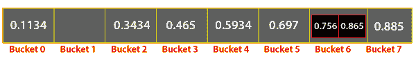

# Java 中的桶排序

> 原文：<https://www.tutorialandexample.com/bucket-sort-in-java/>

## Java 中的桶排序

桶 排序又叫桶排序。桶排序首先将数组或列表的元素放入不同的桶中。第一个桶包含最小值的元素。第二个存储桶包含的元素大于第一个存储桶中存在的元素。类似地，第三个桶包含的元素大于第二个桶的元素，依此类推。因此，存储桶被排序。之后，一个接一个，把每个桶都拿走，分类。当输入数字在给定范围内以均匀方式分布时，特别使用桶排序。

在本节中，我们将在一个 Java 程序中实现桶排序方法。

算法

第一步:创建一个空桶。

第二步:以桶自动排序的方式分配输入数组的元素。

步骤三:迭代每个桶，检查是否为空。如果桶是空的，移动到下一个桶。如果桶不为空，则对数组中的元素进行排序。

第四步:将 buckets 的元素一个一个串联起来。这样形成的数组或列表是排序后的数组或列表。

伪代码

<textarea wrap="soft" class="urvanov-syntax-highlighter-plain print-no" data-settings="dblclick" readonly="" style="box-sizing: border-box; background: rgb(255, 255, 255); border-width: 0px; border-style: initial; border-color: initial; padding: 0px 5px; color: rgb(0, 0, 0); width: 735.547px; overflow: hidden; height: 520px; position: absolute; opacity: 0; border-radius: 0px; box-shadow: none; white-space: pre; overflow-wrap: normal; resize: none; tab-size: 3; z-index: 0; font-family: Monaco, monacoregular, &quot;courier new&quot;, monospace !important; font-size: 14px !important; line-height: 20px !important;">

<table class="crayon-table" style="box-sizing: border-box; margin-bottom: 15px; margin-left: -28px; border-color: rgb(238, 238, 238); width: 1155.28px; border-spacing: 0px !important; background: 0px 0px !important; table-layout: auto !important;"><tbody style="box-sizing: border-box;"><tr class="urvanov-syntax-highlighter-row" style="box-sizing: border-box; background: 0px center; padding: 0.857em 0.587em; max-width: 100%; border-width: initial !important; border-style: none !important; border-color: initial !important; vertical-align: top !important; margin: 0px !important;"><td class="crayon-nums " data-settings="hide" style="box-sizing: border-box; padding: 0.857em 0.587em; max-width: 100%; border-top: none !important; border-right-color: rgb(85, 85, 85) !important; border-bottom: none !important; border-left: none !important; background: rgb(34, 34, 34) !important; vertical-align: top !important; margin: 0px !important; color: rgb(137, 137, 137) !important;">

1

2

3

4

5

6

7

8

9
10

11

12

13

14

15

16
</td><td class="urvanov-syntax-highlighter-code" style="box-sizing: border-box; padding: 0.857em 0.587em; width: 1127.97px; background: 0px center; max-width: 100%; border-width: initial !important; border-style: none !important; border-color: initial !important; vertical-align: top !important; margin: 0px !important;">

 

 bucketSorting()

   Make n buckets (buckets[n]). // These n buckets can hold a number of different values that fall within the range of the bucket    

for (i = 0; i < n; i++) // loop through all of the buckets

   { 

                buckets[i] = 0; // assign 0 values to each of the bucket

   } 

   for(int j = 0; j < sizeOfArray; j++)

   {

      bIndex ->  n * array[j];

     Add array[j] to bucket[bIndex];

   }

   for(int j = 0; j < sizeOfArray; j++)

   {

        sort bucket[j];

   }

   for(int j = 0; j < n; j++)

   {

      for(int i = 0; i < bucket[j].size(); i++)

      {

         array[index] -> bucker[j].get(i);

         index -> index + 1;

      }

   }

 end bucketSorting() 

 

</td></tr></tbody></table>

 Java 程序  下面的代码使用上面定义的伪代码实现了桶排序。

文件名:BucketSortExample.java

<textarea wrap="soft" class="urvanov-syntax-highlighter-plain print-no" data-settings="dblclick" readonly="" style="box-sizing: border-box; background: rgb(255, 255, 255); border-width: 0px; border-style: initial; border-color: initial; padding: 0px 5px; color: rgb(0, 0, 0); width: 735.547px; overflow: hidden; height: 1740px; position: absolute; opacity: 0; border-radius: 0px; box-shadow: none; white-space: pre; overflow-wrap: normal; resize: none; tab-size: 3; z-index: 0; font-family: Monaco, monacoregular, "courier new", monospace !important; font-size: 14px !important; line-height: 20px !important;"/>

<table class="crayon-table" style="box-sizing: border-box; margin-bottom: 15px; margin-left: -28px; border-color: rgb(238, 238, 238); width: 763.547px; border-spacing: 0px !important; background: 0px 0px !important; table-layout: auto !important;"><tbody style="box-sizing: border-box;"><tr class="urvanov-syntax-highlighter-row" style="box-sizing: border-box; background: 0px center; padding: 0.857em 0.587em; max-width: 100%; border-width: initial !important; border-style: none !important; border-color: initial !important; vertical-align: top !important; margin: 0px !important;"><td class="crayon-nums " data-settings="hide" style="box-sizing: border-box; padding: 0.857em 0.587em; max-width: 100%; border-top: none !important; border-right-color: rgb(85, 85, 85) !important; border-bottom: none !important; border-left: none !important; background: rgb(34, 34, 34) !important; vertical-align: top !important; margin: 0px !important; color: rgb(137, 137, 137) !important;">
1

【2】

【3】

【4】

【5】
【6】
【7】 

【28】

【29】

【30】

【31】

【32】
【33】

34】 

55【T1110】
【56】【T1112】
【57】【T1114】
【58】【T1117】

【60】【T1121】【61】 

【82】

【83】

【84】

【85】

【86】

【87】

</td><td class="urvanov-syntax-highlighter-code" style="box-sizing: border-box; padding: 0.857em 0.587em; width: 736.234px; background: 0px center; max-width: 100%; border-width: initial !important; border-style: none !important; border-color: initial !important; vertical-align: top !important; margin: 0px !important;">

 

 // A Java program that does sorting of an array

 // using the bucket sort

 // import statements

 import java.util.*;

 import java.util.Collections;

 class BucketSort

 {

 // A method to sort a[] of length size

 // using the bucket sort

 void bucketSorting(float a[], int size)

 {

 if (size <= 0)

 {

     // no need to proceed further

     //when size is less than or equal to 0

    return;

 }

 // Step 1

 // creating buckets of quantity size

 Vector<Float> bucket[] = new Vector[size];

 for (int j = 0; j < size; j++)

 {

                bucket[j] = new Vector<Float>();

 }

 // Step 2

 // Placing numbers present in the array a[] into the different buckets

 for (int j = 0; j < size; j++)

 {

                float i = a[j] * size;

                // typecasting i into integer

                int index = (int) i;

                // adding elements to the appropriate bucket

                bucket[index].add(a[j]);

 }

 // Step 3

 // Sorting the individual buckets

 for (int j = 0; j < size; j++)

 {

                Collections.sort(bucket[j]);

 }

 // Step 4

 // Concatenating all of the buckets into the array a[]

 // index for re-writing the array a[]

 int idx = 0;

 // iterating over every bucket

 for (int j = 0; j < size; j++)

 {

                // iterating over every element of the bucket

                for (int i = 0; i < bucket[j].size(); i++)

                {

                               // doing the concatenation work

                                a[idx] = bucket[j].get(i);

                                idx = idx + 1;

                }

 }

 }

 }

 public class BucketSortExample

 {

 // Main method

 public static void main(String argvs[])

 {

 // input array

 float a[] = { (float)0.697, (float)0.465, (float)0.756, (float)0.1134,

                (float)0.865, (float)0.885, (float)0.3434, (float)0.5934};

 // calculating size of the input array

 int size = a.length;

 System.out.println("The array before sorting is: ");

 for (int i = 0; i < size; i++)

 {

                System.out.print(a[i] + " ");

 }

 // creating an object of the BucketSort class

 BucketSort bucketSortObj = new BucketSort();

 // invoking the method bucketSorting ()

 bucketSortObj. bucketSorting (a, size);

 // line break

 System.out.println("\n");

 System.out.println("The array after sorting is: ");

 for (int i = 0; i < size; i++)

 {

                System.out.print(a[i] + " ");

 }

 }

 } 

 

</td></tr></tbody></table>

  输出:

<textarea wrap="soft" class="urvanov-syntax-highlighter-plain print-no" data-settings="dblclick" readonly="" style="box-sizing: border-box; background: rgb(255, 255, 255); border-width: 0px; border-style: initial; border-color: initial; padding: 0px 5px; color: rgb(0, 0, 0); width: 735.547px; overflow: hidden; height: 120px; position: absolute; opacity: 0; border-radius: 0px; box-shadow: none; white-space: pre; overflow-wrap: normal; resize: none; tab-size: 3; z-index: 0; font-family: Monaco, monacoregular, "courier new", monospace !important; font-size: 14px !important; line-height: 20px !important;"/>

<table class="crayon-table" style="box-sizing: border-box; margin-bottom: 15px; margin-left: -19px; border-color: rgb(238, 238, 238); width: 754.547px; border-spacing: 0px !important; background: 0px 0px !important; table-layout: auto !important;"><tbody style="box-sizing: border-box;"><tr class="urvanov-syntax-highlighter-row" style="box-sizing: border-box; background: 0px center; padding: 0.857em 0.587em; max-width: 100%; border-width: initial !important; border-style: none !important; border-color: initial !important; vertical-align: top !important; margin: 0px !important;"><td class="crayon-nums " data-settings="hide" style="box-sizing: border-box; padding: 0.857em 0.587em; max-width: 100%; border-top: none !important; border-right-color: rgb(85, 85, 85) !important; border-bottom: none !important; border-left: none !important; background: rgb(34, 34, 34) !important; vertical-align: top !important; margin: 0px !important; color: rgb(137, 137, 137) !important;">

1
T3】2
T5】3
4

5

6
</td><td class="urvanov-syntax-highlighter-code" style="box-sizing: border-box; padding: 0.857em 0.587em; width: 735.641px; background: 0px center; max-width: 100%; border-width: initial !important; border-style: none !important; border-color: initial !important; vertical-align: top !important; margin: 0px !important;">

数组排序 是:
0.6970.4650.756 排序后 为:

0.11340.34340.4650.5934
</td></tr></tbody></table>

说明:输入数组的大小为 8。因此，第一个元素 0.697 放入第 5 个第桶[0.697 * 8 = 5.576 = > 5(只取整数部分)]。第二个元素放入桶中，其索引是 3.72 的整数部分(0.465 * 8 = 3.72)，即 3。同样，其他元素也可以放入不同的桶中。下图说明了同样的情况。

在将每个数字放入桶中之后，在每个桶上调用静态方法<em style="box-sizing: border-box; margin: 0px; padding: 0px; border: 0px; outline: 0px; text-size-adjust: 100%; vertical-align: baseline; background: 0px 0px;"> sort() </em>来对桶获取的元素进行排序。

按照伪代码，最后一部分是连接，也就是使用存储在桶中的值从头到尾重写输入数组 a[]。方法<em style="box-sizing: border-box; margin: 0px; padding: 0px; border: 0px; outline: 0px; text-size-adjust: 100%; vertical-align: baseline; background: 0px 0px;"> bucketSorting() </em>的最后一个 for 循环也是如此。最终排序后的数组如下所示。

对具有非零整数部分的数字进行排序

到目前为止，我们只对整数部分为 0 的数字进行了排序(参见上例的输入)。然而，当给出像 1.234 这样的数字时，上面的程序就失败了。为了处理这样的数字，必须对上面的程序进行一些修改。但首先，请观察对具有非零整数部分的数字进行排序的算法。

算法

第一步:计算输入数组的最小和最大元素。

第二步:找到每个桶的范围。   范围=(最大-最小)/ N

这里，N 表示桶的总数。

第三步:用上面计算的帮助范围做 N 个桶。

第四步:将数组的元素分散到这些桶中，即 bucketIdx =(array[j]–minimum)/range  第五步:现在，逐个对每个桶进行排序    第六步:逐个收集桶中所有排序后的元素，并进行串联，形成排序后的数组。

现在观察基于上述算法的程序。

文件名:BucketSortExample.java

<textarea wrap="soft" class="urvanov-syntax-highlighter-plain print-no" data-settings="dblclick" readonly="" style="box-sizing: border-box; background: rgb(255, 255, 255); border-width: 0px; border-style: initial; border-color: initial; padding: 0px 5px; color: rgb(0, 0, 0); width: 735.547px; overflow: hidden; height: 2500px; position: absolute; opacity: 0; border-radius: 0px; box-shadow: none; white-space: pre; overflow-wrap: normal; resize: none; tab-size: 3; z-index: 0; font-family: Monaco, monacoregular, "courier new", monospace !important; font-size: 14px !important; line-height: 20px !important;"/>

<table class="crayon-table" style="box-sizing: border-box; margin-bottom: 15px; margin-left: -36px; border-color: rgb(238, 238, 238); width: 771.547px; border-spacing: 0px !important; background: 0px 0px !important; table-layout: auto !important;"><tbody style="box-sizing: border-box;"><tr class="urvanov-syntax-highlighter-row" style="box-sizing: border-box; background: 0px center; padding: 0.857em 0.587em; max-width: 100%; border-width: initial !important; border-style: none !important; border-color: initial !important; vertical-align: top !important; margin: 0px !important;"><td class="crayon-nums " data-settings="hide" style="box-sizing: border-box; padding: 0.857em 0.587em; max-width: 100%; border-top: none !important; border-right-color: rgb(85, 85, 85) !important; border-bottom: none !important; border-left: none !important; background: rgb(34, 34, 34) !important; vertical-align: top !important; margin: 0px !important; color: rgb(137, 137, 137) !important;">
1

【2】

【3】

【4】

【5】
【6】
【7】 

【28】

【29】

【30】

【31】

【32】
【33】

34】 

55【T1110】
【56】【T1112】
【57】【T1114】
【58】【T1117】

【60】【T1121】【61】 

【82】

【83】

【84】

【85】

【86】
【87】

【88】 

109
【T1219】【110】

【111】

【112】
【113】
【114】

【115】

</td><td class="urvanov-syntax-highlighter-code" style="box-sizing: border-box; padding: 0.857em 0.587em; width: 735.828px; background: 0px center; max-width: 100%; border-width: initial !important; border-style: none !important; border-color: initial !important; vertical-align: top !important; margin: 0px !important;">

 

 // A Java program that does sorting of an array

 // using the bucket sort

 // import statements

 import java.util.*;

 import java.util.Collections;

 class BucketSort

 {

 // method for finding the maximum element

 float findMax(float a[], int size)

 {

     float maxEle = a[0];

     for(int i = 1; i < size; i++)

     {

         if(maxEle < a[i])

         {

             maxEle = a[i];

         }

     }

     return maxEle;

 }

 // method for finding the minimum element

 float findMin(float a[], int size)

 {

     float minEle = a[0];

     for(int i = 1; i < size; i++)

     {

         if(minEle > a[i])

         {

             minEle = a[i];

         }

     }

     return minEle;   

 }

 // method for determining the range for every bucket

 int getRange(float minVal, float maxVal, int size)

 {

     int range = ((int)maxVal - (int)minVal) / (int)size;

     return range;

 }

 // A method to sort a[] of length size

 // using the bucket sort

 void bucketSorting(float a[], int size)

 {

 if (size <= 0)

 {

     // no need to proceed further

     // when size is less than or equal to 0

     return;

 }

 float maxVal = findMax(a, size);

 float minVal = findMin(a, size);

 int range = getRange(minVal, maxVal, size);

 // determining number of buckets required

 int noofbucket = (int)maxVal - (int)minVal + 1;

 // Step 1

 // creating buckets of quantity noofbucket

 Vector<Float> bucket[] = new Vector[noofbucket];

 for (int j = 0; j < noofbucket; j++)

 {

                bucket[j] = new Vector<Float>();

 }

 // Step 2

 // Placing numbers present in the array a[] into the different buckets

 for (int j = 0; j < size; j++)

 {

                // calculating index of the bucket

                float i = (a[j] - minVal) / range;

                // typecasting i into integer

                int index = (int) i;

                // adding elements to the appropriate bucket

                bucket[index].add(a[j]);

 }

 // Step 3

 // Sorting the individual buckets

 for (int j = 0; j < noofbucket; j++)

 {

                Collections.sort(bucket[j]);

 }

 // Step 4

 // Concatenating all of the buckets into the array a[]

 // index for re-writing the array a[]

 int idx = 0;

 // iterating over every bucket

 for (int j = 0; j < noofbucket; j++)

 {

                // iterating over every element of the bucket

                for (int i = 0; i < bucket[j].size(); i++)

                {

                               // doing the concatenation work

                                a[idx] = bucket[j].get(i);

                                idx = idx + 1;

                }

 }

 }

 }

 public class BucketSortExample

 {

 // main method

 public static void main(String argvs[])

 {

 // input array

 float a[] = { (float)2.697, (float)1.465, (float)3.756, (float)6.1134,

                (float)0.865, (float)1.085, (float)2.0434, (float)8.0934};

 // calculating size of the input array

 int size = a.length;

 System.out.println("The array before sorting is: ");

 for (int i = 0; i < size; i++)

 {

                System.out.print(a[i] + " ");

 }

 // creating an object of the BucketSort class

 BucketSort bucketSortObj = new BucketSort();

 // invoking the method bucketSorting ()

 bucketSortObj. bucketSorting (a, size);

 // line break

 System.out.println("\n");

 System.out.println("The array after sorting is: ");

 for (int i = 0; i < size; i++)

 {

                System.out.print(a[i] + " ");

 }

 }

 }

 

</td></tr></tbody></table>

输出:

<textarea wrap="soft" class="urvanov-syntax-highlighter-plain print-no" data-settings="dblclick" readonly="" style="box-sizing: border-box; background: rgb(255, 255, 255); border-width: 0px; border-style: initial; border-color: initial; padding: 0px 5px; color: rgb(0, 0, 0); width: 735.547px; overflow: hidden; height: 120px; position: absolute; opacity: 0; border-radius: 0px; box-shadow: none; white-space: pre; overflow-wrap: normal; resize: none; tab-size: 3; z-index: 0; font-family: Monaco, monacoregular, "courier new", monospace !important; font-size: 14px !important; line-height: 20px !important;"/>

<table class="crayon-table" style="box-sizing: border-box; margin-bottom: 15px; margin-left: -19px; border-color: rgb(238, 238, 238); width: 754.547px; border-spacing: 0px !important; background: 0px 0px !important; table-layout: auto !important;"><tbody style="box-sizing: border-box;"><tr class="urvanov-syntax-highlighter-row" style="box-sizing: border-box; background: 0px center; padding: 0.857em 0.587em; max-width: 100%; border-width: initial !important; border-style: none !important; border-color: initial !important; vertical-align: top !important; margin: 0px !important;"><td class="crayon-nums " data-settings="hide" style="box-sizing: border-box; padding: 0.857em 0.587em; max-width: 100%; border-top: none !important; border-right-color: rgb(85, 85, 85) !important; border-bottom: none !important; border-left: none !important; background: rgb(34, 34, 34) !important; vertical-align: top !important; margin: 0px !important; color: rgb(137, 137, 137) !important;">

1
T3】2
T5】3
4

5

6
</td><td class="urvanov-syntax-highlighter-code" style="box-sizing: border-box; padding: 0.857em 0.587em; width: 735.641px; background: 0px center; max-width: 100%; border-width: initial !important; border-style: none !important; border-color: initial !important; vertical-align: top !important; margin: 0px !important;">

数组排序 是:

2.6971.4653  排序后 为:

0.8651.0851.4652.0434

</td></tr></tbody></table>

    解释:最大值元素为 8.0934，最小值元素为 0.865。因此，每个铲斗的范围是:

(8.0934 的整数部分-0.865 的整数部分))/8 = >(8–0)/8 = 1。

因此，输入数组的第一个元素 2.697 位于((2.697–0.865)/1)= > 1 的整数部分。因此，位于索引 1 的桶存储数字 2.697。类似地，也可以为其他数字计算桶的索引。

在为每个数字确定了存储桶的索引之后，代码的其余部分的行为与上一个示例中的行为相同。

  分析桶排序

桶排序工作在分散和聚集方法上。因此，它也被称为分布排序。桶排序有时也被称为基数排序的表亲，因为这种排序算法支持从数字的最高有效位移动到最低有效位来进行排序工作。

  时间复杂度

桶排序的时间复杂度取决于元素的分布。与元素的非均匀分布相比，均匀分布导致更好的时间复杂度。

当所有元素都存储在一个容器中时，时间复杂度最高。这种情况下的时间复杂度是 O(n^2，其中 n 是数组中存在的元素总数。

当桶中的元素均匀分布时，时间复杂度最佳，这意味着每个桶包含几乎相等数量的元素。在这种情况下，时间复杂度是 O(n + p)，其中 O(p)是对桶中存在的元素进行排序的时间复杂度。在这种情况下，我们必须使用一种具有线性时间复杂度的算法来对存储桶中的元素进行排序。O(n)是创建桶的时间复杂度。

当元素在输入数组中随机分布时，平均时间复杂度出现。因此，每个桶包含的元素数量不同。这种情况下的桶排序算法给出的时间复杂度为 O(n + n^2/p + p)，其中 n 是元素的总数，p 是桶的总数。

注意，传统上，插入排序用于对存储桶中的元素进行排序。    空间复杂度

假设已经创建了 k 个桶来对给定的数组进行排序。因此，到目前为止，空间复杂度为 O(k)。现在，这些桶可以容纳的最大元素数是输入数组中存在的元素总数。如果 n 表示数组中元素的总数，那么桶排序算法的空间复杂度是 O(n + k)。

结论    桶排序算法不能用于任何给定的数据集。人们必须分析数据是否均匀分布。如果数据不是均匀分布的，这就不是用来完成排序过程的算法。

请注意，计数排序提供了计数排序的一瞥。想象一个场景，每个桶只容纳一个元素。

 </body> </html></textarea>