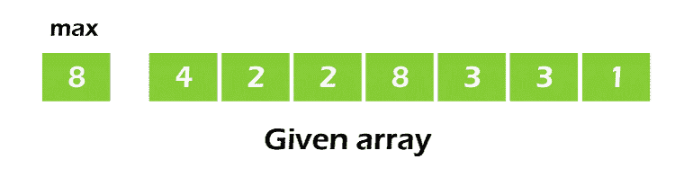
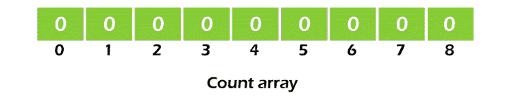
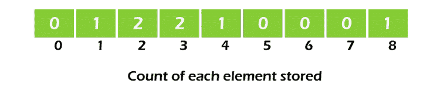
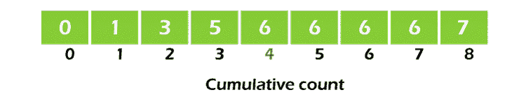
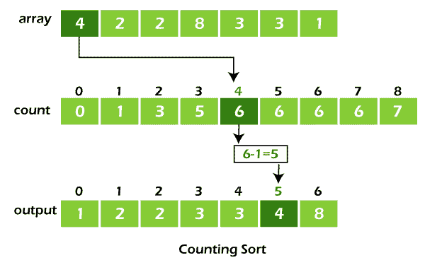
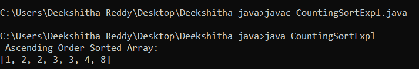

# Java 中的计数排序

> 原文：<https://www.tutorialandexample.com/counting-sort-in-java/>

使用计数排序方法对数组的元素进行排序，该方法计算每个不同元素在数组中出现的次数。计数保存在一个辅助数组中，辅助数组的索引映射到计数以进行排序。

## 实施计数排序

*   在提供的数组中找到最大的元素(姑且称之为 max)。



*   创建一个长度为 max+1 的数组，并将其所有项设置为 0。数组中元素的数量保存在该数组中，以便计数。



*   调整计数数组中每个元素计数的索引。例如，如果元素 3 的这种计数是 2，则 2 被放置在所述计数数组的第三个位置。如果数组中的元素“5”不存在，则 0 保留在第五个位置。



*   应该存储计数数组元素的累积和。这使得在排序后的数组中合适的索引处插入元素变得更加容易。



*   在计数数组中，确定每个原始数组元素的索引。这提供了总计数。将元素放在确定索引的位置，如下图所示。



*   一旦你正确定位了每个元素，从它的计数中减去一。

## 计数排序算法

```
countingSort(array, size)
	max <- find the biggest component of an array
	Set the count array to zeroes.
	for j <- 0 to size
discover the total number of each distinct element, and then store that number at the jth index in the count array.
for i <- 1 to max
 Find the total and save it directly in the count array.
for j <- size down to 1
 return the array's elements
  reduce the count of each element that has been restored by 1 
```

## Java 计数排序程序

countingsortexpl . java

```
import java.util.Arrays;
class CountingSortExpl {
void countSort(int a[], int s) {
int[] output = new int[s + 1];
// Determine the array's greatest element
int max = a[0];
for (int i = 1; i < s; i++) {
if (a[i] > max)
   max = a[i];
} int[] count = new int[max + 1];
 // Set up the count array with nothing but zeros
for (int i = 0; i < max; ++i) {
 count[i] = 0;
}
// Save the total number of each element.
for (int i = 0; i < s; i++) {
count[a[i]]++;
}
// Keep track of each array's cumulative count.
for (int i = 1; i <= max; i++) {
count[i] += count[i - 1];
}
// Place the members of the output array in the count array by finding the index 
// of each original array element.
for (int i = s - 1; i >= 0; i--) {
output[count[a[i]] - 1] = a[i];
     count[a[i]]--;
}
// Transform the sorted items into the initial array.
for (int i = 0; i < s; i++) {
a[i] = output[i];
}
}
public static void main(String args[]) {
int[] d = { 8, 2, 3, 4, 1, 3, 2 };
int s = d.length;
  CountingSortExpl c = new CountingSortExpl();
  c.countSort(d, s);
  System.out.println(" Ascending Order Sorted Array: ");
   System.out.println(Arrays.toString(d));
}
}
```

**输出:**



## 复杂性

### 时间复杂度


| 最好的 | O(n+k) |
| 最差的 | O(n+k) |
| 平均的 | O(n+k) |


### 空间复杂性

空间复杂度为 O(max)。

## 计数排序的应用

在下列情况下，使用计数排序:

*   较小的数字可以有几个计数。
*   要求是线性复杂度。