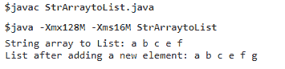

# Java 中的字符串数组

> 原文：<https://www.tutorialandexample.com/string-array-in-java>

**Java 中的字符串数组**

数组是存储相似类型数据的线性数据结构。它允许我们存储固定数量的元素。它可以是不同的数据类型，如原语或非原语。

### Java 中的字符串数组是什么？

在 Java 中，字符串数组是存储字符串值的固定大小的对象。字符串是一个字符序列。它是一个不可变的对象，这意味着存储在数组对象中的值不能被修改。

### 在 Java 中声明字符串数组

在 Java 中声明字符串数组有以下几种方法。

1.  **无尺寸声明**

**语法:**

```
String[] myStrArray;
```

这样，字符串数组 **myStrArray** 可以像其他普通变量一样声明。但是在使用它之前，应该用 new。

*   **用大小声明**

**语法:**

```
String[] myStrArray = new String[5];
```

这里，字符串数组 **myStrArray** 是使用 **new** 关键字声明的。它可以储存五种元素。

### 初始化字符串数组

有两种方法可以初始化数组:

**内联初始化:**在内联初始化中，我们首先声明一个数组，然后放入数组的元素。

**语法:**

```
 String[] myStrArray1 = new String[]{"a", "b", "c"};
 String[] myStrArray2 ={"a", "b", "c"}; 
```

这里， **myStrArray1** 被声明并立即初始化。并且 **myStrArray2** 就在声明之后被实例化。

我们也可以将第一个语句拆分如下:

```
 String[] myStrArray1;                                       // array declaration
 myStrArray1 = new String[] { "A", "B", "C", "D", "E" };     // array initialization 
```

### 声明后初始化

**语法:**

```
 String[] strarr = new String[4];
 strarr[0] = "a";
 strarr[1] = "b";
 strarr[2] = "c";
 strarr[3] = "d"; 
```

在这里， **strarr** 首先被声明，然后使用索引逐一初始化。

### 对字符串数组执行的操作

1.  **字符串数组的大小**

Java String 类提供了一个名为 length 的属性。它决定了字符串的长度。

**StringSize.java**

```
 public class StringSize
 {
     /* Driver Code */
     public static void main(String []args)
      {
         /* String Array declaration and initialization */
         String[] myStrArr1 ={"a", "b", "c"};   
         /*prints length of array */
         System.out.println("Length of the String array: "+myStrArr1.length);
      }
 } 
```

**输出:**

```
Length of the String array: 3
```

在上面的类 **StringSize** 中，一个字符串数组 **myStrArr1** 被声明并立即初始化。Length 属性用于打印 **myStrArr1** 的长度。

*   **在数组中迭代**

**IterateString.java**

```
 public class IterateString
 {
     /* Driver Code */
     public static void main(String []args)
      {
         /* String Array declaration and initialization */
         String[] myStrArr1 ={"a", "b", "c"};   
         /*iterates over array */
         for(int i=0;i<myStrArr1.length;i++)
         System.out.println("myStrArr1["+i+"]: "+myStrArr1[i]);
      }
 } 
```

**输出:**

```
 myStrArr1[0]: a
 myStrArr1[1]: b
 myStrArr1[2]: c 
```

在上面的程序中，我们使用了 Java for 循环来遍历数组。循环从 0 开始，一直执行到数组的长度。

*   **查找字符串数组中的元素**

**SearchStrArray.java**

```
 public class SearchStrArray
 {
     /*Driver Code */
     public static void main(String[] args)
     {
         /* String Array declaration and initialization */
         String[] myStrArr1 = { "a", "b", "c" };
         boolean flag = false;
         int index = 0;
         String k = "b"; /* Element to be searched */
         for (int i = 0; i < myStrArr1.length; i++)
         {
             if(k.equals(myStrArr1[i]))
             {
                 index = i;
                 flag = true;
                 break;  /*stops the loop after element is found */
             }
         }
         if(flag)
             System.out.println("Element "+ k +" found at the index "+ index);
         else
             System.out.println("Element "+ k +" not found in the array");
     }
 } 
```

**输出:**

```
Element b found at the index 1
```

在上面的程序中，我们搜索了元素 b。在 if 语句中，我们将元素(b)与数组中的每个元素进行了比较。如果没有找到匹配，break 关键字将中断循环的执行，并跳转到下一条语句。

*   **对字符串数组进行排序**

**SortStrArray.java**

```
 import java.util.*;
 public class SortStrArray
 {
     /*Driver Code */
     public static void main(String[] args)
     {
         /* String Array declaration and initialization */
         String[] myStrArr = { "c", "a", "b", "f", "e" };
         System.out.println("Before Sorting: "+ Arrays.toString(myStrArr));
         /*Sorting operation */
         Arrays.sort(myStrArr);
         System.out.println("After Sorting: "+ Arrays.toString(myStrArr));
     }
 } 
```

**输出:**


在上面的代码中， **Arrays.sort(myStrArr)** 方法用于对字符串数组进行排序。

*   **将字符串数组转换成字符串**

**strarrytostr . Java**

```
 import java.util.*;
 public class StrArraytoStr
 {
     /*Driver Code */
     public static void main(String[] args)
     {
         /* String Array declaration and initialization */
         String[] myStrArr = { "c", "a", "b", "f", "e" };
         /* String array to String conversion */
         String theString = Arrays.toString( myStrArr);
         System.out.println("String: "+ theString);
     }
 } 
```

**输出:**


在上面的代码中，使用**arrays . tostring(myStrArr)**方法将字符串数组转换为字符串。

*   **将一个字符串数组转换成一个列表并将一个新元素添加到列表中**

**StrArraytoList.java**

```
 import java.util.*;
 public class StrArraytoList
 {
     /*Driver Code */
     public static void main(String[] args)
     {
         /* String Array declaration and initialization */
         String[] myStrArr = { "a", "b", "c", "e", "f" };
         /* String array to List conversion */
         List<String> fixedList = Arrays.asList(myStrArr);
         System.out.print("String array to List: ");
         for (String str : fixedList)
         {
              System.out.print(str + " " );
         }
         /* A new list for adding new elements */
         List<String> stringList = new ArrayList<String>( fixedList );
         /*Adding a new element to the List */
         stringList.add( "g" );
         System.out.println();
         System.out.print("List after adding a new element: ");
         for (String str : stringList)
         {
              System.out.print(str + " " );
         }
     }
 } 
```

**输出:**



在上面的代码中， **Arrays.asList(myStrArr)** 方法用于将字符串数组 **myStrArr** 转换为列表。

这样，我们已经理解了 Java 中的字符串数组以及对它们执行的各种操作。