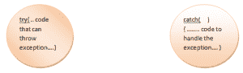

# Java 中的异常处理

> 原文：<https://www.tutorialandexample.com/exception-handling-in-java>

在研究 java 中如何处理异常之前，有必要了解什么是异常。

### 什么是例外？

Whenever a program is written, errors are encountered. Some of these errors are displayed at compile time and they demand to be corrected for the programs to run. Some of the errors do not show up at compile time but disrupts the normal flow of execution at run time. These errors are known as Exceptions in programming. "An exception is an unwanted condition that occurs at run time and disrupts the normal flow of execution of the code." An exception can also be thought as a run time error. The program with an exception is compiled successfully but not run. Exceptions occur when the operation initiated by the programmer is not valid. Most common types of exception are:

*   被零除。
*   访问越界的数组元素。
*   试图在未定义类型的数组中添加值。
*   访问越界的字符串元素。
*   将数组大小声明为负数。
*   等等。

When exceptions occur in the code, a sufficient mechanism is needed to handle it; else the program will not get executed smoothly. Java provides a mechanism to handle exceptions using five keywords namely; try, catch, throw, throws and finally. *"Java exception is an object that describes the occurrence of an exception in the java code."*

## 例外的类型:

We have three types of exception in java they are:

1.  **检查异常:**这些异常从 java.lang.Exception 类扩展而来，并在代码体中使用 try 和 catch 块进行处理。这些异常发生在编译时，如果不处理它们，程序将无法进一步执行。例如**文件未找到，SQL 和 IO** 异常。
2.  **未检查的异常:**这些异常是从 java.lang.RuntimeException 类扩展而来的，基本上不在代码中处理。Java 虚拟机(JVM)处理这样的异常。这些异常发生在运行时。例如**指标越界、被零除**等。
3.  **错误:**是正常情况下无法处理的异常。它们通常是为了应对灾难性故障而创建的。例如**栈溢出、内存不足错误、虚拟机错误**等。

## 如何处理异常？

The exception is handled in java by using 5 keywords:

1.  尝试
2.  捕捉
3.  最后
4.  投
5.  扔

### 1.试着抓住

Whenever a programmer feels that a block of code can throw some exception that section of code is written under the try block and set of operations to be performed after the exception is caught, written under the catch block. The catch block catches the exception thrown by the try block. A try block should always be followed by at least one catch block. **Syntax of try and catch block:**

```
try
{
.....................
..................... // code which is expected to throw an exception.
}
catch(Exception-name e)
{
.........................
......................... // process to handle the exception.
}
```

  

### 演示 try 和 catch 块用法的程序

```
class Excep
{
public static void main(String args[])
{
int x,y;
try
{
x=0;
y=5567/5*x;
System.out.println("Result is"+y);
}
catch (ArithmeticException e)
{
System.out.println("Division by zero exception is encountered:"+e);
}
}
}
```

**Output:**

```
Division by zero exception is encountered: java.lang.ArithmeticException

```

### 说明了多个 catch 块的使用。

In some cases, more than one exception can be thrown by a block of code. To handle multiple exceptions being thrown, we can use multiple catch blocks.**Syntax for using multiple catch blocks:**

```
try
{
.............
}
catch(Exception-type1 e)
{ 
..............
}
catch(Exception-type2 e)
{ 
...............
}
catch(Exception-type N e)
{ 
...............
}
```

Program to show how multiple catch blocks are used within a program

```
class multicatch
{
public static void main(String args[])
{
int ar[] =new int[2];
ar[0]=5;
ar[1]=10; int b=5;
try
{
int x = ar[1]/b-ar[0];
System.out.println("The result of operation is"+x);
System.out.println("8th element of array is"+ar[7]);
}
catch(ArithmeticException e)
{
System.out.println("Divide by zero exception occurred"+ae);
}
catch(ArrayIndexOutOfBoundsException e) 
{
System.out.println("Element does not exist"+e);
}
catch(Exception e)
{
System.out.println("Exception occurred"+e);
}
}
```

In the above program, we have caught the main Exception class in the end and its specific cases are mentioned above. This is because all the specific exceptions are defined under the main exception class and if we use it at the very first place then the other catch statements will never be executed and we will get a compile time error stating; 'second catch statement is unreachable'.

### 2.最后

Finally statement is usually written after the try and catch block. No matter whether any exception is thrown in the program or not, finally block always gets executed. For this reason, we use the finally block when we want a series of steps to always get executed. It can also be used to handle the exception that is not caught by the catch statement previously, or that is thrown by the try block. Each try block should have at least one catch or finally statement.**Syntax of finally**

```
try
{
.........
}
catch(exception-type e)
{
..........
}
finally
{
...........
}
```

### 说明 finally 语句用法的程序

```
class multicatch
{
public static void main(String args[])
{
int ar[] =new int[2];
ar[0]=5;
ar[1]=10; int b=5;
try
{
int x = ar[1]/b-ar[0];
System.out.println("The result of operation is"+x);
System.out.println("8th element of array is"+ar[7]);
}
catch(ArithmeticException e)
{
System.out.println("Divide by zero exception occurred"+ae);
}
catch(ArrayIndexOutOfBoundsException e) 
{
System.out.println("Element does not exist"+e);
}
catch(Exception e)
{
System.out.println("Exception occurred"+e);
}
finally
{
int z= ar[1]/ar[0];
System.out.println("Result is"+z);
}
}
}
```

### 3.扔

With the help of throw keyword, it is possible for the programmer to explicitly throw an exception that is not defined in the Java run time system. The syntax of throw statement is-

```
throw throwableInstance;
```

Here, throwableInstance much be an

*   可抛出类的对象
*   可抛出类的子类

There are two ways of obtaining a throwable object:

*   在 catch 子句中使用参数。
*   用新关键字创建对象。

When throw keyword is encountered in the code, the normal flow is disrupted. The code is inspected try block, inspected to see if it has a catch statement to handle the exception, subsequently all the try blocks are checked, if no catch block is found then the exception is handled by the default exception handler.

### 说明 throw 关键字用法的代码

```
class NewException extends Exception
{
NewException(String txt)
{
super(txt);
}
}
class TestNewException
{
public static void main(String args[])
{
int x = 1000000, y=1;
try
{
int z = x/y;
if(z>1000)
{
throw new NewException("Result is too large then desirable");
}
}
catch(NewException e)
{
System.out.println("User defined exception caught");
System.out.ptintln(e.getMessage());
} 
finally
{
System.out.println("This program was declined due to uncertain termination");
}
}
}
```

### 4.投

*   Throws 关键字与方法声明一起使用，让用户知道该方法可以引发指定类型的异常。
*   当方法可能引发异常，但没有处理该异常的机制时，使用 Throws 关键字。

### 程序演示了 throws 关键字的使用

```
class ExcepLast
{
void divide() throws ArithmeticException
{
int a =55, b=0, c;
c = a/b;
}
public static void main(String args[])
{
try
{
divide();
}
catch(ArithmeticException e)
{
System.out.println("Exception is successfully caught"+e);
}
}
}
```

## 投掷和投掷的区别

| 扔 | 投 |
| Throw 用于显式抛出异常。 | Throws 用于让用户知道某个方法可能抛出的异常。 |
| Throw 关键字后跟一个实例。 | Throws 关键字后跟一个类。 |
| Throw 关键字在方法中使用。 | Throws 关键字与方法签名一起使用。 |
| 不能显式引发多个异常。 | 可以声明多个异常。 |
| 不可能传播已检查的异常。 | 检查异常的传播是可能的。 |

## 错误和异常的区别

| **错误** | **异常** |
| 编译时检测到错误。 | 运行时检测到异常。 |
| 错误无法恢复。 | 异常可以被恢复。 |
| 错误在 java.lang.Error 包下定义。 | 异常在 java.lang.Exception 包下定义。 |
| 程序代码不能处理错误。 | 异常可以在程序代码中处理。 |
| 错误被定义为未检查类型。 | 异常被定义为已检查和未检查类型。 |
| 例如，缺少分号、缺少变量声明等。 | 例如，将整数除以零、访问超出界限的元素等。 |

[← Prev](https://www.tutorialandexample.com/java-strings)[Next →](https://www.tutorialandexample.com/difference-between-throw-and-throws-in-java)