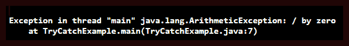
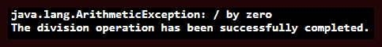
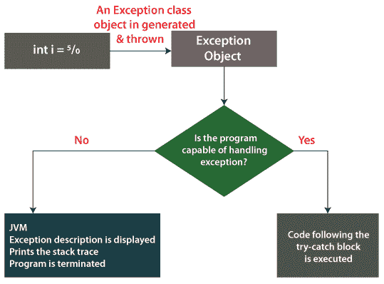
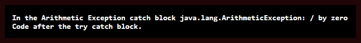

# Java 尝试捕捉

> 原文：<https://www.tutorialandexample.com/java-try-catch/>

**Java try catch**

有些语句会导致异常，而异常会导致程序异常终止。为了避免这种异常终止，那些看起来可能引发异常的语句应该放在 **try** 块中。当 try 块中引发异常时，catch 块执行。通过使用 **Java try-catch** 块，我们可以处理这个异常。在本主题中，我们将讨论 try-catch 块如何帮助处理异常。

**Java try-catch 语法**

try-catch 的语法如下:

```
 try
 {
 //statements that may cause exceptions
 }
 catch(ExceptionClass obj)
 {
 //statements
 } 
```

**Java try-catch 块的重要性**

让我们试着理解，如果在程序的帮助下省略 try-catch 块，会发生什么。

**文件名**:TryCatchExample.java

```
 public class TryCatchExample
 { 
 // main method
 public static void main(String argvs[])
 {
 int val = 70 / 0; // statement responsible for exception. Line no 7
 // print statement
 System.out.println("The division operation has been successfully completed.");
 }
 } 
```

**输出:**



**解释:**注意到 print 语句没有被执行。这是因为第 7 行出现了异常。异常导致程序异常终止，这种行为是不正确的。应该执行那些不会导致异常的语句，并显示它们的输出。为了达到同样的目的，使用了 Java try-catch 块。让我们看看如何处理上述异常。

**文件名**:TryCatchExample1.java

```
 public class TryCatchExample1
 { 
 // main method
 public static void main(String argvs[])
 {
 try
 {
 int val = 70 / 0;
 }
 catch(ArithmeticException e)
 {
 System.out.println(e);  
 }
 // print statement
 System.out.println("The division operation has been successfully completed.");
 }
 } 
```

**输出:**



**解释:**现在，我们观察异常被处理。catch 块后面的 print 语句此时被执行，程序正常终止。

### 正确处理 Java 尝试捕捉

人们应该理解，应该小心处理 Java try-catch 块。假设，我们确信代码中的一些语句不会抛出异常，那么这样的语句就不应该放在 try 块中。观察下面的代码。

**文件名**:TryCatchExample2.java

```
 public class TryCatchExample2
 { 
 // main method
 public static void main(String argvs[])
 {
 try
 {
 int val = 70 / 0; // line 8
 // print statement 1
 System.out.println("Hello Java. The language is awesome.");
 }
 catch(ArithmeticException e)
 {
 System.out.println(e);  
 }
 // print statement 2
 System.out.println("The division operation has been successfully completed.");
 }
 } 
```

**输出:**


**解释:**注意第一条打印语句(在第 10 行)没有被打印出来。不执行第一个 print 语句的原因是第 8 行。在第 8 行，引发了*Java . lang . arithmeticeexception*。因此，控制转移到 catch 块。因此，try 块中第 8 行之后的任何语句都不会被执行。因此，第一个 print 语句不会在控制台上打印出来。合适的方法是将 print 语句 1 放在 try-catch 块之外。因此，我们可以说，只有那些能够引发异常的语句才应该放在 try 块中。

### 试锁块的工作

下面的流程图演示了 try-catch 块的工作原理。



**记住:**

*   一个 catch 块不可能有多个 try 块。如果我们试图这样做，就会产生编译时错误。
*   每个 try 块后面必须至少跟一个 catch 块或 finally。
*   一个 try 块可以有多个 catch 块。多个 catch 块可以非常方便地以不同的方式处理每个异常。
*   catch 块可以处理多种类型异常。确保每种类型的异常由竖线(|)分隔。它减少了代码重复，提高了效率。例如:

```
 try
 {
 // code
 }
 catch (ExceptionType1 | Exceptiontype2 | Exceptiontype2 ex)
 {
 // catch block
 } 
```

尽管一个 try 块可以有多个 catch 块，但一次只能执行一个 catch 块。catch 块的排序应该总是从特定到一般，这意味着*算法异常*应该总是在*执行之前；*否则，抛出编译错误。

**文件名**:TryCatchExample3.java

```
 public class TryCatchExample3
 { 
 // main method
 public static void main(String argvs[])
 {
 try
 {   
 int arr[] = new int[6];  // line 9
 // arr[6] = 8; // line 10 
 arr[6] = 130 / 0; // line 11
 }   
 // multiple catch blocks for handling different types of exception
 catch(ArithmeticException ae) 
 { 
   System.out.println("In the Arithmetic Exception catch block " + ae); 
 }   
 catch(ArrayIndexOutOfBoundsException aie) 
 { 
   System.out.println("In the ArrayIndexOutOfBounds Exception catch block. " + aie); 
 }   
 catch(Exception ex) 
 { 
   System.out.println("In the Parent Exception catch block " + ex); 
 }     
 System.out.println("Code after the try catch block.");   
 }
 } 
```

**输出:**



**解释:**从输出中可以明显看出，只有*算术异常*的 catch 块被执行，原因是第 11 行。第 11 行可以生成两个异常，一个是*算术异常* (130 / 0)，另一个是*ArrayIndexOutOfBounds*(arr[6])异常。然而，首先执行操作 130 / 0，因此，也首先引发*算术异常*。为了引发 *ArrayIndexOutOfBounds* 异常，取消对第 10 行的注释。