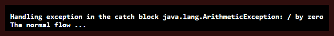
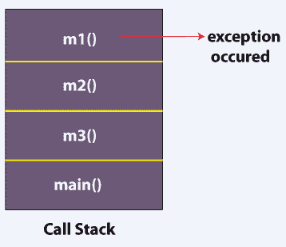
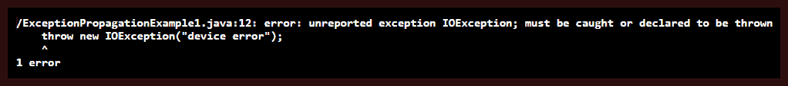
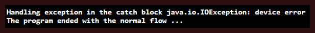

# Java 异常传播

> 原文：<https://www.tutorialandexample.com/java-exception-propagation/>

**Java 异常传播**

当一个异常从栈顶抛出并且没有被捕获时，它沿着栈向下运行到紧接在 peek 方法后面的前一个方法。如果没有捕获到异常，那么它会继续下一个先前的方法，并继续传播，直到捕获到异常。栈中存在的方法列表被称为**调用栈**，而异常从栈顶传播到栈底的过程被称为 **Java 异常传播**。

### 未检查异常中的传播

默认情况下，Java 有助于在调用堆栈中传播未检查的异常。让我们借助下面的程序来证实这一点。

**文件名**:ExceptionPropagationExample.java

```
 public class ExceptionPropagationExample
 {
 void m1()
 {
     // Arithmetic Exception occurred which is an unchecked exception
     int i = 51 / 0;
     // propagating the exception to m2()
 }
 void m2()
 {
     m1();
     // propagating the exception to m3()
 }
 void m3()
 {
     try
     {
         m2();
     }
     // handling any raised exception in the catch block
     catch (Exception e)
     {
 System.out.println("Handling exception in the catch block " + e);
     }
 }
 // main method
 public static void main(String argvs[])
 {
     // Creating an object of the ExceptionPropagationExample class
 ExceptionPropagationExample  obj = new ExceptionPropagationExample ();
     // invoking the method m3()
     obj.m3();
 System.out.println("The normal flow ...");
 }
 } 
```

**输出:**



**解释:**方法 m3()调用方法 m2()，m2 又调用方法 m1()。在方法 m1()中，引发了一个未检查的异常。Java 运行时系统试图解决这个异常。但是，系统在 m1()中没有找到处理异常的代码。因此，它沿着堆栈向下，在 m2()中寻找异常处理代码。然而，这一次搜索也是徒劳的，搜索继续在堆栈中最后一个方法中进行，这一次找到了处理异常的代码，它处理方法 m1()引发的异常。下图描述了调用堆栈。



### 检查异常中的传播

在检查的异常中，默认情况下不会出现异常传播。请遵守以下程序。

**文件名**:ExceptionPropagationExample1.java

```
 // import statement
 import java.io.IOException;
 public class ExceptionPropagationExample1
 {
 // a method that throws a checked exception
 void m1()
 {
     // throwing the IOException, which is a checked exception
     throw new IOException("device error");
     // propagating the exception to m2()
 }
 void m2()
 {
     m1();
     // propagating the exception to m3()
 }
 void m3()
 {
     try
     {
         m2();
     }
     // handling any raised exception in the catch block
     catch (Exception e)
     {
 System.out.println("Handling exception in the catch block " + e);
     }
 }
 // main method
 public static void main(String argvs[])
 {
     // Creating an object of the ExceptionPropagationExample1 class
     ExceptionPropagationExample1  obj = new ExceptionPropagationExample1 ();
     // invoking the method m3()
     obj.m3();
 System.out.println("The normal flow ...");
 }
 } 
```

**输出:**



**说明:**输出确认程序没有正常终止。这是因为在方法 *m1()* 中引发的 checked 异常没有被处理。我们还看到 *m3()* 愿意使用 try-catch 块来处理异常。然而，在 *m1()* 方法中引发的 *IOException* 永远不会传播到方法 *m3()* 。因此，我们看到被检查的异常不会自己传播。

### 在检查的异常中强制传播

可能会出现需要传播检查过的异常的情况。为了达到同样的效果，需要使用 throws 关键字。下面的程序说明了同样的情况。

**文件名**:ExceptionPropagationExample2.java

```
 // import statement
 import java.io.IOException;
 public class ExceptionPropagationExample2
 {
 // a method that throws a checked exception
 // and propagates the exception handling
 // responsibility to the caller method
 void m1() throws IOException
 {
     // throwing the IOException, which is a checked exception
     throw new IOException("device error");
     // propagating the exception to m2()
 }
 // the method m2() also propagates the exception handling
 // responsibility to the caller method
 void m2() throws IOException
 {
     m1();
     // propagating the exception to m3()
 }
 void m3()
 {
     try
     {
         m2();
     }
     // handling any raised exception in the catch block
     catch (Exception e)
     {
 System.out.println("Handling exception in the catch block " + e);
     }
 }
 // main method
 public static void main(String argvs[])
 {
     // Creating an object of the ExceptionPropagationExample2 class
     ExceptionPropagationExample2  obj = new ExceptionPropagationExample2 ();
     // invoking the method m3()
     obj.m3();
 System.out.println("The program ended with the normal flow ...");
 }
 } 
```

**输出:**



**解释:**我们观察到程序正常终止。发生这种情况是因为 throws 关键字。throws 关键字通过方法 *m2()* 提供了从方法 *m1()* 到 *m3()* 引发的异常的路径。
T9】