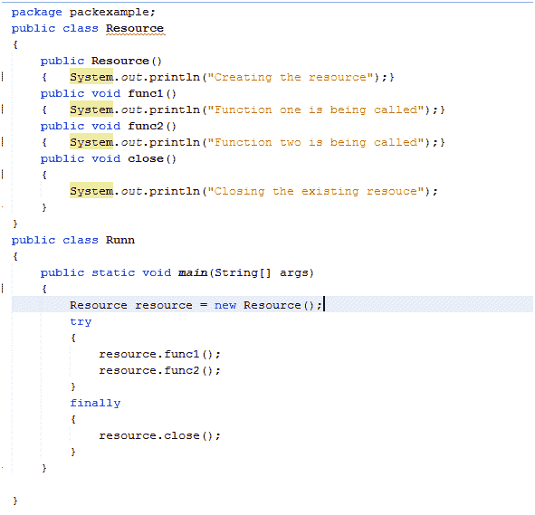
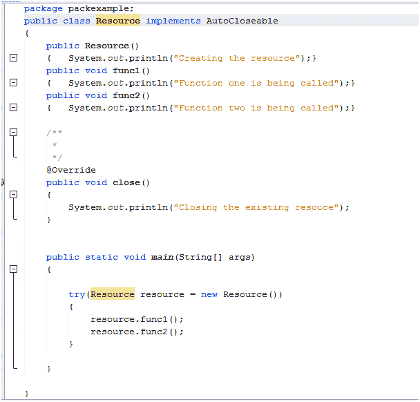
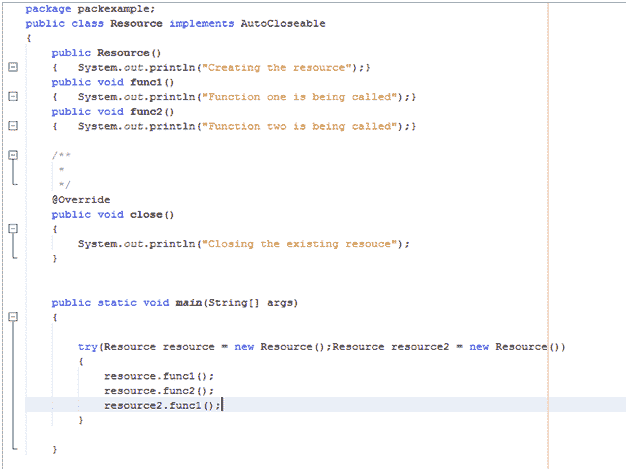

# 自动资源管理

> 原文：<https://www.tutorialandexample.com/automatic-resource-management>

在计算机程序设计中，资源管理是指有效管理系统资源的一系列技术。有两种资源管理方式:

1.  计算机程序本身管理资源。
2.  计算机程序指定一个主机来管理资源。

Java has a resource management technique known as ARM. But before taking an insight into the ARM, let us see about the garbage collection.

### 碎片帐集

It is a memory management technique which frees up the memory space occupied by the objects which have not been used for a long time. It is done automatically, and the programmer does not have to do anything with it. Now, the question may arise as to how the JVM decides which objects to clean up? The Java virtual machine has its own set of algorithms to decide which objects have not been utilized for a long period of time.

### 垃圾收集的优势

*   内存管理是高效的
*   不需要用户输入。

### 垃圾收集的缺点

*   垃圾收集管理内存，但它不是即时的。
*   它降低了可靠性。

To keep the advantages of Garbage Collection intact and overcome its disadvantages, **Java 7 ARM was introduced**. It was very effective for effective management of memory. ARM is used in Java programs by using **try with resource** block and by implementing the AutoCloseable interface. This interface has only one method to be overridden by the implementing class, and it is **'close ()'**. The try with resource statement is a try statement that declares one or more resources which need to be closed at the end of methods declaration. The scenario of closing of resources before ARM was introduced. Before Java 7 the resources were closed using the try and finally statements. It is illustrated with the help of program written below:  The close method was called under the finally block, and the resources were closed.

### 用 ARM 让我们看看这个场景

 With ARM being used, the resources get automatically closed at the end of the try block.

### 如果我们有两个以上的资源会怎么样？

We can do this by increasing the level of nesting, that is we can enclose the second resource try block in the first one or vice versa. But it can make the code noisy. To avoid such issues, we declare both the resources in the same try block as illustrated in the program below: We can do this for multiple resources as well. So ARM provides a measure of effective resource management for one as well as more than one resources.

## ARM 的优势:

*   它是瞬间发生的。
*   也可以同时使用多个资源。
*   它没有那么吵。

[← Prev](https://www.tutorialandexample.com/difference-between-throw-and-throws-in-java)[Next →](https://www.tutorialandexample.com/multithreading-in-java)