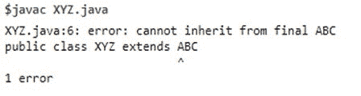
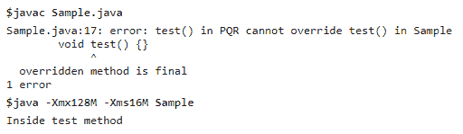
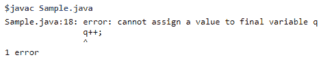
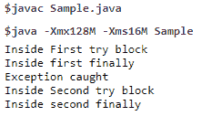

# final、finally 和 finalize()之间的区别

> 原文：<https://www.tutorialandexample.com/difference-between-final-finally-and-finalize>

【final、finally 和 finalize()之间的区别

在 Java 中，final、finally 和 finalize 听起来很相似，但它们在功能上完全不同。Final 和 finally 是两个关键字，但是 finalize 是 Object 类的一个方法。在本节中，我们将讨论 final、finally 和 finalize()之间的区别。

### Java final 关键字

final 在 Java 中是一个**关键字**，这意味着我们不能在 Java 程序中使用 final 作为标识符。当一个类、方法和变量名前面带有 final 关键字时，这意味着它们不能被另一个类继承，该方法不能被另一个方法覆盖，赋给变量的值不能分别更新。

让我们在 Java 程序中对类、方法和变量使用 final 关键字。

1.  **对类使用 final 关键字:**

**XYZ.java**

```
 final class ABC
 {
     /* Methods and variable can be declared here. */
 }
 /*Compile time error. XYZ can’t inherit ABC as it is final. */
 public class XYZ extends ABC
 {
     /* Driver Code */
     public static void main(String args[])
     {
     }
 } 
```

**输出:**



上面的代码显示了 final 关键字与类 **ABC 的用法。**类 **XYZ** 不能继承类 **ABC** ，因为它是最终类。

*   **使用 final 关键字和方法**

**Sample.java**

```
 public class Sample
 {
            /* final method */
           final void test()
           {
               System.out.println("Inside test method"); 
           }
           /* Driver code */
           public static void main(String a[])
           {
               Sample s=new Sample();
               s.test();
           }
 }
 class PQR extends Sample
 {
           /* Compile time error. Can't override test() because it is final. */
           void test() {}
 } 
```

**输出:**



上面的代码显示了 final 关键字与在**示例**类中声明的 **test()** 方法的用法。该方法不能在子类 **PQR** 中被覆盖。

**3。将 final 关键字用于变量:**

**Sample.java**

```
 public class Sample
 {
     /* Driver Code */
      public static void main(String a[])
      {
               // Simple variable
               int p = 5;
               // Variable with final keyword
               final int q = 6;
               /* modifying the simplevariable : Allowed */
               p++;
               /* Compile Time error. Can’t modify final variable*/
               q++;
      }
 } 
```

**输出:**



上面的代码显示了 final 关键字的使用，变量 **q** 在**样本**类中声明。

### Java 最终关键字

在 Java 中，finally 是保留关键字。它用于异常处理。finally 块总是在 try-catch 块之后使用。即使发生意外异常，finally 块也会执行。在 finally 块中编写清理代码始终是一个好习惯，即使没有预测到异常。

**FinallyExample.java**

```
 public class FinallyExample
 {
           /* methodOne()with try-catch and finally block. Called inside try-catch block in driver code */
           static void methodOne()
           {
                    try
                    {
                              System.out.println("Inside First try block");
                              throw new RuntimeException("e");
                    }
                    finally
                    {
                              System.out.println("Inside first finally");
                    }
           }
           /*Method called outside try-catch block in driver code.*/
           static void methodOne()
           {
                    try
                    {
                              System.out.println("Inside Second try block");
                              return;
                    }
                    finally
                    {
                              System.out.println("Inside second finally");
                    }
           }
           /* Driver Code */
           public static void main(String args[])
           {
                    try {
                              methodOne();
                    }
                    catch (Exception e) {
                              System.out.println("Exception caught");
                    }
                    methodTwo();
           }
 } 
```

**输出:**



上面的代码显示了 FinallyExampleclass 中在 **methodOne()** 和 **methodTwo()** 内声明的 finally 块的用法。

 **### Java finalize()方法

在 Java 中，finalize()方法由垃圾收集器调用，以便释放内存堆。就在移除未使用的对象之前调用它。它是 Object 类的一个方法。当一个对象被取消引用时，它被调用。被取消引用的对象需要被垃圾收集器销毁。

**FinalizeExample.java**

```
 public class FinalizeExample
 {
     @Override
           protected void finalize()
           {
                    System.out.println("finalize method executed");
           }
           /*Driver Code */
           public static void main(String a[])
           {
                    Sample h1 = new Sample();
                    h1 = null;      /* Marking h1 for garbage collection */
                     System.gc();    /*Garbage collector calls finalize */
                    System.out.println("Main completed");
           }
 } 
```

**输出:**

```
 Main completed
 finalize method executed 
```

上面的代码显示了在 **FinalizeExample** 类中覆盖的 **finalize()** 方法的使用。

### final、finally 和 finalize()之间的区别


| **Sr 号** | **决赛** | **最后** | **finalize()** |
| 1. | final 是一个关键字/访问修饰符。 | 最后是与 try-catch 块一起使用的块。 | finalize()是在 java.lang.Object 类中声明的受保护方法。 |
| 2. | 类、变量和方法前面都有 final 关键字。 | try-catch 块后面是 finally 块。最后不一定要用。但是建议在处理异常时使用 finally block。 | finalize()方法作用于标记为垃圾回收的对象。 |
| 3. | 使用 final 关键字意味着对类、方法和变量的限制。不能扩展类，不能重写方法，不能更新变量值。 | finally 块在异常处理期间使用。即使 try-catch 块不执行，finally 块中的语句也会执行。 | 使用 finalize()方法时，应该重写它。它用于垃圾收集。 |
| 4. | 当程序员调用 final 方法时，它就会被执行。 | finally 块在 try-catch 块之后执行它的执行。 | finalize()方法在垃圾收集器销毁被取消引用的对象之前执行。 |


在本文中，我们已经讨论了 final、finally 和 finalize()的例子。还解释了它们之间的主要差异。**