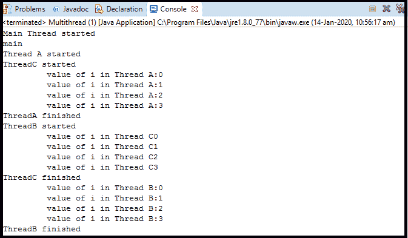

# java 线程调度器

> 原文：<https://www.tutorialandexample.com/thread-scheduler-in-java/>

**调度:**它被定义为单个 CPU 上多个线程按照一定的顺序执行被称为调度。

抢占式优先级调度:这种算法根据线程相对于其他可运行线程的优先级来调度线程。在任何时候，当多个线程准备好被执行时，运行时系统选择那些具有最高优先级的可运行线程来执行。所选择的线程运行，直到一个更高优先级的线程变得可运行，它让步，或者它的 run 方法存在，或者它的时间片是给那个线程已经到期。

如果给定线程的时间分片完成，或者与仍在运行的前一较高优先级线程相比，最高优先级线程进入可运行状态。这个当前正在运行的线程将被从运行状态中抢占，并且这个最高优先级的线程将获得在运行状态中完成其任务的时间片。这种类型的调度被称为抢占式优先级调度。

**先来先服务调度:** JVM 根据线程的到达时间，给出其执行的时间片，并根据其到达时间调度那些线程的作业。在就绪队列中，哪个作业先来，就先得到 CPU。作业的到达时间越短，作业获得 CPU 的时间就越快。

**时间片调度:**这是先来先服务调度的抢占式版本。在这个算法中，每个线程都循环执行。系统中定义了一个特定的时间片，称为时间段。就绪队列中的每个线程都被分配了 CPU 的时间段。如果该进程的执行在此期间完成，那么该线程将终止，否则该线程将返回就绪队列，等待下一轮完成执行。然后，下一个新线程获得在处理器中执行的时间片。

### 线程调度器示意图:


### 线程调度器的工作方式:

1.  在操作系统中，有四个不同优先级的线程。即线程 1、线程 2、线程 3、线程 4。
2.  哪个线程先去处理器执行，由线程调度器决定。线程调度器是 JVM 的一部分。
3.  线程调度器等待线程，这是一些优先级(优先级是 JVM 给线程的 1 到 10 之间的数字)。调度程序立即将优先级较高的线程交给处理器执行。当另一个线程具有最高优先级时，处理器中先前较高的执行线程将从处理器中被抢占，并且该最高优先级线程被给予处理器以完成其任务。这种算法被称为抢占式优先级调度。
4.  如果两个线程具有相同的优先级(Thread2 和 Thread4)，FCFS 调度由线程调度器分配给线程在处理器中执行，先来的线程被分配时间片用于其执行，然后该线程将在完成其时间片后被处理器抢占。那么将给予其他线程执行的机会，或者没有其他线程的阻塞，否则将导致线程的饥饿。

**线程类中定义了三个影响线程调度器优先级的静态变量:**

| 方法 | 描述 |
| 公共静态 int MIN_PRIORITY | 这是线程的最低优先级。该值为 1。 |
| 公共静态 int NORM_PRIORITY | 如果没有明确定义，这是线程的默认优先级。该值为 5。 |
| 公共静态 int MAX_PRIORITY | 这是线程的最高优先级。该值为 10。 |

### 线程优先级的获取和设置方法:

| 方法 | 描述 |
| public final int getPriority() | 这个方法返回给定线程的优先级。 |
| 公共最终无效设置优先级(int p) | 这个方法将线程的优先级改为值 p。 |

### 受优先级影响的方法:

1.  **yield()** :当 yield()方法在线程上被调用时，它给线程调度器一个提示，它准备暂停执行。线程调度器检查是否有任何线程具有与 yield()方法调用的当前线程相同或更高的优先级。如果调度程序发现任何具有更高或相同优先级的线程，那么它会将当前线程转移到就绪/可运行状态，并将处理器交给其他线程，如果没有，当前线程将继续执行。
2.  **sleep():** 该方法指示当前正在执行的线程休眠指定的毫秒数，以便另一个具有时间片的线程在处理器中继续执行。
3.  **join():** 这个方法用于将执行中的线程排队。一旦在线程上被调用，当前线程将等待，直到调用线程完成它的执行。

**示例 1:使用 setPriority()方法设置线程的优先级**:

**举例**:

```
class A extends Thread
 { 
 int i=0;
 public void run()
 {
 System.out.println("Thread A started"); 
 while(i<4)
 {
 System.out.println("\t value of i in Thread A:"+i); 
 i++;                 
 }                       
 System.out.println("ThreadA finished");         
 } 
 } 
 class B extends Thread
 {
 public void run()
 {int i=0;
 System.out.println("ThreadB started"); 
 while(i<4)
 {
 System.out.println("\t value of i in Thread B:"+i);    
 i++;
 }
 System.out.println("ThreadB finished");
 } 
 }  
 class C extends Thread
 {
 public void run()
 {
 int i=0; 
 System.out.println("ThreadC started");
 while(i<4)
 {
 System.out.println("\t value of i in Thread C"+i);
 i++;
 } 
 System.out.println("ThreadC finished");
 }
 }
 public class scheduller { 
 public static void main(String[] args) {             
 System.out.println("Main Thread started");              
 A a=new A();
 B b=new B();
 C c=new C(); 
 Thread th=Thread.currentThread();
 System.out.println(th.getName());
 th.setPriority(Thread.MAX_PRIORITY);
 b.setPriority(Thread.MIN_PRIORITY);
 c.setPriority(Thread.NORM_PRIORITY); 
 a.start();
 b.start();
 c.start();
 }
 } 
```

**输出:**



### 解释:

1.上面的程序中有四个线程。ThreadA、ThreadB、ThreadC 和主线程。

2.我们将使用 Thread 类非静态方法 setPriority 来设置这些线程的优先级。

3.在 setPriority 方法中，我们将使用优先级的静态常量变量，以便每个线程根据用户获得优先级

4.然后我们使用 start 方法来执行不同线程的 run 方法。

5.由于主线程有 MAX_PRIORITY，所以线程调度器给它提供第一个时间片来完成它的执行。

6.由于 ThreadC 具有 NORM_PRIORITY，所以下一个线程调度器向它提供时间片来完成它的执行。

7.ThreadA 有默认的 NORM_PRIORITY，它是由 JVM 提供的。ThreadC 和 ThreadA 具有相同的优先级，因此 FCFS 时间片优先级被赋予线程。

8.那么 ThreadB 具有 MIN_PRIORITY，所以线程调度器向它提供最后一个时间片来完成它的任务。

9.当各个线程的 run 方法完成时，它的执行也终止。

**示例 2:使用优先级对 join()方法的影响:**

**案例 A:** **显示不使用优先级的三个具有 join()方法的线程的输出:**

```
class A extends Thread
 { 
 int i=0;
 public void run()
 {
 System.out.println("Thread A started"); 
 while(i<4)
 {
 System.out.println("\t value of i in Thread A:"+i);
 i++;                 
 }                        
 System.out.println("ThreadA finished");        
 }
 }
 class B extends Thread
 { 
 public void run()
 {int i=0;
 System.out.println("Thread B started");
 while(i<4)
 { 
 System.out.println("\t value of i in Thread B:"+i);    
 i++;
 }
 System.out.println("ThreadB finished");
 }
 } 
 class C extends Thread
 {
 public void run()
 { 
 int i=0;
 System.out.println("Thread C started");
 while(i<4)
 { 
 System.out.println("\t value of i in Thread C"+i);
 i++;
 }
 System.out.println("Thread C finished");
 }
 } 
 public class priority {
 public static void main(String[] args) {             
 System.out.println("Main Thread started");              
 A a=new A();
 B b=new B();
 C c=new C();
 a.start(); 
 b.start();
 c.start();
 try
 {
 a.join();
 b.join(); 
 c.join();
 }  
 catch(InterruptedException e)
 { 
 e.printStackTrace();
 }
 }
 } 
```

**输出:**


### 解释:

1.ThreadA、ThreadB 和 ThreadC 以及主线程已经创建。

2.首先在 ThreadA 上调用 join 方法，然后在 ThreadB 上调用，最后在 ThreadC 上调用。

3.TheadB 和 ThreadC 必须等待 ThreadA 完成它的 run 方法(线程的执行)。

4.ThreadC 还等待 ThreadB 完成它的执行，以便它可以启动分配给它的作业。

5.当所有的用户线程(ThreadA，ThreadB，ThreadC)都完成了它们的执行时，最后一个主线程被执行。

**案例 B** : **使用上述 join()方法** **程序中优先级的效果:**

```
class A extends Thread
 { 
 int i=0;
 public void run()
 {
 System.out.println("Thread A started");
 while(i<4)
 { 
 System.out.println("\t value of i in Thread A:"+i);
 i++;                 
 }                       
 System.out.println("ThreadA finished");        
 }
 } 
 class B extends Thread
 {
 public void run()
 {int i=0;
 System.out.println("Thread B started");
 while(i<4)
 { 
 System.out.println("\t value of i in Thread B:"+i);    
 i++;
 } 
 System.out.println("ThreadB finished");
 }
 } 
 class C extends Thread
 {
 public void run()
 { 
 int i=0;
 System.out.println("Thread C started");
 while(i<4)
 { 
 System.out.println("\t value of i in Thread C"+i);
 i++;
 }
 System.out.println("Thread C finished");
 }
 } 
 public class scheduller {
 public static void main(String[] args) {             
 System.out.println("Main Thread started");              
 A a=new A();
 B b=new B();
 C c=new C();
 b.setPriority(Thread.MAX_PRIORITY);
 c.setPriority(Thread.NORM_PRIORITY); 
 a.setPriority(Thread.MIN_PRIORITY);
 a.start();
 b.start(); 
 c.start();
 try
 {
 a.join();
 b.join();
 c.join();
 }  
 catch(InterruptedException e)
 {
 e.printStackTrace();
 }
 }
 } 
```

**输出:**


### 解释:

1.我们已经在上面的程序中设置了线程的优先级。

2.ThreadB 有 MAX_PRIORITY，所以线程调度器根据最大优先级给 ThreadB 分配第一个时间片。

3.ThreadC 有 NORM_PRIORITY，ThreadA 有 MIN_PRIORITY，所以时间片在 ThreadA 之前给了 ThreadC。

4.join 方法的活动将在观察每个线程的优先级后跟随每个线程。

**例 3:** **优先级对收益率的影响()方法**

**案例 A:只有 yield()方法的程序。**

```
import
java.lang.*;
 class MyThread extends Thread
 {
 public void run()
 {
 for(int i=0;i<5;i++) 
 System.out.println(Thread.currentThread().getName());
 }
 }
 public class priorityyield {
 public static void main(String s[])
 {
 MyThread t=new MyThread(); 
 t.start();
 for(int i=0;i<5;i++)
 {
 MyThread.yield();
 System.out.println(Thread.currentThread().getName());
  }
 }           
 } 
```

**输出:**


### 解释:

1.有两个线程 Thread-0，并且创建了主线程。

2.Thread.yield()在主线程堆栈中调用，因此它将从运行状态被抢占，并被发送到可运行状态。

3.那么下一个线程 0(用户线程)已经花了时间片来完成它的工作。

4 .当主线程将再次获得时间片时，它将完成其剩余的任务

**案例 B** : **使用优先级对收益率的影响()方法程序:**

```
import java.lang.*;
 class MyThread extends Thread
 { 
 public void run()
 {
 for(int i=0;i<5;i++)
 System.out.println(Thread.currentThread().getName());
 }
 } 
 public class priorityyield {
 public static void main(String s[])
 {
 MyThread t=new MyThread();
 t.start();
 t.setPriority(Thread.MIN_PRIORITY); 
 for(int i=0;i<5;i++)
 {
 MyThread.yield();
 System.out.println(Thread.currentThread().getName());
  }
 }                                                   
 }                                                    
```

**输出:**


### 解释:

1.主线程的优先级高于线程 0，因此主线程在线程 0 之前占用时间片。

2.yield()方法将根据这里赋予线程的优先级工作。

**例 4:优先级对睡眠的影响():**

**案例 A:只有 sleep()方法的程序。**

```
import java.lang.*;
 public class ThreadDemo implements Runnable
 {
 Thread t;
 public void run()
 { 
 for(int i=0;i<4;i++)
 {
 System.out.println(Thread.currentThread().getName()+" "+i);
 try
 {
 Thread.sleep(10);
 } 
 catch(Exception e)
 {
 e.printStackTrace();
 }
 }
 } 
 public static void main(String[] s1)throws Exception {
 Thread t1=new Thread(new ThreadDemo());
 Thread tmain=Thread.currentThread();
 t1.start();
 t1.setName("ThreadA"); 
 Thread t2=new Thread(new ThreadDemo());
 t2.setName("ThreadB");
 t2.start(); 
 System.out.println(tmain.getName());
 }
 } 
```

**输出:**


### 解释:

1.上面的程序中有主线程，Thread-0，Thread-1 线程。

2.Thread-0 和 Thread-1 是程序中将调用 Thread.sleep(10)的线程。

3.当一个线程进入睡眠状态时，下一个线程将从线程调度器获得时间片并执行其作业。

4 .当线程将要休眠时，它的时间片将被减少，并且新的时间片将被给予下一个可运行的线程。

**情况 B:对 sleep()方法具有优先级效果的程序。**

```
import java.lang.*;
 public class ThreadDemo implements Runnable
 {
 Thread t;
 public void run()
 {
 for(int i=0;i<4;i++)
 { 
 System.out.println(Thread.currentThread().getName()+" "+i);
 try
 {
 Thread.sleep(10);
 }
 catch(Exception e)
 {
 e.printStackTrace();
 }
 }
 }
 public static void main(String[] s1)throws Exception { 
 Thread t1=new Thread(new ThreadDemo());
 Thread tmain=Thread.currentThread();
 t1.start();
 t1.setName("MIN Thread");
 t1.setPriority(Thread.MIN_PRIORITY);
 Thread t2=new Thread(new ThreadDemo());
 t2.setName("NORM Thread");
 t2.start(); 
 t2.setPriority(Thread.NORM_PRIORITY);
 System.out.println(tmain.getName());
 tmain.setPriority(Thread.MAX_PRIORITY);
 }
 } 
```

**输出:**


### 解释:

1.因为主线程具有 MAX_PRIORITY。第一个时间片将被赋予它

2.线程 t2 具有 NORM_PRIORITY，因此它将获得下一个时间片。

3.线程 t1 有 MIN_PRIORITY，所以它会得到线程调度器的最后一个时间片。

4.睡眠方法会影响线程。该线程进入睡眠状态，然后该时间片将被其他线程抢占。