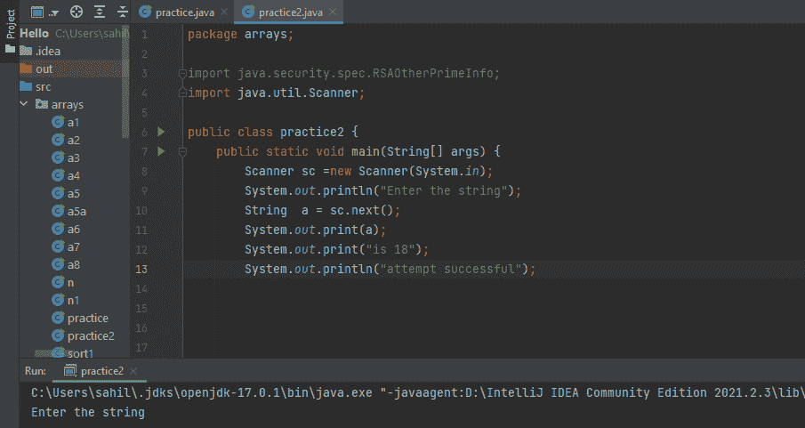

# Java IO

> 原文：<https://www.tutorialandexample.com/java-io>

它是 java 库的一部分，但通常被称为 I/O 流、文件 I/O 和文件处理。Java I/O 概念满足了输入处理和输出生成的需要。它有预定义的类，用于执行文件的输入输出操作和用户通过键盘和控制台执行的输入输出操作。为了满足上述需求，Java 采用了流的概念。有了这个概念，I/O 操作变得更快。它使程序能够将整个对象写入和读取到流中。Java I/O 的主要应用之一是在 Java 中实现文件处理的概念。

## 文件处理

正如我们在上面的文章中提到的，stream 花费了很多时间，所以您可能想知道 stream 是什么，它对 IO 操作有多大帮助；所以让我们来看看流的概念。顾名思义，它用于实现两个功能:在文件中读取和写入数据。它用于在文件上应用各种任务。它不需要任何不同的包；java.io 包由所有文件类组成，允许用户使用不同的文件格式。

**流**

流被定义为支持各种各样的

对象。这个想法最早出现在 Java 8 中，并且一直沿用至今。Java Stream 具有以下特性:

*   流不是一种数据结构，而是接受来自集合、数组和 I/O 通道的输入。
*   它不改变原始数据结构；相反，它们按照流水线方法的指定来传递结果。

在深入研究 Java 中可用的各种输入和输出流之前，让我们先来看看三个最常用的标准或默认流:

1.  **系统。In:** 用于读取用户通过键盘输入的字符。
2.  **系统。Out:** 用于在显示设备上显示程序的输出，通过实现 print()方法来实现。
3.  System.err: 它将程序生成的所有错误数据显示在显示设备上，如计算机屏幕。

借助下面的代码，我们可以更好地理解 System.in 和 System.out 是如何工作的。

  

我们在上面的代码中使用了 Scanner 类来接收输入。

**扫描仪 sc=新扫描仪(System.in)**

上面突出显示的代码行用在程序的第八行，它是一个 Scanner 类，可以使用正则表达式传递基本类型和字符串，其中 System.in 表示用户的键盘。

**字符串 a = sc.next()**

上面突出显示的代码行在程序中使用，位于第十行，它接受用户的输入，配置为 String(在上面的例子中)。

我们使用 print()方法打印来自用户的输入和我们想要打印的其他文本。下面是代码的输出。

  

我们使用了两种类型的打印:print(参数)和 println(参数)。当使用 print()方法时，光标保持在文本的末尾，而在 println 的情况下，光标移动到新行。我们用下面的例子来理解这一点。

  

首先，我们打印了一个空格，这样我们的输出看起来有点好。

然后我们已经连续打印了 4 个关键字。

行内第 13 行，光标转到新的一行并打印一些空格，在第 16 行之后，光标再次转到新的一行并打印“大家好”。为了更准确地理解，我们来看看上面代码的输出。

  

## 流的类型

Java 提供了两种类型的流，解释如下:

**1。InputStream:** 它的目的是读取数据。InputStream 的有用方法如下。

*   **公共抽象 int read()抛出异常:**它读取下一个数据字节。
*   **Public it available()抛出异常:**它的作用是估算从输入流中读取所用的字节。
*   **Public void close()抛出异常:**顾名思义它关闭当前输入流。

**2。OutputStream:** 它的作用是写数据。输出流的有用方法如下。

*   **Public void write(int)抛出异常:**用于在当前输出流中写入一个字节。
*   **Public void writes ( a[])抛出异常:**如参数所示，它将一个字节数组写入当前输出流。
*   **Public void flush()抛出异常:**刷新当前输出流。
*   **Public void close()抛出异常:**顾名思义，上面的方法关闭了现在的输出流。

## 特征 I/O 流

I/O 流是一个强大的概念，可以显著简化 I/O 操作。java.io 包包含执行 I/O 操作所需的所有类。让我们讨论 I/O 流为 java 用户提供的不同类型和特性。

*   **字节流:**用于管理原始二进制数据的输入输出。

 ***   **字符流:**用于管理字符数据的输入输出。

 ***   **缓冲流:**用于优化输入输出数据。

 ***   **扫描格式化:**程序可以执行两个功能:读取和写入。

 ***   **数据流**被实现来管理来自原语和字符串数据类型的二进制输入-输出。

 ***   **对象流:**顾名思义，它管理对象的输入输出。

 **## Java.io 类

最重要的 Java.io 类如下:

*   缓冲输入流
*   BufferedOutputStream
*   缓冲阅读器
*   缓冲写入器
*   ByteArrayInputStream
*   ByteArrayOutputStream
*   CharArrayReader
*   CharArrayWriter
*   安慰
*   数据输入流–
*   数据输出流
*   文件
*   文件描述符
*   文件输入流
*   文件输出流
*   文件权限
*   文件读取器和文件写入器
*   过滤器输入流
*   过滤器输出流
*   过滤阅读器
*   FilterWriter
*   输入流
*   InputStreamReader
*   LineNumberInputStream
*   行号阅读器
*   对象输入流
*   ObjectInputStream(对象输入流)。盖菲尔德
*   对象输出流
*   ObjectOutputStream。普特菲尔德
*   ObjectStreamClass
*   ObjectStreamField
*   输出流
*   OutputStreamWriter
*   PipedInputStream
*   管道输出流
*   管道搬运工
*   管道记录器
*   PrintStream
*   版画作者
*   推回输入流
*   推回阅读器
*   RandomAccessFile
*   读者
*   序列输入流
*   SerializablePermission 权限
*   StreamTokenizer
*   StringBufferInputStream
*   字符串阅读器
*   字符串写入程序
*   作者
*   Java 中的 ZipInputStream 类
*   Java 中的 ZipEntry 类
*   Java 中的 JarEntry 类
*   Java 中的 ZipOutputStream 类
*   拉链。Java 中的 InflaterInputStream 类
*   拉链。Java 中的通缩输入流类
*   拉链。Java 中的通缩输出流类************