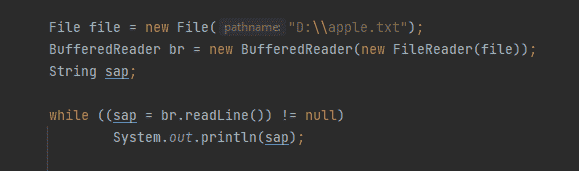
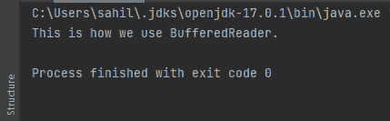
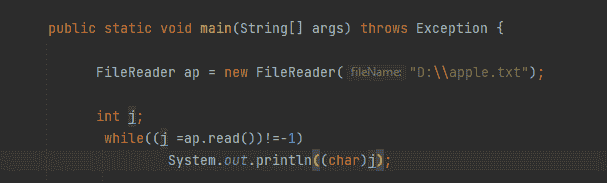
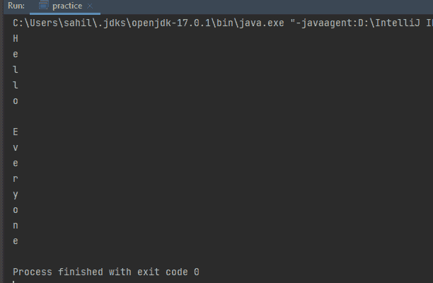
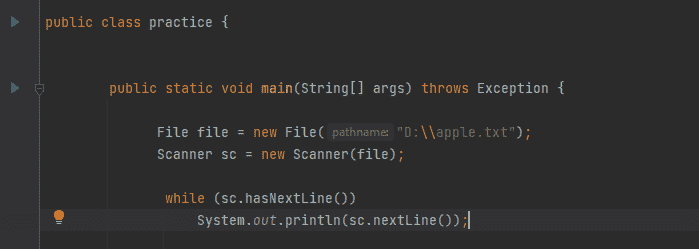
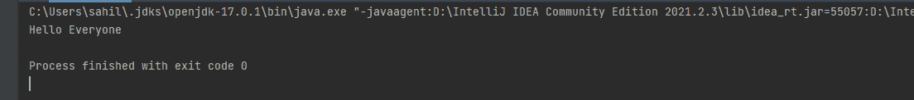
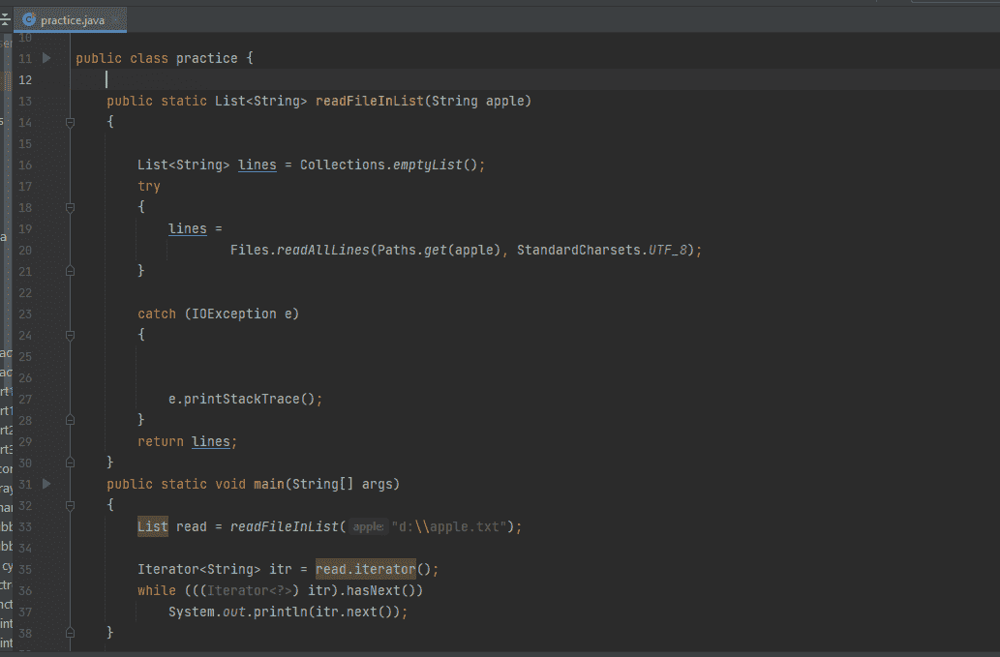
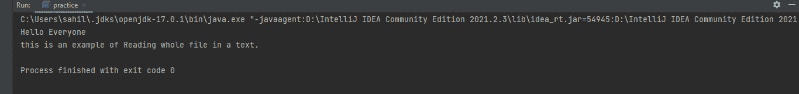
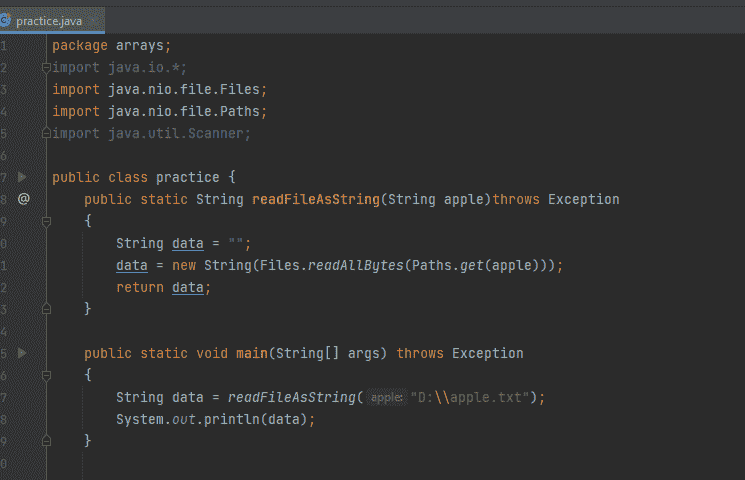
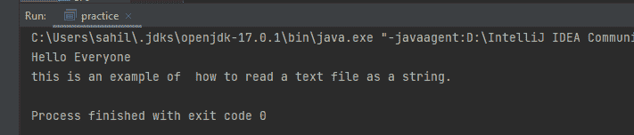

# Java 读取文件

> 原文：<https://www.tutorialandexample.com/java-read-file>

Java 为用户提供了许多读取文件的方法。要读取文本文件，可以使用文件阅读器、缓冲阅读器或扫描仪。每个实用程序都提供了一些特殊的功能例如，BufferedReader 提供了用于快速读取的数据缓冲，而 Scanner 提供了分析功能。文件中的内容类型决定了使用哪种文件阅读器。一些方法适合更快的实现，而另一些方法则擅长读取小文件数据。一些提供逐行读取，而其中一个逐字符读取文件。在下面的文章中，我们将看看 Java 读取文件的所有方式。

## 1.BufferedReader 类

为了从字符输入流中读取文本，使用了 BufferedReader 类。它缓冲字符以有效地读取输入，包括字符、数组或行。

缓冲区大小或者由用户决定，或者由默认大小决定，可以使用默认大小，因为它足够大，可以处理大多数情况。它使用继承概念继承了 reader 类。BufferedReader 有两种类型的构造函数，如下所示:

*   **BufferedReader(Reader in):**这将使用 buffered Reader 的默认大小。
*   **buffered Reader****(Reader in，int n):** 这将使用用户指定的大小。

  

上面的代码片段是一个如何使用 BufferedReader 从文件中读取内容并打印出来的例子。

在第一行中，我们指定了文件的路径。该文件包含一些文本。我们检查文件是否为空，然后打印文件的内容。当我们运行程序时，我们可以在控制台中看到打印出来的文件。

  

*   FileReader: 似乎 FileReader 与 BufferedReader 有相似之处，但也有许多不同之处。与 BufferedReader 不同，它不以任何方式进行缓冲。它从文件中读取数据并提取字符。
    总的来说，它比 BufferedReader 慢，效率也低。
    FileReader 有以下构造函数。

*   **FileReader(File File):****在 File 实例中获取文件的名称。**
*   ****FileReader(字符串文件名):** 首先，它打开文件。如果文件不在指定的路径中，那么它将抛出 FileNotFoundException**

**     

与 BufferedReader 不同，当 FileReader 从文本文件中提取字符时，文本是一个字一个字打印出来的。

*   Scanner 类:Scanner 类也可以用来从文本文件中读取文本。下面是 JavaJava 中 Scanner 类提供的构造函数。
*   ****Scanner(文件源):** 该函数从代表文件的 File 对象中读取数据。**
*   ******Scanner(InputStream source):****要从 InputStream 中读取数据，调用这个方法。******
*   ********Scanner(路径源):** 该方法读取对象指定的文件。******

******     

下面是 Scanner 类的一个实现。

 **还有一种方法可以读取整个文件。我们可以使用下面的代码，而不是使用 while 循环；-

 **这是一个 java 扫描器类。这用于设置正在使用的扫描仪的定界图案。在这种情况下，使用扫描仪模式。它返回 scanner 对象。

为了更好地理解，我们来比较一下 BufferedReader、FileReader 和 Scanner。


| **<u>缓冲器</u>** | **<u>FileReader</u>** |
| 它被缓冲 | 它没有被缓冲 |
| 它使用缓冲区来读取数据。 | 它从文件中读取数据。 |
| 它缓冲角色。 | 它从文件中获取字符。 |
| 相对更快 | 相对较慢。 |
| 读取文件的效率更高 | 效率相对较低。 |
| 它既能阅读整行，也能阅读单个字符。 | 在任何给定的时间，只能读取一个字符。 |


| **<u>缓冲器</u>** | **<u>扫描仪</u>** |
| 它带有一个更大的缓冲存储器。 | 它有一个较小的缓冲存储器。 |
| 它是同步的。 | 它不是同步的。 |
| 它相对来说更快。 | 它相对较慢。 |
| 当我们处理多线程时，应该使用它。 | 它应该在我们不处理多线程的时候使用。 |


*   **读取列表中的整个文件:**在 Java 7 中，增加了一种将文件作为文本行读取的便捷方法。方法列表<字符串>就是用来这么做的。记录中的字节被解码成字符，以使用所需的字符集。这种方法保证在检查完所有字节后关闭记录，否则会引发 I/O 错误或不同的运行时异常。

 ****语法**

```
public static List readAllLines(Path path, Charset cs)throws IOException
```

  

在上面的代码中，我们将文件的所有数据存储在一个列表中，该列表的引用变量是 read。苹果是我们文件的名字。

为了打印存储在列表中的数据，我们使用了一个 while 循环，它首先遍历列表，然后打印列表中的数据，直到列表不为空。当我们运行上面的程序时，下面是我们得到的结果。

  

*   **以字符串形式读取文本文件:**这是 Java 中以字符串形式读取整个文件的常用方法，但文件大小必须较小或中等。与上面将整个文件数据存储在 List 中的方法不同，这个方法将所有文件数据存储在一个字符串中。

**  

上面的代码片段实现了将文本文件作为字符串读取的知识。Apple 是我们的文件名，从上面的代码中可以看出，我们已经使用 String 读取了文件名 apple 中的所有数据。为了打印文件中的数据，我们刚刚打印了字符串。下面是我们代码的结果。

  

## 结论

由于我们已经提到了在 JavaJava 中读取文件的所有方法，人们可能会对实现感到困惑。尽管我们已经提到了几乎每种方法的用例，但是人们可能正在寻找读取文件的最佳方式。将一种方法称为最佳方法是相当棘手的，因为它会随着您的需求和您正在实现的内容而变化。

在比较所有文件读取方法并分析其实现的同时，我们可以假设；读取文件最快的方法是实现 BufferedReader 的概念。与其他可用的方法相比，它的实现速度足以在一秒钟内读取数百万行。****************