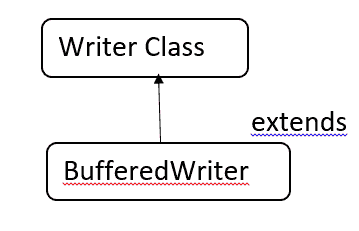

# Java BufferedWriter

> 原文：<https://www.tutorialandexample.com/java-bufferedwriter>

### BufferWriter 类:

它用于更高效地写入数据。这个类存在于 java.io 包中，它从 Writer 类继承数据。Writer 类是一个抽象类。

  

### 编写器类:

它是 Java.io 包的一个类，它代表字符集。它是一个抽象类。

### Writer 子类:

*   缓冲写入器
*   文件写入器
*   字符串编写器
*   输出流写入器

### 编写器类对象创建语法:

```
Writer object1 = new FileWriter();
```

注意:在这里，我们使用 FileWriter 来创建一个对象，因为 Writer 类是抽象的。

**BufferedWriter 类声明:**

 **```
public class BufferedWriter extends Writer
```

**buffered writer 中的构造函数:**

*   BufferedWriter(Writer w)
*   BufferedWriter(Writer w，int s)

**BufferedWriter(Writer w):**

它生成一个输出流，而不提及或考虑大小。

**语法:**

```
BufferedWriter object1 = new BufferedWriter (w (or) file)
```

**BufferedWriter(Writer w，int s):** 它通过提及或考虑大小来生成输出流。这里，s 代表流的大小。

**语法:**

```
BufferedWriter object1 = new BufferedWriter( w (or) file , int s)
```

**BufferedWriter 工作原理:**写操作时，字符不是写入磁盘，而是写入内部缓冲区，然后，缓冲区被字符填满，然后写入磁盘

**BufferedWriter 类方法:**

*   换行符()
*   写(整数)
*   write (char c[]，int start，int length)
*   write(字符串 s1，int start，int length)
*   齐平()
*   关闭()

**write (int n):**

它用于将单个字符写入内部缓冲区。返回类型是 void，它覆盖 Writer 类中的 write 方法。它只接受一个参数，即整数类型。当输入或输出中出现错误时，它抛出 IOException，这是一个输入/输出异常。

**语法:**

```
public void write(int n)
```

**程序:**

```
import java.io.*;
public class A
{
    public static void main(String[] args)
        throws IOException
 {
        StringWriter object1 = new StringWriter();
BufferedWriter  object2  = new BufferedWriter( object1);
object2.write(65);
object2.flush();
 System.out.println (object1.getBuffer());
    }
} 
```

**输出:**

```
A
```

**newLine ():**

它包含了 writer 类的一个新行。返回类型为 void。它不返回任何值。当输入或输出出错时，抛出 IOException，即输入/输出异常。

**语法**:

```
public void newline()
```

**程序:**

```
import java.io.*;
public class Main{
    public static void main(String[] args) throws IOException
    {
   StringWriter object1 = new StringWriter();
  BufferedWriter  object2 = new BufferedWriter(object1);
  object2.write(65);
  object2.newLine();
  object2.write(66);
  object2.flush();
  System.out.println (object1.getBuffer());
    }
}
```

**输出:**

```
A
B
```

**write ( char c[]，int start，int length):**

它将特定数组中的字符写入内部缓冲区。当缓冲区大小或长度等于数组大小时，它不返回任何值，而是直接使用主流。

它抛出输入/输出异常和索引越界异常。当输入或输出中存在错误时会发生 I/O 异常，当通过 write 方法传递负长度或长度大于数组时会发生索引超出界限异常。

**语法:**

```
public int read(char[] c, int start, int length)
```

*   它是目的缓冲器
*   start–从哪个索引开始写入字符。
*   长度。几个字符

**程序:**

```
import java.io.*;
public class Main{
    public static void main(String[] args) throws IOException
    {
   StringWriter object1 = new StringWriter();
  BufferedWriter  object2 = new BufferedWriter(object1);
  char c[] = [‘J’, ’A’, ’V’, ‘A’];
  object2 . write(c, 0, 2);
 object2 . newLine ();
 object2 . write(c,2,2);
  object2.flush();
  System.out.println (object1.getBuffer());
    }
} 
```

**输出:**

```
JA
VA
```

**write (String s1，int start，int length):**

它用于在字符串通过编写器流时写入字符串的一部分。它抛出输入/输出异常和索引越界异常。

当输入或输出中存在错误时会发生 I/O 异常，当通过 write 方法传递负长度或长度大于字符串时会发生索引超出界限异常。

**语法:**

```
public int read(String s1, int start, int length)
```

S1-它是目的缓冲区

start–从哪个索引开始写入字符。

长度。几个字符

**程序:**

```
import java.io.*;
  class C{
    public static void main(String[] args) throws IOException
    {
   StringWriter object1 = new StringWriter();
  BufferedWriter  object2 = new BufferedWriter(object1);
  object2 . write(“JAVA”, 0, 2);
  object2.flush();
  System.out.println (object2.getBuffer());
}
}
```

**输出:**

```
JA
```

**flush ():** 用于刷新字符和输入流。它不返回任何值。

**语法:**

```
public void flush()
```

**程序:**

```
import java.io.*;
  class C{
    public static void main(String[] args) throws IOException
    {
   StringWriter object1 = new StringWriter();
  BufferedWriter  object2 = new BufferedWriter(object1);
  object2 . write(“JAVA”, 0, 2);
  object2.flush();
System.out.println(“Data is flushed”);
  System.out.println (object2.getBuffer());
}
}
```

**输出:**

```
Data is flushed.
JA
```

**close ():** 用于关闭缓冲的 Writer 类。

 ****语法:**

```
public void close()
```****