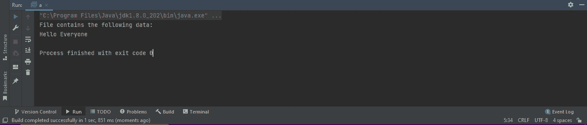

# Java InputStreamReader

> 原文：<https://www.tutorialandexample.com/java-inputstreamreader>

### 什么是 InputStreamReader？

InputStreamReader 是字节流和字符流之间的转换器:它读取字节，并在字符集的帮助下将其转换为字符。它使用的字符集可以显式提供，也可以按名称提供，或者允许使用平台的默认字符集。它位于 java.io 包中，并扩展了抽象类 Reader。InputStreamReader 通常被称为连接流和字符流的路径，因为它从给定的字符输入流中读取一个字节。

## 如何创建 InputStreamReader？

下面是创建 InputStreamReader 的步骤。

导入 java.io.InputStreamReader 包是创建 InputStreamReader 的第一步。没有这个包，我们无法实现 InputStreamReader。导入包后，我们必须遵循以下步骤。

首先，我们创建一个 InputStreamReader，它的引用变量为 st，然后我们需要创建一个 FileInputStream，它的引用变量为 fl。下面的示例演示了上面的代码行。

```
FileInputStream fl = new FileInputStream( path);
InputStreamReaderst   = new InputStreamReader( fl  );
```

2.通过实现此代码，使用默认字符编码存储提取的数据。我们也可以根据文件或个人需要定义字符编码。字符编码可以是 UTF8 或 UTF16。我们在下面的代码中使用 Charset 类指定了文件中的字符编码。

```
InputStreamReaderst   = new InputStreamReader( fl, Charset c );
```

## InputStreamReader 的构造函数

以下是 InputStreamReader 提供的构造函数:

*   **InputStreamReader(InputStreamst)****:**当需要创建一个具有默认字符集的 InputStreamReader 时，就会实现这个构造函数。
*   **InputStreamReader(InputStreamst，Charset ):** 当需要创建具有指定字符集的 InputStreamReader 时，实现该构造函数。
*   **InputStreamReader(InputStreamst，CharsetDecoder dc):** 当需要创建具有指定字符集解码器的 InputStreamReader 时，实现该构造函数。
*   **InputStreamReader(InputStreamst，String name):** 当需要创建使用命名字符集的 InputStreamReader 时，实现该构造函数

## InputStreamReader 的方法

以下是 InputStreamReader 提供的方法。

*   **就绪()**

这是一个具有返回类型的方法。当需要检查字符流是否准备好执行它的功能(即，它是否可以读取)时，实现这个方法。

如果 InputStreamReader 的输入缓冲区为空或者可以从基础字节流中读取字节，则认为 InputStreamReader 已准备好执行其功能。

*   **read(char[] arr**

当需要从阅读器中读取字符并将它们存储在预定义的数组中时，就使用它。

*   **read(char[] arr，int st，int l)**

当必须从读取器中读取几个等于长度的字符，并将其存储在从开始处开始的指定数组中时，会使用该函数。

*   **关()**T2】

**当需要关闭** cInputStreamReader 并释放所有附属于它的流时，实现这个方法。

一旦实现了这个方法，流就会关闭。因此，像 ready()、ready()这样的方法以及文章中提到的其他方法不会执行它们的功能，并且会抛出 IOException。

*   **getEncoding()方法**

当需要获取实现的编码类型以将提取的数据保存在输入流中时，实现该方法。

*   **马克()**

当需要标记流中数据被读取的点时，这个方法被实现

*   **复位()**

这是一个具有返回类型的方法。它将控件返回到流中设置标记的位置。

```
import java.io.InputStreamReader;
import java.io.FileInputStream;
public class a {
public static void main(String[] args) {
char[] arr = new char[14];

        try {

            FileInputStream fl = new FileInputStream("d://sample.txt");

InputStreamReader File_input = new InputStreamReader(fl );

File_input.read(arr);
System.out.println("File contains the following data:");
System.out.println(arr);

input.close();
}

catch(Exception e) {
            e.getStackTrace();
}
    }
}
```

在上面的代码中，首先，我们导入了实现 FileInputStream 和 InputStreamReader 的重要包。

然后我们创建了一个字符数组作为 arr 的引用变量，大小为 14，因为它是文件中数据的大小。

然后，我们创建了一个 FileOutputStream，其中引用变量为 fl，包含指定的文件路径为 d://sample.txt，并创建了一个 InputStreamReader、一个引用变量为 File_input 和一个默认编码。

然后我们从文件中读取字符，将它们存储在一个数组中。要查看文件中的数据，我们必须打印数组。下面是实现上述代码时获得的输出。

  

该文件包含以下文本:Hello Everyone，输出中显示了相同的文本。