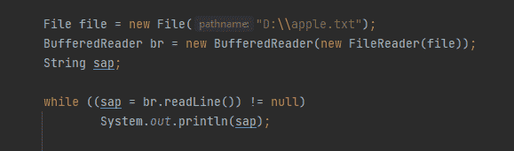
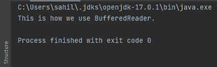
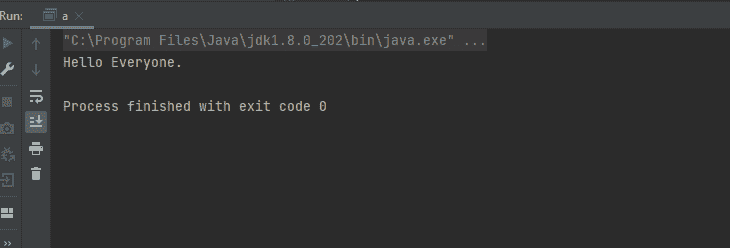

# Java 逐行读取文件

> 原文：<https://www.tutorialandexample.com/java-read-file-line-by-line>

Java 提供了两个选项来逐行读取文件。每种选择都有不同的好处，也有自己的缺点。以下是实现上述目标的方法:

*   缓冲阅读器
*   扫描仪类别

## 缓冲阅读器

这个类在 java.io 包中，当需要从字符输入流中读取文本时实现。它缓冲字符以提供对输入的有效读取，如字符、数组和行。

缓冲区大小由用户确定，或者是已经定义的大小，默认情况下，也可以使用该大小，因为它足够大，可以满足最大的情况。它使用继承的概念来继承 reader 类。它实现了以下接口:

*   可关闭的
*   可自动关闭
*   易读的

下面的示例显示了如何声明 BufferReader 类(buffer reader 语法)

```
Public class BufferedReader extends Reader (Where public class is an access specifier)
```

## 缓冲区读取构造函数

BufferReader 有两种类型的构造函数，如下所示:

**1。缓冲阅读器(Reader in)**

这将使用 Bufferedreader 的默认大小。

**2。BufferReader(Reader in，int n)**

这将使用用户指定的大小，其中“n”表示构造函数的大小。如果数组的大小小于等于零，它将引发 IllegalArgumentException。

## 缓冲区读取方法

以下是 BufferReader 的方法。

1.  **Void Close():** 其他的方法，比如 read()和 mark()，如果使用这个方法会抛出 IOException。
2.  **Void mark():** 标记当前位置。
3.  **Boolean markSupported():** 顾名思义，上述方法检查或告知流是否支持 marl()操作。它重写类读取器中支持的标记。
4.  **Int read( ):** 仅读取 1 个字符时使用。它重写类读取器中的 read。
5.  **Int read( char[] buff，int off，int l):** 当需要从数组中读取一部分字符时实现。
    *   debuff–目的缓冲器。
    *   off–这是字符排序开始的地方。
    *   l–您可以阅读的字符数。
6.  **String readLine():** 在这种情况下，要读取一整行文本。
7.  **Boolean ready():** 顾名思义，上面的方法检查并告知输入是否准备好被读取。它覆盖了 ready 类读取器。
8.  **Void reset():** 顾名思义，流被重置到它最近的标记。
9.  **Long skip( long n):** 在需要跳过字符的时候实现。在上面的语法中，n 表示要跳过的字符数。它覆盖类阅读器中的 skip。

**例子**

  

上面的代码片段是一个如何使用 BufferedReader 从文件中读取内容并打印出来的例子。

在第一行中，我们指定了文件的路径。该文件包含一些文本。我们检查文件是否为空，然后打印文件的内容。当我们运行程序时，我们可以在控制台中看到打印出来的文件。

  

## 何时使用 BufferedReader 读取文件

*   当我们需要同步概念的时候。
*   当我们处理多线程时。
*   当我们需要写几百万行的时候。

## 扫描仪

在 java 中，还有另一种获取输入的方式，称为扫描器。Java。Scanner 类可以解析基本类型和字符串。它实现了以下功能:

可关闭的

能经受住压热器作用的

迭代器< string>

## 扫描仪类如何工作

它将整行分割成小的元素。例如，下面是一个输入字符串。

```
MY name is Sahil
```

scanner 对象会读取整行，将上面的行分成四个元素或记号，分别是:“My”、“name”、“is”和“Sahil”。然后 object 迭代所有上述标记，并根据程序中声明的方法类型读取每个元素。

## 构造器

下面是 java 中 Scanner 类提供的构造函数。

*   **扫描仪(文件源)**

这个函数用于从代表一个文件的文件对象中读取数据。

*   **扫描仪(输入流源)**

若要从 InputStream 读取数据，请调用此方法。

*   **扫描仪(路径源)**

此方法读取对象指定的文件。

**例子**

下面的一小段代码是 Scanner 类的实现示例。

```
import java.io.File;
import java.io.FileNotFoundException;
import java.util.Scanner;
public class a {
public static void main(String[] args) {
        File file = new File("d://sample.txt");
        try {

            Scanner st  = new Scanner(file);
            while (st.hasNextLine()) {
                String output = st.nextLine();
System.out.println(output);
}
        } catch (FileNotFoundException e) {
            e.printStackTrace();
}
    }
}
```

*   首先，我们导入必要的包来实现 scanner 类。
*   然后，我们为 sample.txt 文件创建了一个 file 实例。
*   之后，我们创建了一个扫描器对象，它将读取指定文件(Sample.txt)中的数据
*   我们使用 hasNextLine()方法逐行读取文本。
*   然后，文件的内容被读取并存储在输出字符串中，我们打印输出(字符串的引用变量)以在控制台中查看结果，如下所示。

  

在上面的代码中，我们使用了一个名为 hasNextLine()的方法。

它是一个具有布尔返回类型的 Scanner 类方法。当需要检查输入中是否有另一行时，就需要执行这个操作。它在 while 循环中使用。如果返回 true，while 循环将再次运行以读取文件中的内容。但是我们指定的文件只有一行文本——大家好。因此，在运行一次之后，hasNextLine()方法返回 false 并终止 while 循环。

## 扫描器类特性与缓冲阅读器类的比较。


| **<u>缓冲器</u>** | **<u>扫描仪</u>** |
| 它有一个更大的缓冲存储器。 | 它有一个较小的缓冲存储器。 |
| 它是同步的。 | 它不是同步的。 |
| 它相对来说更快。 | 它相对较慢。 |
| 当我们处理多线程时，应该使用它。 | 它应该在我们不处理多线程的时候使用。 |

