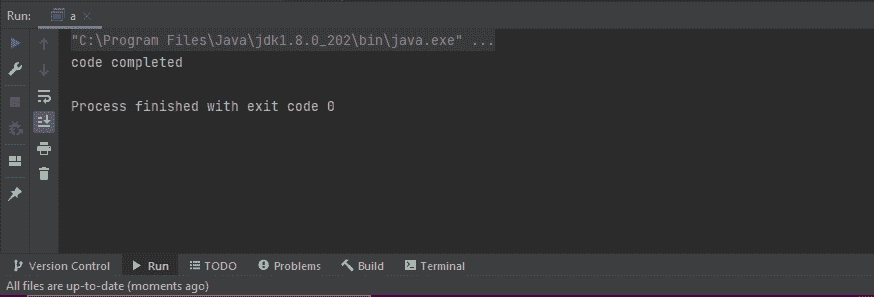
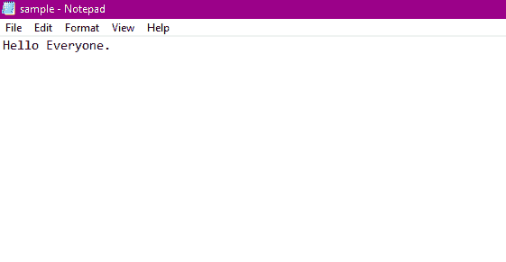

# Java FileOutputStream

> 原文：<https://www.tutorialandexample.com/java-fileoutputstream>

### What is FileOutputStream?

当我们需要将原始流数据写入文件时，我们需要寻找另一个选项:FileOutputStream。当文件的数据是面向字节时使用它。它位于 java.io 包下，扩展了抽象类输出流。它实现了以下接口，例如:

*   可关闭的
*   可冲洗的
*   可自动关闭

 **## 为什么我们需要 FileOutputStream？

我们利用文件写入器和缓冲写入器类将文本写入文件。然而，当需要实现面向字符的类时，这些类不允许二进制数据。正是在这一点上，出现了对 FileOutputStream 的需求。

## 如何使用 FileOutputStream

以下是演示如何使用 FileOutputStream 的步骤:

导入 **java.io.FileOutputStream** 包是创建 FileOutputStream 的第一步。一旦包被导入，FileOutputStream 就可以通过下面的方法来实现。

**1。使用文件的路径**

```
FileOutputStream ot = new FileOutputStream(String path, boolean value);
```

```
FileOutputStream ot = new FileOutputStream(String path);
```

在第一行中，我们创建了一个 FileOutputStream，它有一个引用变量 ot。这个 FileOutputStream 包含布尔参数。

在第二行中，我们创建了一个 FileOutputStream，它也有一个引用变量 ot。此 FileOutputStream 不包含布尔参数。

参数 path 是用户在编写程序时提供的文件路径。

此外，value 是一个布尔参数，可以留空。如果 Boolean 设置为 true，新数据将被添加到文件中当前数据的末尾。如果未指定或未使用，新数据将覆盖文件以前的数据。

**2。利用文件的对象**

```
FileOutputStream to = new FileOutputStream(File object);
```

在上面的代码中，我们创建了一个输出流，它将链接到指定的 file 对象。

## FileOutputStream 的构造函数

FileOutputStream 具有以下构造函数，例如:

**1。FileOutputStream(File fl):** 当需要写入 File 对象指定的文件时，实现这个构造函数。

**语法:**

```
FileOutputStream ft = new FileOutputStream(File fl);
```

**2。FileOutputStream(Filefl，boolean):** 这个构造函数是在需要写入 file 对象指定的文件时实现的，它也有一个 boolean 参数。

**语法:**

```
FileOutputStream ft = new FileOutputStream(File fl, boolean a);
```

**3。file output stream(FileDescripterfobj):**这个构造函数用于构建一个文件输出流，用于写入所提供的文件描述符，表示文件系统中已存在的文件描述符。

**语法:**

```
FileOutputStream fout = new FileOutputStream(FileDescripterfobj);
```

**4。FileOutputStream(String n):** 当必须创建文件输出流对象以写入指定名称的文件时，使用此构造函数。

**语法:**

```
FileOutputStream ft = new FileOutputStream( String n);
```

**5。FileOutputStream(String n，boolean a):** 该构造函数用于构建一个文件输出流对象，该对象将写入所提供的文件。

**语法:**

```
FileOutputStream ft = new FileOutputStream(String n, boolean a);
```

## FileOutputStream 方法

下面是 FileOutputStream 提供的方法。


| one | [**【void close()**](https://www.tutorialspoint.com/java/io/fileoutputstream_close.htm)当需要关闭当前文件输出流并释放与该流相关的所有资源时，执行该方法。 |
| Two | [**protected void finalize()**](https://www.tutorialspoint.com/java/io/fileoutputstream_finalize.htm)当所有连接到文件的连接都需要清理时，使用此方法。它还确保调用 close 方法，以便不会留下与流相关的引用。 |
| three | [**filechannelgethannel()**](https://www.tutorialspoint.com/java/io/fileoutputstream_getchannel.htm)这是一个返回类型的方法。它返回一个 FileChannel 对象，该对象对于当前文件输出流是唯一的。 |
| four | [**【FileDescriptorgetFD()**](https://www.tutorialspoint.com/java/io/fileoutputstream_getfd.htm)这是一个返回类型的方法，实现后将返回与当前流相关的文件描述符。 |
| five | [**void write(byte[]a)**](https://www.tutorialspoint.com/java/io/fileoutputstream_write_byte.htm)该方法将指定字节数组长度的字节写入当前输出流。 |
| six | [**void write(byte[] a，into，int l)**](https://www.tutorialspoint.com/java/io/fileoutputstream_write_byte_len.htm) 该方法写入指定字节数组长度的字节，从偏移量 o 开始到当前输出流。 |
| seven | [**【void write(int c)**](https://www.tutorialspoint.com/java/io/fileoutputstream_write.htm)当需要将指定字节写入当前输出流时，执行该方法。 |
| eight | **<u>【flush()</u>**该方法在需要清除当前输出流时执行。此方法使输出流中的所有数据都被写入目标。 |


**例子**

在下面的示例中，FileOutputStream 类用于将数据写入文件。要将数据写入文件，还需要创建一个带有文件名的类对象。字符串的内容被存储并转换成一个字节数组，然后用 write()方法将它(字节数组中的内容)写入文件。“大家好，”是我们将写入文件的文本。

```
import java.io.FileOutputStream;
public class a {
public static void main(String[] args) {
        String data = "Hello Everyone.";

        try {
            FileOutputStream output = new FileOutputStream("d://sample.txt");

            byte[] arr = data.getBytes();

output.write(arr);
System.out.println("code completed");
output.close();

}

catch(Exception e) {
            e.getStackTrace();
}
    }
}
```

**输出**

当我们运行上面的代码时，我们获得了下面的输出。

  

我们在控制台中看不到任何东西，但是当我们打开名为 sample 的文本文件时，我们可以看到它的文本。

**