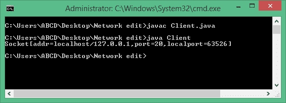
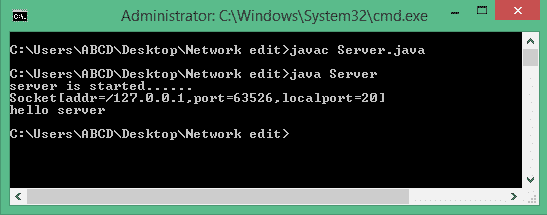
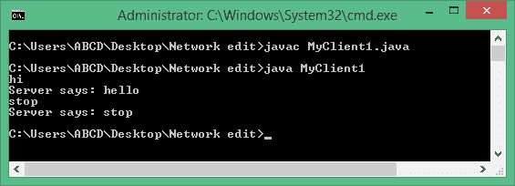
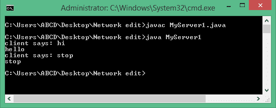
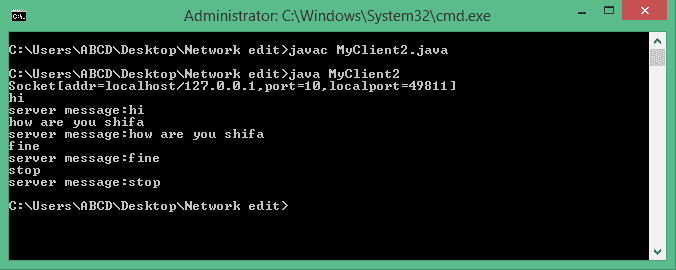
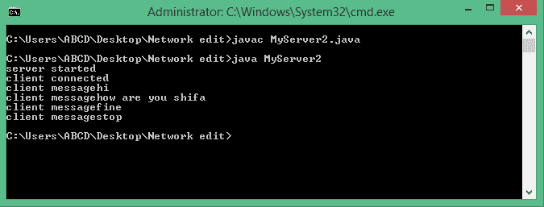

# Java 套接字编程

> 原文：<https://www.tutorialandexample.com/java-socket-programming/>

**Java 套接字编程**

套接字编程用于应用程序之间的通信，即运行在不同 JRE 上的客户机和服务器可以是面向连接的或无连接的。可以使用 Socket 类设计客户端程序。可以使用 ServerSocket 类创建服务器程序。Socket 和 ServerSocket 类都是 java.net 包中的内置类。客户端程序在其通信端实例化套接字对象，并尝试将套接字连接到服务器。建立连接后，服务器可以通过读写套接字进行通信。

使用套接字在两台计算机之间建立连接时，会发生以下步骤:

*   服务器创建一个 ServerSocket 对象，该对象表示将在哪个端口号上进行通信。
*   服务器调用 ServerSocket 类的 accept()方法。accept()方法一直等到客户机在给定的端口上连接到服务器。
*   客户端创建一个套接字对象，指示它在互联网上连接的服务器名称和端口号。
*   accept()方法引用服务器上的一个套接字，该套接字连接到客户机的套接字。
*   建立连接后，可以使用 I/O 流进行通信。每个套接字都有一个输出流和输入流。客户端的输出流连接到服务器的输入流，客户端的输入流连接到服务器的输出流。在双向通信中，数据可以同时通过两个流发送。

**套接字类**

Socket 类表示客户端和服务器用来相互通信的套接字。客户端通过实例化其类来拥有 Socket 对象，而不是服务器通过 accept()方法的返回值来获取 Socket 的对象。Socket 类设计一个客户端程序。

套接字类的构造函数:

**语法:**

```
Socket s=new Socket(“localhost”,8080); //localhost—port name and 8080—port number
```

| **构造器** | **描述** |
| 公共套接字(字符串 host1，int port1)抛出 UnknownHostException，IOException | 此方法尝试在特定端口连接到特定服务器。 |
| 公共套接字(InetAddress host1，int port1)抛出 IOException | 它表示在指定的端口连接到指定的服务器，只是主机表示一个 InetAddress 对象。 |
| 公共套接字(String host，int port，InetAddress inet，int localPort)抛出 IOException | 它连接到指定的主机和端口，在本地主机上的指定地址和端口创建一个套接字。 |
| 公共套接字(InetAddress host1，int port，InetAddress localAdd，int localPort)抛出 IOException | 它与前面的构造函数相同，并且宿主表示 InetAddress 对象而不是字符串。 |
| 公共套接字() | 此方法用于创建未连接的套接字。connect()方法用于将这个套接字连接到服务器。 |

### 套接字类的方法

| **方法** | **描述** |
| 公共 void connect(SocketAddress host1，int timeout1)引发 IOException | 这个方法将套接字连接到特定的主机。当您使用无参数构造函数实例化套接字时，将使用此方法。 |
| public inet address getnet address(void) | 当套接字连接到互联网时，它返回另一台计算机的地址。 |
| public int getLocalPort() | 它返回本地机器上套接字绑定到的端口。 |
| 公共 socket address getRemoteSocketAddress() | 它返回远程套接字的地址。 |
| 公共 InputStream getInputStream()引发 IOException | 它返回套接字的输入流。输入流连接到远程套接字的输出流。 |
| public output stream get output stream()抛出 IOException | 它返回套接字的输出流。输出流连接到远程套接字的输入流。 |
| 公共 void close()引发 IOException | 它关闭套接字，这使得该套接字对象不再能够再次连接到任何服务器。 |

**公共输出流 getuputstream():**

上述方法将数据从客户端程序写入服务器程序，从服务器程序写入客户端程序，客户端程序返回 OutputStream 类对象。下面给出了一个语法，告诉我们如何在 Socket 类中使用它:

**语法:**

```
Socket s=new Socket(“localhost”,8080);
OutputStream os=new s.getOutputStream();
DataOutputStream dis=new DataOutputStream(os);

```

**public input stream getinpertstream()**

服务器使用它从客户机系统读取数据，或者客户机从返回 InputStream 类对象的服务器系统读取数据。

下面给出了一个语法，告诉我们如何在 Socket 类中使用它:

**语法:**

```
Socket s=new Socket(“localhost”,10);
InputStream input=new s.getInputStream();
DataInputStream datainput=new DataInputStream(is);
```

**公共同步 void close()**

关闭套接字类的对象，或者它用于关闭客户端请求。下面给出了一个语法，告诉我们如何将它合并到 Socket 类中:

**语法:**

```
Socket s=new Socket(“localhost”,8080);
 s.close(); 
```

### ServerSocket 类

此类可用于创建服务器应用程序用来侦听客户端请求的 ServerSocket 实例。如果应用程序已成功绑定到指定的端口，ServerSocket 构造函数不会引发异常，并为客户端请求做好准备。

ServerSocket 类有四个构造函数:

| **构造器** | **描述** |
| 公共服务器套接字(int 端口)引发 IOException | 它试图创建一个绑定到给定端口的 ServerSocket。 |
| public ServerSocket(int port，int backlogs)抛出 IOException | 它还尝试创建一个绑定到指定端口的 ServerSocket，backlogs 参数指定有多少传入客户端必须存储在 await 队列中。 |
| public ServerSocket(int port，int backlog，InetAddress add)抛出 IOException | 它还尝试创建如上的 ServerSocket 实例，以及指定本地 IP 地址的 InetAddress 参数。InetAddress 用于具有多个 IP 地址的服务器，允许服务器指定它的哪些 IP 地址接受互联网上的客户端请求。 |
| public ServerSocket()抛出 IOException | 它创建一个未绑定的服务器套接字。当您准备绑定服务器套接字时，它使用 bind()方法。 |

**服务器套接字类的方法**

| **方法** | **描述** |
| public int getLocalPort() | 它返回正在监听网络的服务器套接字的端口。 |
| 公共套接字 accept()引发 IOException | 它等待一个到来的客户端。 |
| public void setSoTimeout(int 超时) | 它设置服务器套接字在 accept()方法期间等待客户端的时间的超时值。 |
| 公共 void bind(SocketAddress 主机，int backlog) | 此方法将套接字绑定到 SocketAddress 对象中指定的服务器和端口。 |

当 ServerSocket 调用 accept()时，该方法在客户端连接之前不会返回。客户端连接后，ServerSocket 在未指定的端口上创建一个新的套接字，并返回对这个新套接字的引用。现在，客户端和服务器之间存在连接，可以开始通信了。ServerSocket 对象用于与客户端通信。ServerSocket 类用于设计一个服务器程序。它有一些用于设计服务器程序的构造函数和方法。ServerSocket 类包含一个构造函数，用于创建一个单独的端口号来运行服务器程序。

**语法:**

```
ServerSocket ss=new ServerSocket(8080);
```

**公共套接字接受()**

它用于接受客户在互联网上的请求。下面给出了下面的语法，它告诉我们如何在 ServerSocket 类中使用它。

**语法:**

```
Socket s=new Socket(“localhost”,8080);
 ServerSocket ss=new ServerSocket(8080);
 Socket s=ss.accept(); 
```

以下是 TCP 协议的一些示例:

**例 1:从客户端到服务器的单向通信。**

**客户端编程:**

```
import java.net.*;
 import java.io.*;
 class Client
 {
 public static void main(String s1[])
 {
 try
 {
 Socket s=new Socket("localhost",20); //creates the socket instance
 System.out.println(s); 
 //DataOutputStream class is to create an output stream to send response to the server.
 DataOutputStream d1=new DataOutputStream(s.getOutputStream()); 
 d1.writeUTF("hello server");
 d1.close();
 }
 catch(Exception e)
 {
 System.out.println(e); 
 }
 }
 } 
```

**服务器端编程**

```
import java.net.*;
 import java.io.*;
 class Server
 {
 public static void main(String s1[])
 {
 try
 {
 ServerSocket ss=new ServerSocket(20);
 System.out.println("server is started......"); 
 Socket s=ss.accept();  //establishing connection  and waits for the client.
 System.out.println(s);
 //DataInputStream class is to create an input stream to receive a response from the client.
 DataInputStream ds=new DataInputStream(s.getInputStream());
 String msg=(String)ds.readUTF();
 System.out.println(msg);
 } 
 catch(Exception e)
 {
 e.printStackTrace();
 }
 }
 } 
```

客户端的输出:



服务器的输出:



**例 2:点对点聊天，即(双方读写)双向交流:**

客户端首先向服务器写入，然后服务器接收并打印文本。然后服务器写给客户端，客户端接收并打印文本。

**客户端编程:**

```
import java.net.*;  
 import java.io.*;  
 class MyClient1{  
 public static void main(String s1[])throws Exception{  
 Socket s=new Socket("localhost",10);  
 //DataInputStream class is to create an input stream to receive response from the server.
 DataInputStream din=new DataInputStream(s.getInputStream());  
 //DataOutputStream class is to create output stream to send information to the server socket.
 DataOutputStream dout=new DataOutputStream(s.getOutputStream()); 
 BufferedReader br3=new BufferedReader(new InputStreamReader(System.in));     
 String str="",str2="";  
 while(!str.equals("stop")){  
 str=br3.readLine();  
 dout.writeUTF(str);  
 dout.flush();  
 str2=din.readUTF();  
 System.out.println("Server says: "+str2);  
 }     
 dout.close();  
 s.close();  
 }}   
```

**服务器端编程:**

```
import java.net.*;  
 import java.io.*;  
 class MyServer1{  
 public static void main(String s2[])throws Exception{  
 ServerSocket ss=new ServerSocket(10);  
 Socket s=ss.accept();  
 // DataInputStream creates  an input stream to receive input from the client.
 DataInputStream din=new  
 DataInputStream(s.getInputStream());  
 //DataOutputStream creates an output stream to send information to the client.
 DataOutputStream dout=new 
 DataOutputStream(s.getOutputStream());  
 BufferedReader br=new BufferedReader
 (new InputStreamReader(System.in));  
 String str="",str2="";   
 while(!str.equals("stop")){  
 str=din.readUTF();  
 System.out.println("client says: "+str);  
 str2=br.readLine();  
 dout.writeUTF(str2);  
 dout.flush();  
 }  
 din.close();  
 s.close();  
 ss.close();  
 }}   
```

客户端的输出:



服务器的输出:



**示例 3:用于通信的回显服务器:无论客户端写什么消息，它都会从服务器反射到客户端**

**客户端:**

```
import java.io.*;
 import java.net.*;
 public class MyClient2
 {             
 Socket s;
 DataInputStream din;
 DataOutputStream dout;
 public MyClient2()
 { 
 try
 {
 s=new Socket("localhost",10);
 System.out.println(s);
 din=new DataInputStream(s.getInputStream());
 dout=new DataOutputStream(s.getOutputStream());
 clientChat(); 
 }
 catch(Exception e)
 {
 System.out.println(e);
 }
 }
 public void clientChat() throws IOException 
 {
 BufferedReader br3=new BufferedReader(new InputStreamReader(System.in));
 String s1;
 do
 {
 s1=br3.readLine(); 
 dout.writeUTF(s1);
 dout.flush();
 System.out.println("server message:"+din.readUTF());
 }
 while(!s1.equals("stop"));
 }
 public static void main(String s[])
 {
 new  MyClient2();
 }
 } 
```

**服务器端:**

```
import java.io.*;
 import java.net.*;
 public class MyServer2
 {
 ServerSocket ss;
 Socket s;
 DataInputStream dis;
 DataOutputStream dos; 
 public MyServer2()
 {
 try
 {
 System.out.println("server started");
 ss=new ServerSocket(10);
 s=ss.accept();
 System.out.println("client connected");
 dis=new DataInputStream(s.getInputStream());
 dos=new DataOutputStream(s.getOutputStream());
 serverChat();
 }
 catch(Exception e)
 {
 System.out.println(e);
 }
 } 
 public static void main(String s[])
 {
 new MyServer2();
 }
 public void serverChat() throws IOException{
 String str;
 do 
 {
 str=dis.readUTF();
 System.out.println("client message"+str);
 dos.writeUTF(str);
 dos.flush();
 }
 while(!str.equals("stop"));
 } 
 } 
```

客户端的输出:



服务器的输出:



### 套接字编程的局限性

1.  您可以在本地共享资源，但不能在全球共享。
2.  你不能开发基于互联网的应用程序。
3.  您只能开发半双工应用程序。
4.  您无法从通用协议(如 http、ftp 等)获得服务。
5.  您无法从通用服务器软件(如 Tomcat、WebLogic 等)获得服务。

注意:Servlet 和 JSP 技术已经克服了这些限制。