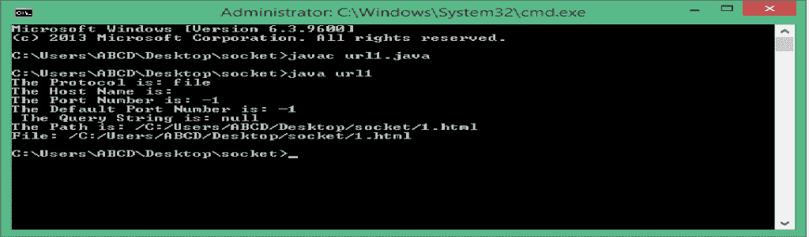
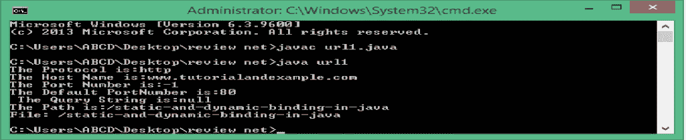
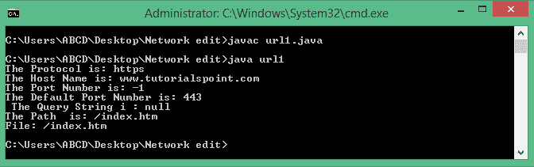
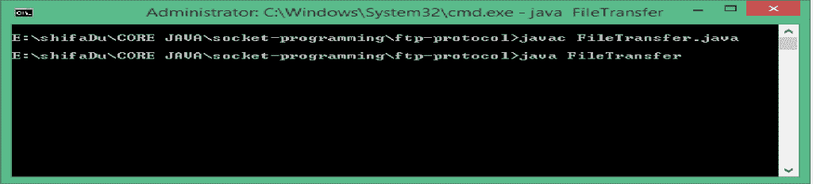
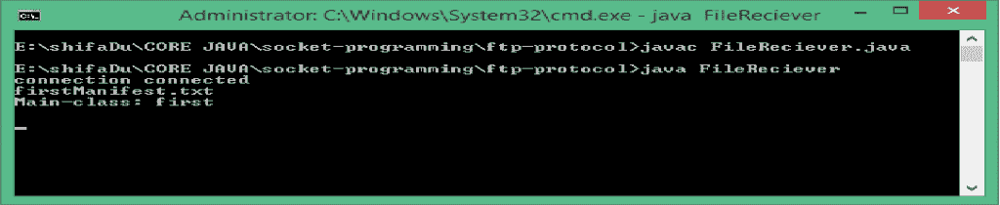
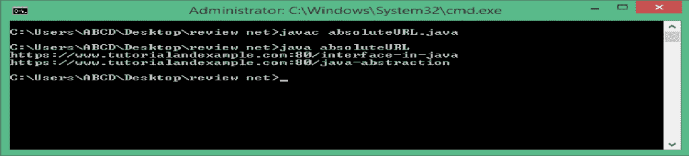
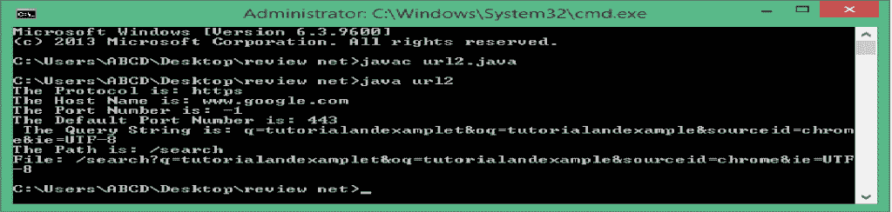
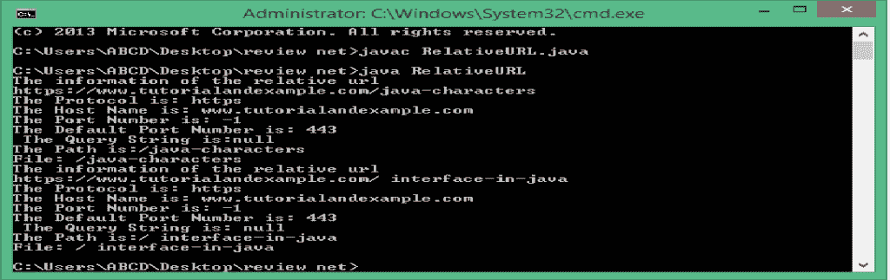

# 带有示例的 Java URL 类

> 原文：<https://www.tutorialandexample.com/java-url/>

**Java URL 统一资源定位符**

要在互联网上找到任何资源，你需要有它的地址。

URL 和 IP 地址是用于此目的的指针。IP 地址指向计算机的物理地址。代替所有这些，URL 包含要使用的协议、域名或 IP 地址、路径和可选的片段标识符。很容易看出 IP 地址是 URL 的一部分，尽管通常看到的是域名而不是 IP 地址。

域名指定了互联网用户可以访问您的网站的地址。由于以前的计算机使用 IP 地址，这是一系列的数字，但人类很难记住字符串的数字。正因为如此，域名被开发出来，是用字母和数字的组合来代表访问你的网站的地址。

URL 是统一资源定位器的缩写。它被用来访问万维网上的资源(文档)。资源可以是文件、目录或更复杂的对象，比如对数据库或搜索引擎的查询。Web 浏览器通过使用 URL 向 web 服务器请求页面。URL 指的是网址。

由于互联网的快速增长，互联网正面临着 IP 地址池的快速耗尽。发明 IPv6 的目的是增加网络中可以使用的 IP 地址数量。此外，对于可能的 URL 的数量没有限制，因为不缺少名称。

**网址的语法:**

```
Scheme://host:port/path?query-string#fragment-id
```

**Scheme**-它告诉我们用于访问资源的协议。

**主机名** -主机名表示资源在互联网上的位置。

**端口号**-表示服务器在互联网上的位置。

**Path**——指定用户想要访问的主机内的特定资源。

**Query-string**-它包含要在服务器上运行的服务器端脚本上传递的数据。它前面有一个问号(？)，通常是由“与”符号分隔的名称和值对的字符串。

**片段标识符**–它由散列字符(#)引入，是文档 URL 的可选最后部分，用于指定页面内的位置。

### 如何翻译 URL:

网络浏览器使用 IP 或互联网协议查找网页。IP 是像 172.217.163.110 一样的一系列数字，要记住你想访问的每个网站的数字变得很困难。使用像[www.google.com](http://www.google.com)这样的基于单词的 URL 要容易得多。当主机将 URL 写入地址字段时，您的 web 浏览器使用 DNS(域名服务器)将 URL 转换为相应的 IP。

通过域名服务器(DNS)处理请求，将域名转换为 IP 地址是必不可少的。如果没有 DNS，请求将会失败，因为计算机将无法找到主机。然后，浏览器可以使用 IP 号码为您查找信息。

**语法:**

```
Creation of the instance of URL:
URL url=new URL("https://www.tutorialandexample.com/java-tutorial"); 
```

一些用于创建 URL 实例的构造函数:

| 构造器 | 描述 |
| URL(字符串 str1) | 它从指定的字符串创建一个 URL 对象。 |
| URL(字符串协议，字符串主机 11，字符串文件) | 它根据指定的协议、host11 和文件名创建 URL 对象。 |
| URL(字符串协议，字符串主机 1，int 端口 1，字符串文件 1) | 它根据协议、主机、端口和文件名创建一个 URL 对象。 |
| URL(URL 1，字符串 str1) | 它通过解析给定上下文中的给定字符串来创建 URL 对象 |
| URL(字符串协议，字符串主机 1，int 端口，字符串文件 1，URLStreamHandler 句柄 1) | 它从指定的协议、主机、端口号、文件名和句柄 1 创建 URL 对象。 |
| URL(URL 1、str 字串、URLStreamHandler) | 它通过在特定的上下文中用指定的处理程序解析给定的 str 来创建 URL。 |

URL 提供了许多解析 URL 的方法，如下所示:

| 方法 | 描述 |
| 公共字符串 getProtocol() | 它返回 URL 的协议。 |
| 公共字符串 getHost() | 它返回 URL 的主机名。 |
| 公共字符串 getPort() | 它返回 URL 的端口号 |
| 公共字符串 getFile() | 它返回 URL 的文件名 |
| 公共 URLConnection openConnection() | 它返回 URLConnection 的实例。即与该 URL 相关联。 |
| 公共字符串 toString() | 它返回给定 URL 对象的字符串表示形式 |
| 公共字符串 getAuthority() | 它返回 URL 的授权部分，如果为空，则返回 null。 |
| 公共字符串 getPath() | 它返回 URL 的路径，如果为空则返回 null。 |
| 公共字符串 getQuery() | 它返回 URL 的查询部分。 |
| public int getDefaultPort() | 它返回使用的默认端口。 |
| Public String getRef() | 它返回 URL 的引用 |

**网址类型:**

1.  **文件 URL**

文件协议在指定操作系统文件位置的 URL 中使用。它用于从计算机中检索文件。

**特性:**

*   文件 URL 用于指定特定主机上可访问的文件。
*   此 URL 没有指定可通过 internet 普遍访问的资源。

语法:

```
 file://host/path
```

这里，主机是可访问路径的系统的完全限定域名，路径是分层目录路径。它指定了 localhost，如果省略了 host，将从该机器解释 URL。

示例-

[file:///C:/Users/ABCD/Desktop/socket/1 . html](file:///C:/Users/ABCD/Desktop/socket/1.html)

```
import java.net.*;
public class url1{ 
public static void main(String[] args){ 
try
{ 
URL url=new URL("file:///C:/Users/ABCD/Desktop/socket/1.html"); 
System.out.println("The Protocol is: "+url.getProtocol()); 
System.out.println("The Host Name is: "+url.getHost()); 
System.out.println("The Port Number is: "+url.getPort()); 
System.out.println("The Default Port Number is: "+url.getDefaultPort()); 
System.out.println(" The Query String is: "+url.getQuery()); 
System.out.println("The Path is: "+url.getPath()); 
System.out.println("File: "+url.getFile()); 
}
catch(Exception e){System.out.println(e);} 
} 
}  
```

代码的输出:



**2\. http URL**

超文本传输协议规定了分布式协作超媒体信息系统的应用层协议。基于 TCP/IP 的通信协议可用于在万维网上传送数据。数据可以是 html 文件、图像文件、视频等。它是保护两个系统(例如浏览器和 web 服务器)之间通信的基础协议。当你在你的浏览器上写一个 URL 时，它向网页服务器发送一个 http 请求。作为响应，服务器向客户端发送 http 响应。

**特性:**

*   http 协议是指在基于客户机/服务器的体系结构中工作的请求/响应协议，其中浏览器充当 http 客户机，而服务器充当服务器。它是一种无状态协议，因为每个命令都是独立执行的，不知道之前的命令是什么。
*   它与介质无关，因为它可以发送任何类型的数据。
*   它是无连接的，因为服务器处理请求并发回响应，之后客户端断开连接。

**语法:**

http://host:端口/路径/文件

示例:

http://www.tutorialandexample.com/static-and-dynamic-binding-in-java

```
import java.net.*; 
public class url1{ 
public static void main(String[] args){ 
try
{ 
URL url=new URL("http://www.tutorialandexample.com/static-and-dynamic-binding-in-java"); 
System.out.println("The Protocol is:"+url.getProtocol()); 
System.out.println("The Host Name is:"+url.getHost()); 
System.out.println("The Port Number is:"+url.getPort()); 
System.out.println("The Default PortNumber is: "+url.getDefaultPort()); 
System.out.println(" The Query String is:"+url.getQuery()); 
System.out.println("The Path is:"+url.getPath()); 
System.out.println("File: "+url.getFile()); 
}
catch(Exception e){System.out.println(e);
}  
} 
}
```

上面程序的输出:



3 .https URL

https 不是独立于 http 的协议。它只是在 http 协议上使用 TLS/SSL 加密。https 阻止网站以网络上任何人都可以轻易查看的方式广播其信息。使用 https，流量加密的方式使得即使数据包被拦截，它们也会被视为无意义的字符。

**特性:**

*   https 代表安全超文本传输协议。它是 http 的安全版本，通过它，数据以安全的形式在您的浏览器和您所连接的网站之间发送。
*   这意味着你的浏览器和网站之间的所有通信都是加密的。
*   相对于 http，https 的重要性在于我们的数据是安全的，不会被黑客窃取，因为它是加密的。
*   它主要用于安全网页，如网上银行和网上购物订单。

语法:

https://host:端口/路径/文件

示例:

[https://www.tutorialspoint.com/index.htm](https://www.tutorialspoint.com/index.htm)

```
import java.net.*; 
public class url1{ 
public static void main(String[] args){ 
try
{ 
URL url=new URL("https://www.tutorialspoint.com/index.htm"); 
System.out.println("The Protocol is: "+url.getProtocol()); 
System.out.println("The Host Name is: "+url.getHost()); 
System.out.println("The Port Number is: "+url.getPort()); 
System.out.println("The Default Port Number is: "+url.getDefaultPort()); 
System.out.println(" The Query String is: "+url.getQuery()); 
System.out.println("The Path is: "+url.getPath()); 
System.out.println("File: "+url.getFile()) ; 
}
catch(Exception e)
{System.out.println(e);
} 
} 
}  
```

**输出:**



**4**T2。ftp 网址

ftp 是用于在客户端-服务器计算机网络上的客户端和服务器之间传输计算机文件的标准网络协议。它还用于从远程主机下载文件或将文件上传到远程主机。

**特性:**

*   文件传输协议 URL 是 TCP/IP 提供的标准机制，用于将文件从一个设备复制到另一个设备。
*   它用于以最安全的方式在计算机网络上的客户端和服务器之间下载或上传文件。
*   它允许来回传输文件。

**示例:使用 ftp 协议显示文件传输和文件接收方**

**文件传输**

```
import java.awt.*;
 import java.awt.event.*;
 import javax.swing.*;
 import java.io.*;
 import java.net.*;
 public class FileTransfer extends JFrame implements ActionListener
 {
 JFrame jf;
 JButton jb1,jb2;
 TextField tf;
 JFileChooser jfc;
 Socket s;
 DataInputStream din;
 DataOutputStream dout,dout1;
 String s1=new String(); 
 String s2="";
 File f;
 FileTransfer()
 {
 jf=new JFrame("File Transfer");
 jf.setSize(400,400);
 Container c=jf.getContentPane();
 c.setBackground(Color.red);
 jf.setLayout(null);
 jb1=new JButton("choose file");
 jb2=new JButton("send");
 jb1.setBounds(30,50,100,50);
 jb2.setBounds(250,150,70,50); 
 jf.add(jb1);
 jf.add(jb2);
 tf=new TextField();
 tf.setEditable(false);
 tf.setBackground(Color.white);
 tf.setBounds(150,50,190,50);
 jf.add(tf);
 jf.setDefaultCloseOperation(WindowConstants.EXIT_ON_CLOSE); 
 jf.setVisible(true);
 jfc=new JFileChooser();
 jb1.addActionListener(this);
 jb2.addActionListener(this);
 }
 public void fileTransfer(String s1)
 {
 try
 {
 dout1.writeUTF(s1);
 dout1.flush();
 s2=f.getAbsolutePath();
 FileReader fr=new FileReader(s2);
 BufferedReader br=new BufferedReader(fr);
 String s3="";
 do{ 
 s3=br.readLine();
 if(s3!=null)
 {
 dout.writeUTF(s3);
 dout.flush();
 }
 }
 while(s3!=null);
 }
 catch(Exception e)
 {
 System.out.println(e+"file not found");
 }
 }
 public void actionPerformed(ActionEvent e)
 {
 if(e.getSource()==jb1)
 {
 int x=jfc.showOpenDialog(null);
 if(x==JFileChooser.APPROVE_OPTION)
 {
 f=jfc.getSelectedFile();
 String path=f.getPath();
 s1=f.getName();
 tf.setText(path+"//"+s1);
 }
 }
 if(e.getSource()==jb2)
 {
 try
 {
 //s1=tf.getText();
 s=new Socket("localhost",10);
 dout1=new DataOutputStream(s.getOutputStream());
 dout=new DataOutputStream(s.getOutputStream());
 }
 catch(Exception e1)
 {
 System.out.println("send button:"+e1);
 }
 fileTransfer(s1);
 } 
 }
 public static void main(String a[])
 {
 FileTransfer ft=new FileTransfer();
 }
 } 
```

程序的输出:



**文件接收者**

```
import java.awt.*;
 import javax.swing.*;
 import java.io.*;
 import java.net.*;
 public class FileReciever
 {
 Socket s;
 ServerSocket ss;
 DataInputStream dis,dis1;
 PrintWriter pw;
 public FileReciever()
 {
 try
 {
 ss=new ServerSocket(10);
 s=ss.accept();
 System.out.println("connection connected"); 
 dis=new DataInputStream(s.getInputStream());
 String s2=dis.readUTF();
 System.out.println(s2);
 FileWriter fr=new FileWriter(s2);
 pw=new PrintWriter(fr);
 fileReciever();
 }
 catch(Exception e1)
 {
 }
 }
 public void fileReciever()
 {
 String str="";
 try{ 
 do
 {
 str=dis.readUTF();
 System.out.println(str);
 pw.println(str);
 pw.flush();
 }
 while(!str.equals(null)); 
 }
 catch(Exception e)
 {
 } 
 }
 public static void main(String a[])
 {
 FileReciever fi=new FileReciever();
 }
 } 
```

程序的输出:



### URL 的寻址方式:

1.  **绝对网址**？绝对 URL 是资源的完整地址。绝对 URL 取决于协议、主机名、文件夹名和文件名。它类似于印度邮政服务定义的地址，包含姓名、门牌号、街道地址、城市、州和 pin 码。如果缺少任何信息，邮件就无法送达正确的人。同样，如果您错过了来自 URL 的信息，则无法访问资源文件。

**例 1:**

```
import java.net.*;
 import java.net.URL;
 public class absoluteURL
 {
 public static void main(String s[])
 {
 try
 {
 //It is the complete address of the resource. 
 URL url=new URL("https://www.tutorialandexample.com:80/interface-in-java");
 System.out.println(url);
 //it creates a URL from each component passes as different parameters.
 URL url1=new URL("https","www.tutorialandexample.com", 80 ,"/java-abstraction");
 System.out.println(url1);
 }
 catch(MalformedURLException e) 
 {
 e.printStackTrace();
 }
 }
 } 
```

上面程序的输出:



**例 2:**

```
import java.net.*; 
 public class url1{ 
 public static void main(String[] args){ 
 try
 { 
 URL url=new URL("https://www.google.com/search?q=tutorialandexamplet&oq=tutorialandexample&sourceid=chrome&ie=UTF-8"); 
 System.out.println("The Protocol is: "+url.getProtocol()); 
 System.out.println("The Host Name is: "+url.getHost()); 
 System.out.println("The Port Number is: "+url.getPort()); 
 System.out.println("The Default Port Number is: "+url.getDefaultPort()); 
 System.out.println(" The Query String is: "+url.getQuery()); 
 System.out.println("The Path is: "+url.getPath()); 
 System.out.println("File: "+url.getFile()); 
 }
 catch(Exception e){System.out.println(e);} 
 } 
 }  
```

程序输出:



*   **相对 URL**–相对 URL 并不包含 URL 的所有部分，它总是被认为与基本 URL 相关。相对 URL 包含文件夹名和文件名，或者只包含文件名。当资源文件存储在相同的文件夹或相同的服务器中时，基本上使用这个 URL。在这种情况下，浏览器不需要协议和服务器名称，因为它假定资源文件存储在相对于原始文件的文件夹或服务器中。相对 URL 包含足够的信息，可以到达相对于另一个 URL 的资源。有一个构造函数从另一个 URL 对象(基对象)和一个相对 URL 规范创建一个 URL 对象。

**语法:**

```
URL(URL baseURL , String relativeURL)
```

第一个参数是 URL 对象，它指定新 URL 的基。另一个参数是一个字符串，它指定相对于基的资源名称的其余部分。如果 baseURL 为 null，则构造函数将 relativeURL 视为 absoluteURL 规范。如果 relativeURL 指定了绝对 URL 规范，则构造函数会忽略 baseURL。

示例:我们可以创建一个指向[https://www.tutorialandexample.com/java-characters/](https://www.tutorialandexample.com/java-characters/)的 URL。然后，我们将 URL 相对解析为“../interface-in-java”。双点(..)表示转到父文件夹。

```
import java.net.MalformedURLException;
 import java.net.URL;
 public class RelativeURL
 {
 public static void main(String s[])
 {
 try
 {
 URL base=new URL("https://www.tutorialandexample.com/");
 URL rel1=new URL(base," java-characters ");
 System.out.println("The information of the relative url");
 System.out.println(rel1);
 System.out.println("The Protocol is: "+rel1.getProtocol()); 
 System.out.println("The Host Name is: "+rel1.getHost()); 
 System.out.println("The Port Number is: "+rel1.getPort()); 
 System.out.println("The Default Port Number is: "+rel1.getDefaultPort()); System.out.println(" The Query String is:"+rel1.getQuery()); 
 System.out.println("The Path is:"+rel1.getPath()); 
 System.out.println("File: "+rel1.getFile()); 
 //we create a URL http://www.tutorialandexample.com/java-characters.
 URL base1=new URL("https://www.tutorialandexample.com/java-characters/");
 //we resolve a URL relative as ../ interface-in-java 
 URL rel2=new URL(base1, "../ interface-in-java ");
 System.out.println("The information of the relative url");
 System.out.println(rel2.toExternalForm());
 System.out.println("The Protocol is: "+rel2.getProtocol()); 
 System.out.println("The Host Name is: "+rel2.getHost()); 
 System.out.println("The Port Number is: "+rel2.getPort()); 
 System.out.println("The Default Port Number is: "+rel2.getDefaultPort()); System.out.println(" The Query String is: "+rel2.getQuery()); 
 System.out.println("The Path is:"+rel2.getPath());  
 System.out.println("File: "+rel2.getFile()); 
 }
 catch(MalformedURLException e)
 {
 e.printStackTrace();
 }}
 } 
```

**上述程序的输出:**

