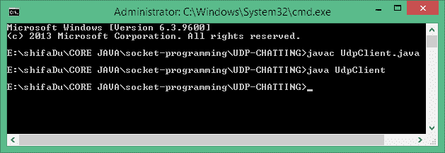
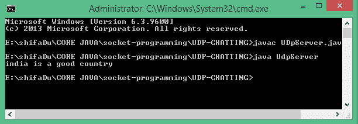
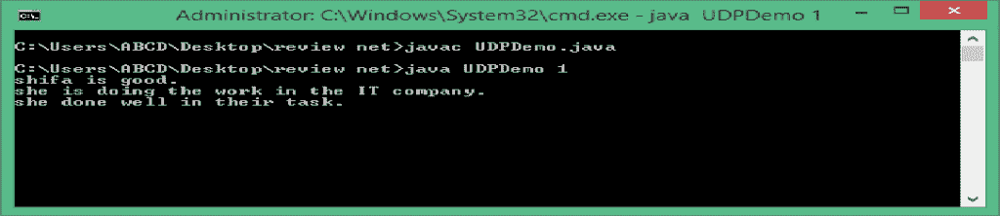
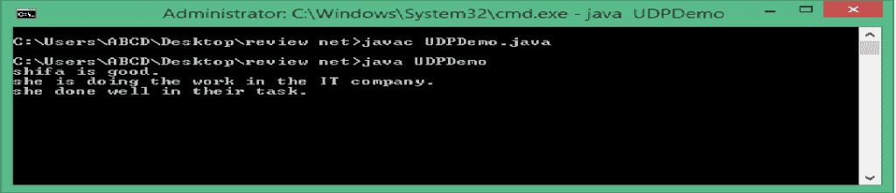
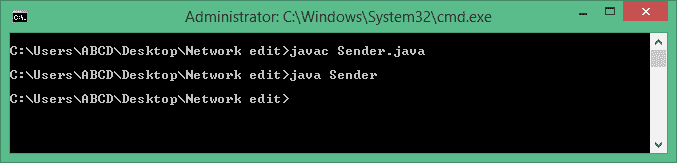
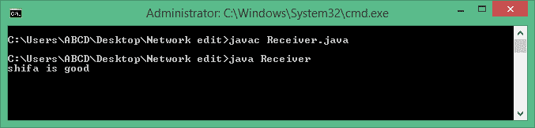

# Java DatagramSocket 和 Java DatagramPacket

> 原文：<https://www.tutorialandexample.com/java-datagramsocket-and-java-datagrampacket/>

**数据报**

TCP/IP 风格的网络以数据包的形式指定了一个序列化的、可预测的和可靠的数据流。服务器和客户端通过可靠的通道(如 TCP 套接字)进行通信，它们之间有专用的点对点通道。它们建立连接，传输数据，然后关闭连接。所有数据都通过信道访问，并按照发送的顺序接收。

数据报是通过网络从一台设备传递到另一台设备的信息组(束)。当数据报为其预定目标释放后，不能保证它会到达，甚至不能保证有人会在那里捕捉数据报包。同样，当数据报被接收时，不能保证它在传输过程中没有被损坏，也不能保证发送它的人还能收到响应。

通过数据报通信的应用程序发送和接收完全独立的信息包。客户端和服务器的这些应用程序没有专用的点对点通道。不能保证数据报的顺序以及它们到目的地的传递。

数据报是独立的，独立的消息通过网络发送，其到达时间和内容没有保证。

Java 通过使用两个类在 UDP 协议上实现数据报

DatagramPacket 对象是数据容器，而 DatagramSocket 是用于发送或接收 DatagramPackets 的机制。Java 为实现 UDP 连接提供了 DatagramSocket 类和 DatagramPacket 类。DatagramSocket 对象用于创建套接字，UDP 流量可以通过套接字作为 DatagramPacket 对象传递。使用 DatagramSockets 时，服务器等待客户端发出请求。一旦客户端发出请求，服务器就通过数据报数据包将其 UDP 流量发送给客户端。

### DatagramSocket 类

此类别代表用于发送和接收数据报数据包的套接字。数据报套接字为无连接数据包提供发送端或接收端。每个数据包都是在套接字上发送或接收的。许多数据包从一台机器发送到另一台机器，并且可能以任何顺序不同地路由。DatagramSocket 定义了许多方法。

### DatagramSocket 类的创建

**语法:**

```
DatagramSocket ds =DatagramSocket();
```

### 常用 DatagramSocket 类的构造函数

| **构造器** | **描述** |
| DatagramSocket()引发 SocketException | 它实例化一个数据报套接字，并将其与本地机器上任何未使用的端口号绑定。 |
| DatagramSocket(int port)引发 SocketException | 它创建一个数据报套接字，并将其与本地主机上的指定端口相关联。 |
| DatagramSocket(int port，int，InetAddress)引发 SockeEexception | 它创建一个数据报套接字，绑定到指定的端口和地址。 |
| DatagramSocket(SocketAddress 地址)引发 SocketException | 它构造一个绑定到指定 SocketAddress 的 DatagramSocket。 |

### DatagramSocket 类的方法

| 方法 | 描述 |
| 公共 void send(DatagramPacket 数据包)引发 IOException | 它用于将 UDP 数据包发送到数据包指定的端口。 |
| 公共同步 void 接收(DatagramPacket 数据包)引发 IOException | receive 方法等待从数据包指定的端口接收数据包，并返回结果。 |
| 公共无效关闭() | 它关闭数据报套接字。 |
| public int getLocalPort() | 它返回这个套接字绑定到的本地主机上的端口号。 |
| public synchronized void setSOTimeout(int)引发 SocketException | 它用以毫秒为单位的指定超时设置 SO_TIMEOUT。 |
| public synchronized int getSOTimeout()抛出 SocketException | 它检索 SO_TIMEOUT 的设置。它返回 0，这意味着该选项被禁用(即无限超时)。 |
| 公共 getLocalAddress() | 它获取套接字绑定到的本地地址。 |
| public InetAddress getInetAddress() | 如果套接字已连接，则返回地址。否则，返回 null。 |
| public int getPort() | 它返回套接字连接的端口号。 |
| 公共布尔值 isConnected() | 如果套接字连接到服务器，则返回 true。 |
| 公共布尔值被绑定() | 如果套接字绑定到一个地址，则返回 true。 |

### DatagramPacket 类

这个类别代表一个数据包。DatagramPacket 类提供无连接的数据包传递服务。每条消息根据包中包含的信息从一台机器路由到另一台机器。大量数据包从一台主机发送到另一台主机，这些数据包的路由可能不同，到达的顺序也可能随机。

### 创建 DatagramPacket 类的对象

**语法:**

```
DatagramPacket dp=DatagramPacket(byte[] b, int length)
```

### 常用构造函数

| **构造器** | **描述** |
| DatagramPacket(byte[] b，int size) | 它指定了接收数据的缓冲区和数据包的大小。 |
| DatagramPacket(byte[] b，int offset，int size) | 它允许您指定缓冲区中存储数据的偏移量。 |
| DatagramPacket(byte data[]，int size，InetAddress add1，int port1) | 它指定目标地址和端口，DatagramSocket 使用这些地址和端口来确定数据包中的数据将被发送到哪里。 |
| DatagramPacket(byte data[]，int offset，int size，InetAddress add) | 它将从指定偏移量开始的数据包传输到数据中。 |

### DatagramPacket 类的方法。

| **方法** | **描述** |
| 公共字节[]获取数据() | 它返回存储数据的缓冲区。 |
| 公共 InetAddress getAddress() | 它返回从套接字接收包的机器的 IP 地址。 |
| public int getLength() | 它返回发送或接收的数据长度。 |
| public int getPort() | 它返回远程主机上的端口号，数据包将被发送到该主机或从该套接字派生。 |
| public int getOffset() | 它返回数据的起始索引。 |
| 公共 void setAddress(InetAddress inet) | 它设置数据包将被发送到的地址。该地址由 inet 指定。 |
| public void setData(byte[] data，int x，int size) | 它将数据设置为 data，将偏移量设置为 x，将长度设置为 size。 |
| 公共 void setLength(int size) | 它将数据包的长度设置为 size。 |
| 公共空设置端口(int 端口) | 它将端口设置为端口。 |

注意:ServerSocket 和 Socket 类使用 TCP 协议(面向连接)。

DatagramSocket 和 DatagramPacket 使用 UDP(无连接协议)。

**例 1:** 向服务器发送 UDP 数据包。

**客户端:**

```
import java.io.*;
import java.net.*;
class UdpClient
{
public static void main(String s1[])throws Exception
{
DatagramSocket ds=new DatagramSocket();
String s="india is a good country";
byte b[]=s.getBytes();
InetAddress i=InetAddress.getLocalHost();
DatagramPacket dp=new DatagramPacket(b,b.length,i,8);
ds.send(dp);
}
} 
```

程序的输出:



**接收端:接收来自客户端的 UDP 数据包。**

```
import java.net.*;
import java.io.*;
class UdpServer
{
public static void main(String s2[])throws Exception{
DatagramSocket ds=new DatagramSocket(8);
byte b[]=new byte[1024];
DatagramPacket dp=new DatagramPacket(b,b.length);
ds.receive(dp);
String r=new String(dp.getData());
System.out.println(r.trim());
}
} 
```

输出:



**示例 2:** 下面的示例实现了一个非常简单的客户端和服务器之间的网络通信。消息在服务器端输入，然后写入客户端，并在客户端显示。

```
import java.net.*;
class UDPDemo
{
public static int  serverPort=922;
public static int clientPort=988;
public static int buffer_size=2000;
public static DatagramSocket ds;
public static byte buffer[]=new byte[buffer_size];
public static void TheServer() throws Exception { 
int pos=0;
while(true) 
{
int c=System.in.read();
switch(c) 
{ 
 case -1:
 System.out.println("Server Quits.");
 return;
 case '\r':
 break;
 case '\n':
 ds.send(new DatagramPacket(buffer,pos,InetAddress.getLocalHost(),clientPort));
 pos=0;
 break;
 default:
 buffer[pos++]=(byte)c;
 }
 }
 }
 public static void TheClient()throws Exception
 {
 while(true)
 { 
 DatagramPacket p=new DatagramPacket(buffer, buffer.length);
 ds.receive(p);
 System.out.println(new String(p.getData(), 0, p.getLength()));
 }
 }
 public static void main(String s8[])throws Exception
 {
 if(s8.length==1)
 {
 ds=new DatagramSocket(serverPort);
 TheServer();
 }
 else
 {
 ds=new DatagramSocket(clientPort);
 TheClient();
 } 
 }
 } 
```

在收到换行符后，在服务器窗口中键入的任何内容都将被发送到客户端窗口。

服务器端的输出:



客户端的输出:



示例 3:向服务器发送 UDP 数据包。

**发送方类别:**

```
import java.net.DatagramPacket;
 import java.net.DatagramSocket;
 import java.net.InetAddress; 
 public class Sender
 {
 public static void main(String s1[])throws Exception
 {
 DatagramSocket ds=new DatagramSocket();
 String str="shifa is good"; 
 InetAddress ip=InetAddress.getByName("localhost");
 byte[] b=str.getBytes();
 DatagramPacket dp=new DatagramPacket(b,b.length,ip,2000);
 ds.send(dp);
 ds.close();
 }
 } 
```

上面程序的输出:



接收方类:接收来自客户端的 UDP 数据包。

```
import java.net.DatagramPacket;
import java.net.DatagramSocket;
public class Receiver
{
public static void main(String s[])throws Exception
{
DatagramSocket ds=new DatagramSocket(2000);
byte[] b1=new byte[1024]; 
DatagramPacket dp=new DatagramPacket(b1,b1.length);
ds.receive(dp);
String str1=new String(dp.getData());
System.out.println(str1);
ds.close();
}
} 
```

程序的输出:

