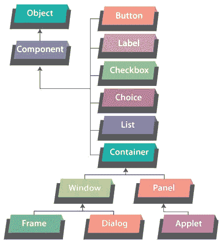
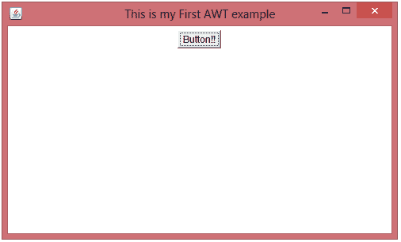
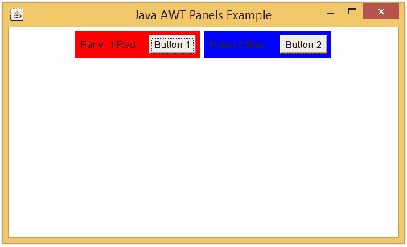
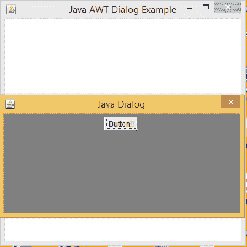
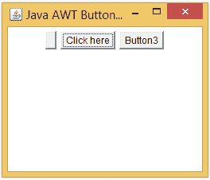
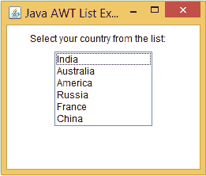
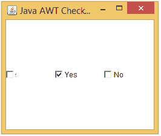
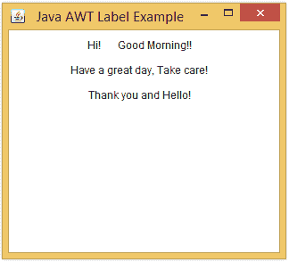
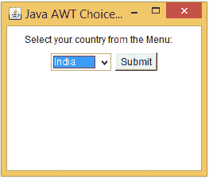

# Java AWT

> 原文：<https://www.tutorialandexample.com/java-awt>

**Java AWT**

Java 编程用于开发不同类型的应用程序，如基于窗口的应用程序、web 应用程序、企业应用程序或移动应用程序。为了创建独立的应用程序，使用 Java AWT API。AWT 允许程序员为基于窗口的应用程序创建图形用户界面(GUI)。

Java 抽象窗口工具包(AWT)是一个应用程序接口(API)。Java AWT 中使用的组件是平台相关的。它使用操作系统的资源，这意味着这些组件的视图根据操作系统而改变。

### AWT 的特点

1.  AWT 有一组本地用户界面组件。
2.  它为组件的图形表示提供了各种类，如字体、形状、颜色。
3.  它提供了一个健壮的事件处理模型。
4.  它有布局管理器，有助于改变窗口大小或屏幕分辨率。
5.  它提供了大量的库，可用于为游戏应用程序或教育应用程序设计图形。
6.  它有数据传输类，通过这些类可以使用本地剪贴板执行剪切和粘贴操作。

### AWT 用户界面方面

AWT UI 是从以下几个方面设计的:

*   UI 的元素:这些是用户可见的元素，用户可以使用这些元素与应用程序进行通信。AWT 提供了广泛的 UI 元素。
*   **布局:**布局对于管理屏幕上不同的 UI 元素非常有用，并且为应用程序提供了一个组织良好的外观。
*   **行为:**它解释了 UI 元素如何作用于用户执行的触发事件。

### AWT 层次结构



1.  **组件**

在 AWT 类层次结构中，组件类是从对象类派生的。组件类是一个抽象类。它是所有 GUI 元素类的超类，如容器、按钮、标签、复选框、选项和列表。因此，组件类负责整个图形界面。

*   **集装箱**

AWT 中的容器是一个组件，它保存了用于构建接口的所有其他组件。我们可以在主容器中插入另一个容器。

AWT 中有四种**类型的集装箱:**

1.  **窗口:**窗口是显示在屏幕上的一个长方形盒子形状的区域。它是 Window 类的一个实例。它没有任何菜单栏、工具栏或边框。它应该总是放在另一个窗口、框架或对话框中。

1.  **Frame:**Frame 是 Window 的子类。它有边框，菜单栏，标题栏。框架的大小也可以改变。它可以容纳所有其他 AWT 组件，如按钮、复选框等。框架是最广泛使用的 AWT 容器类型。

1.  **Dialog:** Dialog 是 Window 的子类。它包含一个边框和标题栏。要创建一个对话框对象，总是需要一个相关框架类的实例。

1.  **面板:**面板是容器的子类。该面板没有任何边框、标题栏或菜单栏。它是保存其他 GUI 组件的通用容器。为了插入组件，Panel 类的实例是必需的。

*   **按钮:**

Button 类允许开发人员创建一个带有适当标签的按钮。它还提供了一种在单击按钮后定义功能的方法。

*   **列表**

List 类用于显示必需项目的列表。使用列表，用户可以选择其中的一个或多个项目。

*   **复选框**

当应用程序希望用户选择真或假时，可以使用复选框。

*   **标签**

标签在应用程序窗口上提供描述性文本信息。它被放在一个容器里。

*   **选择**

选择类用于显示下拉菜单。选中的选项可以在头上看到。

### GUI 相对于 CLI 的优势

1.  GUI 提供交互式图形元素来执行所需的操作，而在 CLI 中，命令只需采用文本格式。
2.  GUI 为用户提供了一种简单而有效的交流方式。但是在 CLI 中，记住所有命令是一项困难的任务。
3.  GUI 为多任务处理提供了便利。另一方面，在 CLI 中不能进行多任务处理。
4.  对于新用户来说，使用 GUI 与应用程序进行交互更容易，但在 CLI 中很难。
5.  GUI 使应用程序更加有趣和用户友好，相反 CLI 没有。

### AWT 类别

各种 AWT 类都有自己的构造函数和方法。下面解释了 AWT 类的一些构造函数和方法。

1.  **窗口:**

窗口类是放置其他图形组件的区域。它不包括边框和菜单栏。

**窗口类的构造函数**


| **构造器** | **描述** |
| **窗口(框架父框架)** | 在指定框架内创建一个新窗口。 |
| **窗口(窗口父窗口)** | 在指定窗口内创建一个新窗口。 |
| **Window(****Window parent Window，GraphicsConfigurationgc)** | 用显示设备的图形配置在指定窗口内创建一个新窗口。 |


**窗口类的方法**


| **方法** | **描述** |
| **voidpaint(图形 g)** | 油漆窗户。 |
| **void setIconImage(图像 ig)** | 使用参数中的图像作为窗口的图标。 |
| **void setSize(int width，int height)** | 用 height 和 width 参数值设置窗口的大小。 |
| **void setBounds(int x，int y，int width，int height)** | 用于使用初始点 x 和 y 设置窗口的高度和宽度。 |
| **Window getOwner()** | 返回当前窗口的父框架或父窗口。 |


*   **帧**

框架是窗口的子类。它有边框、标题栏和菜单栏。Frame 类的默认布局是 BorderLayout。

### Frame 类的构造函数


| **构造器** | **描述** |
| **帧()** | 创建新的框架对象。 |
| **帧(GraphicsConfigurationgc)** | 使用显示设备的图形配置创建新框架。 |
| **帧(字符串名)** | 创建一个新框架，其名称作为框架的标题传递。 |


**框架类的方法**


| **方法** | **描述** |
| **booleanisrevestable()** | 检查框架是否可调整大小。相应地返回 True 或 False。 |
| **MenuBargetMenuBar()** | 返回框架的菜单栏。 |
| **void setMenuBar(MenuBar m)** | 将框架的菜单栏设置为另一个指定的框架。 |
| **void setState(int s)** | 设置框架的状态。 |
| **void setTitle(字符串 t)** | 用指定的新标题更改框架的标题。 |


*   **面板**

面板是容器的子类。该面板没有任何边框、标题栏或菜单栏。它将 FlowLayout 作为默认布局。

### Panel 类的构造函数


| **构造器** | **描述** |
| **面板()** | 使用 FlowLayout 构造一个新面板。 |
| **面板(布局管理器框架)** | 用提到的布局构造一个新面板。 |


**面板类的方法**


| **方法** | **描述** |
| **语音加性()** | 使面板在设备上可见。 |
| **无障碍上下文无障碍上下文()** | 返回连接到面板的 AccessibleContext。 |


*   **对话框**

Dialog 是 Window 的子类。它包含一个边框和标题栏。

### 对话框类的构造函数


| **构造器** | **描述** |
| **对话框(父对话框)** | 用连接的父对话框创建一个没有任何标题的新对话框。 |
| **对话框(对话框父，字符串 s)** | 用连接的父对话框和提到的标题创建一个新对话框。 |
| **对话框(父帧)** | 创建一个新对话框，将指定的框架作为父框架，不带任何标题。 |
| **对话框(帧父，字符串 s)** | 创建一个新的对话框，将指定的框架作为父框架，并带有提到的标题。 |


### 对话框类的方法


| **方法** | **描述** |
| **String getTitle()** | 返回分配给对话框的标题。 |
| **Boolean is revestable()** | 检查对话框是否可调整大小。相应地返回 True 或 False。 |
| **void setTitle(字符串 s)** | 用新的指定标题更改对话框的标题。 |
| **void setVisible(boolean b)** | 根据传递的参数值隐藏或显示对话框。 |


### AWT 类的程序

以下程序使用 Java 编程演示了 AWT 类及其方法和构造函数的实现。

 ****SampleFrame.java**

```
 import java.awt.*;
 public class SampleFrame extends Frame
 {
 SampleFrame()
     { 
         /* Declare a button */
         Button b1=new Button("Button!!");
         /* Position the button on screen */
 b1.setBounds(50,50,50,50); 
         /* Add button on the frame */
         add(b1);
         /* Set width and height of the frame*/
 setSize(500,300);
         /* Set title of the Frame */
 setTitle("This is my First AWT example");
         /* Set the layout for the Frame */
 setLayout(new FlowLayout());
        /* Display the frame on screen */
 setVisible(true); 
     } 
     /* Driver Code */
     public static void main(String args[])
     { 
 SampleFramefr = new SampleFrame(); 
     }
 } 
```

**输出:**

 **

在上面的代码片段中，创建了 AWT 框架。

*   类 ***SampleFrame*** 继承了 **Frame** 类，以便构造一个新的空帧。
*   使用**按钮**类创建一个按钮 ***b1*** 。调整按钮和窗口的大小。
*   使用 ***add()*** 方法将按钮放置在框架上。并且使用 ***setTitle()*** 方法设置帧的标题。
*   最后使用 ***setVisible()*** 方法在屏幕上显示该帧。

**示例面板. java**

```
 import java.awt.*;
 /* Parent Frame */
 class SampleJavaPanel extends Frame
 {
     /* Create instances of Panel class */
     Panel p1,p2,p3 ;
     /* Create instances of Label class */
 Label  lb1,lb2,lb3;
 SampleJavaPanel()
     {
 setLayout(new FlowLayout());       
         /* Panel 1: Adds a label and button on Panel 1 */
         p1 = new Panel();
         lb1 = new Label("Panel 1 Red");
         p1.add(lb1);
         Button bt1 = new Button("Button 1");
         p1.add(bt1);
         p1.setBackground(Color.red);
         add(p1);
         /* Panel 2 Adds a label and button on Panel 2 */
         p2=new Panel();
         lb2 = new Label("Panel 2 Blue");
         p2.add(lb2);
         Button bt2 = new Button("Button 2");
         p2.add(bt2);
         p2.setBackground(Color.blue);
         add(p2);
     }
 }
 public class SamplePanel
 {
     /* Driver Code */
     public static void main(String[] args)
     {
         /* Creates an instance of SampleJavaPanel. */
 SampleJavaPanelpanelframe = new SampleJavaPanel();
         /* Sets the title of the Frame. */
 panelframe.setTitle("Java AWT Panels Example");
         /* Sets the size of the Frame. */
 panelframe.setSize(500,300);
         /* Displays the Frame containing Panel on Screen. */
 panelframe.setVisible(true);
     }
 } 
```

**输出:**

 **

在上面的代码片段中，类 ***SamplePanel*** 构造了一个以 ***panelframe*** 为实例名的框架。类 ***的构造函数***SampleJavaPanel()***构造了两个面板' ***p1*** 和 ***p2*** ，标签为 ***lb1*** 和 ***lb2*** ，按钮 ***b1******

**示例对话框. java**

```
 import java.awt.*;
 import java.awt.event.*;
 public class SampleDialog
 {
     /* Driver Code */
     public static void main(String[] args)
     {
         /* Creates a Frame. */
         Frame frame = new Frame("Java AWT Dialog Example");
 frame.setLayout(new FlowLayout());  
 frame.setSize(400, 400);
 frame.setBackground(Color.white);
 frame.setVisible(true);
         /* Creates a dialog inside the Frame. */
         Dialog d1 = new Dialog(null, true);
         d1.setLayout(new FlowLayout());
         d1.setTitle("Java Dialog");
         d1.setSize(400, 200);
         d1.setBackground(Color.gray);
         /* Creates a Button displayed on the Dialog. */
         Button bt1 = new Button("Button!!");
         bt1.setSize(20,10);
         d1.add(bt1);
         d1.setVisible(true);
     }
 } 
```

**输出:**



这里，类 ***SampleDialog*** 以 ***帧*** 为实例名构造了一个**帧**。使用框架类属性(如框架布局、框架大小、背景颜色和框架可见性)的方法进行设置。创建对话框 ***d1*** 并使用**对话框**类中给出的方法设置其属性。对话框上增加**按钮*bt1*T19】。最后，将 ***d1*** 的可见性设置为**真**，使对话框可见。**

**SampleButton.java**

```
 import java.awt.*;
 public class SampleButton
 {
           /* Creates object of Frame and Button. */
           Frame f;
           Button bt1, bt2, bt3;
           SampleButton()
           {
                    f = new Frame("Java AWT Button Example");
                    /* Create Buttons bt1, bt2, bt3\. */
                    bt1= new Button();
                    bt2= new Button("Click here");
                    bt3= new Button();
                    /* Sets text on the Button. */
                    bt3.setLabel("Button3");
                    /* Add Buttons on the Frame. */
                    f.add(bt1);
                    f.add(bt2);
                    f.add(bt3);
                    /* Set properties of the Frame. */
                    f.setLayout(new FlowLayout());
                    f.setSize(260,220);
                    f.setVisible(true);
           }
           /* Driver Code */
           public static void main(String[] ar)
           {
                    SampleButtonsb = new SampleButton();
           }
 } 
```

**输出:**

 **

在上面的代码片段中，类 ***SampleButton*** 构造了一个以 ***f*** 为实例名的框架。而类 ***SampleButton*** 的构造函数 ***SampleButton()*** 创建了三个按钮 ***bt1、bt2、*** 和 ***bt3*** 。

**SampleList.java**

```
 import java.awt.*;
 public class SampleList
 {
           /* Creates object of Frame, List, Label and String array. */
           Frame f;
           List list;
           Label lb1;
           String[] country;
           SampleList()
           {
                    f = new Frame("Java AWT List Example");
                    /* Creates a list with 6 items. */
                    list= new List(6);
                    lb1 = new Label("Select your country from the list: ");
                    /* Adding items in the list. */
                    list.add("India");
                    list.add("Australia");
                    list.add("America");
                    list.add("Russia");
                    list.add("France");
                    list.add("China");
                    /* Add label and list on the Frame. */
                    f.add(lb1);
                    f.add(list);
                    /* Set properties of the Frame. */
                    f.setLayout(new FlowLayout());
                    f.setSize(260,220);
                    f.setVisible(true);
           }
           /* Driver Code */
           public static void main(String[] ar)
           {
                    SampleListsl = new SampleList();
           }
 } 
```

**输出:**

 **

在上面的代码片段中，类 ***SampleList*** 构造了一个以 ***f*** 为实例名的框架。类 ***SampleList*** 的构造函数 ***SampleList()*** 创建一个 ***list*** ，列表中有 6 项。将 ***列表*** 和标签 ***lb1*** 添加到画面 ***f*** 。

**sampledcheckbox . Java**

```
 import java.awt.*;
 public class SampleCheckbox
 {
           /* Creates object of Frame and Checkbox. */
           Frame f;
           Checkbox cb1, cb2, cb3;
           SampleCheckbox()
           {
                    f= new Frame("Java AWT Checkbox Example");
                    /* Creates a no message Checkbox. */
                    cb1 = new Checkbox();           
                    /* Creates a pre-selected Checkbox with a message. */
                    cb2 = new Checkbox("Yes",true);
                    /* Creates an unselected Checkbox with a message. */ 
                    cb3 = new Checkbox("No");   
                    /* Add Checkboxes on the Frame. */
                    f.add(cb1);
                    f.add(cb2);
                    f.add(cb3);
                    /* Set properties of the Frame. */
                    f.setLayout(new GridLayout());
                    f.setSize(260,220);
                    f.setVisible(true);
           }
           /* Driver Code */
           public static void main(String[] ar)
           {
                    SampleCheckboxsc = new SampleCheckbox();
           }
 } 
```

**输出:**



在上面的代码片段中，类 ***SampleCheckbox*** 构造了一个以 ***f*** 为实例名的框架。类 ***的构造函数***sample checkbox()***sample checkbox***创建了三个复选框 ***cb1*** 无消息 ***，cb2*** 有消息，已检查值，以及 ***cb3*** 有消息，未检查值。

**可采样。java**

```
 import java.awt.*;
 public class SampleLabel
 {
    /* Creates object of Frame and Label. */
    Frame f;
    Label lb1, lb2, lb3, lb4;
    SampleLabel()
    {
           f = new Frame("Java AWT Label Example");
           lb1 = new Label("Hi!");
           lb2 = new Label("Good Morning!!");
           lb3 = new Label("Have a great day, Take care!");
           lb4 = new Label("Thanks");
           /* Setting text on the Labels. */
           lb4.setText("Thank you and Hello!");
           /* Add Labels on the Frame. */
           f.add(lb1);                     
           f.add(lb2);                     
           f.add(lb3);
           f.add(lb4);
           /* Set properties of the Frame. */
           f.setLayout(new FlowLayout());
           f.setSize(260,220);
           f.setVisible(true);
    }
    /* Driver Code */
    public static void main(String[] ar)
    {
           SampleLabelsl = new SampleLabel();
    }
 } 
```

**输出:**

 **

在上面的代码片段中，类 ***SampleBLabel*** 构造了一个以 ***f*** 为实例名的框架。类 ***SampleLabel*** 的构造函数 ***SampleLabel()*** 为标签 ***lb1、lb2、lb3、*** 和 ***lb4*** 创建。标签加在 ***f*** 框上。

**SampleChoice.java**

```
 import java.awt.*;
 public class SampleChoice
 {
    /* Creates object of Frame, Choice, Label and Button. */
    Frame f;
    Choice ch;
    Label lb1;
    Button bt1;
    SampleChoice()
    {
           f = new Frame("Java AWT Choice Example");
           ch = new Choice();
           lb1 = new Label("Select your country from the Menu: ");
           /* Adding items in the list. */
           ch.add("India");
           ch.add("Australia");
           ch.add("America");
           ch.add("Russia");
           ch.add("France");
           ch.add("China");
           bt1= new Button("Submit");
           /* Add label and choice menu on the Frame. */
           f.add(lb1);
           f.add(ch);
           f.add(bt1);
           /* Set properties of the Frame. */
           f.setLayout(new FlowLayout());
           f.setSize(260,220);
           f.setVisible(true);
    }
    /* Driver Code */
    public static void main(String[] ar)
    {
           SampleChoicesl = new SampleChoice();
    }
 } 
```

**输出:**

 **

在上面的代码片段中，类 ***SampleChoice*** 构造了一个以 ***f*** 为实例名的框架。而类 ***SampleChoice*** 的构造函数 ***SampleChoice()*** 创建一个 Choice ***ch*** 。总共有 6 个项目被添加到选择列表中。并将选择 ***ch*** 添加到帧 ***f*** 。

本文解释了 Java AWT 类及其构造函数和方法的基本概念。我们还讨论了如何使用 **java.awt** 包中可用的方法实现 AWT 类。**************